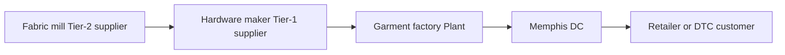
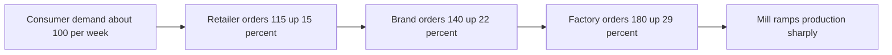

# Lecture 1 — What Is a Supply Chain?

> **Duration:** ~2 hours. **Outcome:** You can name every node type in an end-to-end chain, explain what an "echelon" is, trace the three flows (product, information, cash) through a real example, describe where cost and value accumulate, and explain — in plain language — why the bullwhip effect happens.

## 1. A working definition

A **supply chain** is the network of organizations, facilities, people, and activities that turn raw materials into a product or service and deliver it to a customer. That's the textbook version. The version that actually helps you reason: **a supply chain is every place value gets added and every place a decision gets made, from raw material to the customer's hands.**

Every node in that network is either adding value (converting fabric into a jacket), adding location (moving the jacket closer to the customer), or adding availability (holding the jacket in stock so it's ready when ordered). If a node in your map isn't doing one of those three things, ask whether it needs to be there at all — that question alone eliminates a lot of unnecessary cost in real networks.

Run this whole lecture against one example: **Crunch Gear**, a fictional outdoor-apparel company. We'll use it all week.

## 2. The nodes

A chain is built from a small set of recurring node types. Crunch Gear's chain, tier by tier:

| Node type | Crunch Gear example | What it does |
|---|---|---|
| **Raw material supplier** | A fabric mill in Vietnam | Produces the base input (woven nylon shell fabric) |
| **Component supplier** | A zipper and hardware manufacturer | Produces sub-components that get assembled into the finished good |
| **Contract manufacturer (plant)** | A garment factory in Bangladesh | Cuts, sews, and finishes the jacket from fabric + components |
| **Distribution center (DC) / warehouse** | Crunch Gear's Memphis DC | Receives finished goods in bulk, holds inventory, ships smaller orders out |
| **Regional / forward warehouse** | A West Coast fulfillment center | A second echelon closer to customers, for faster delivery |
| **Wholesale customer** | An outdoor retail chain | Buys in bulk, resells to consumers in its own stores |
| **DTC customer** | A person ordering on crunchgear.com | The end consumer, buying one unit at a time |
| **Reverse logistics** | A returns processing center | Takes back damaged, wrong-size, or unwanted units |

Real chains have more or fewer of these depending on the business — a software company's "supply chain" might be three nodes (cloud hosting, CDN, customer); an automaker's might be thousands of supplier nodes feeding a handful of assembly plants. The node types above are the common vocabulary you'll reuse in every industry.

## 3. Echelons — the tiers of the network

An **echelon** is a tier, or layer, in the chain — a stage the product physically passes through and stops at. Crunch Gear's jacket moves through five echelons before it reaches a consumer:

```
Tier-2 supplier      Tier-1 supplier      Plant           DC              Retailer / DTC
(fabric mill)   -->   (hardware maker) --> (garment    -->  (Memphis  -->  (store shelf or
                       ships to plant)      factory)         DC)            customer's door)
```

Each arrow is a **lane** — a physical transportation link with its own cost, lead time, and mode (ocean freight, truck, air, parcel). Every echelon a product crosses adds lead time, adds a handling cost, and usually adds an inventory holding point — somewhere product sits and waits, which is money tied up doing nothing until it sells. **Echelon count is a design choice, not a law of nature** — Lecture 3 goes deep on how many echelons a network actually needs.


*Crunch Gear's jacket crosses five echelons, each arrow a lane with its own cost and lead time.*

A subtlety worth internalizing now: "supplier" and "customer" are relative to where you're standing. The garment factory is Crunch Gear's supplier, but the hardware maker is *the factory's* supplier. Multi-tier maps (showing your supplier's suppliers) matter enormously for risk — Week 11 comes back to this when a single sub-tier factory fire shuts down an entire product line nobody thought was fragile.

## 4. The three flows

This is the single most useful mental model in the whole course. Every supply chain, no matter how complex, is three overlapping networks stacked on the same nodes:

### 4a. Product / material flow — moves downstream

Physical goods moving from raw material toward the consumer: fabric → cut panels → sewn jacket → cartons → pallets → DC → store → customer. This is the flow people picture when they hear "supply chain," but it's only one of three.

### 4b. Information flow — moves both directions

Orders, forecasts, purchase orders, shipment notices, point-of-sale (POS) data, and inventory visibility move **both upstream and downstream**, and usually *faster* than product does:

- **Downstream → upstream:** a store's POS data, a customer's order, a forecast — signals about what's actually being consumed, sent back toward the factory.
- **Upstream → downstream:** an advance shipping notice (ASN) telling the DC a truck left the factory with 4,000 units and will arrive Tuesday; a supplier telling you a component is on backorder.

Information flow is where the *bullwhip effect* (section 6) is born — because information gets distorted, delayed, and re-interpreted at every node it passes through.

### 4c. Cash flow — moves upstream

Money moves opposite to product: the consumer pays the retailer, the retailer pays Crunch Gear (net terms, e.g. 30–60 days after invoice), Crunch Gear pays the contract manufacturer (often *before* the goods even ship, via a letter of credit or deposit), and the manufacturer pays its own material suppliers. Cash flow has its own timing, independent of when product physically moves — and that timing gap is exactly what the **cash-to-cash cycle** KPI in Lecture 2 measures.

**Put together:** at any single moment, a jacket sitting on a container ship has *already* triggered a cash payment upstream (Crunch Gear paid the factory), has *not yet* triggered a cash receipt downstream (the retailer hasn't paid Crunch Gear, because the goods haven't arrived and sold through), and information about it (an ASN, a customs status update) is flowing to whoever needs to plan around its arrival. Three flows, three different clocks, one physical object.

## 5. Where cost and value accumulate

Follow one jacket's cost build-up through the chain (illustrative numbers):

| Stage | Cost added | Running cost | Why it's added here |
|---|---:|---:|---|
| Raw fabric (mill) | $4.50 | $4.50 | Material cost |
| Hardware (zippers, snaps) | $1.80 | $6.30 | Component cost |
| Cut & sew (factory) | $7.20 | $13.50 | Labor + factory overhead |
| Ocean freight + duty | $2.40 | $15.90 | Landed cost to get it into the country |
| DC handling + domestic freight | $1.60 | $17.50 | Warehousing + last-mile transportation |
| Crunch Gear margin + overhead | $22.50 | $40.00 | Wholesale price to the retailer |
| Retailer margin | $60.00 | $100.00 | Retail shelf price to the consumer |

Two things to notice. First, **cost accumulates monotonically downstream** — every node adds cost, none removes it (returns and rework are the exception, and they're expensive precisely because they run the flow backward against the grain of the whole system). Second, **"landed cost"** — everything it costs to get one unit sitting in your own warehouse, ready to sell (material + conversion + freight + duty + handling) — is the number operations people actually manage day to day. The $100 shelf price is a pricing/marketing decision; the $17.50 landed cost is a supply-chain decision, and it's the number every later week in this course helps you drive down without hurting service.

## 6. Push, pull, and the decoupling point

Upstream of some point in the chain, work happens on a **forecast** ("we predict we'll sell 50,000 units this season, so start cutting fabric now") — that's **push**. Downstream of that point, work happens against an **actual order** ("this customer just bought one, ship it") — that's **pull**. The point where the chain switches from push to pull is the **decoupling point**, and it's usually wherever finished-goods inventory sits waiting for demand — Crunch Gear's DC, in this example. Move the decoupling point earlier (build-to-order) and you cut inventory risk but add lead time; move it later (hold more finished stock closer to the customer) and you cut lead time but add inventory risk. This exact trade-off returns, with numbers, in Lecture 3.

## 7. A first look at the bullwhip effect

Here's the preview; Weeks 3–4 (forecasting) come back to this with real math. The **bullwhip effect** is the tendency for small, normal fluctuations in *consumer* demand to become large, erratic swings in *orders placed with suppliers*, and the swings get bigger the further upstream you look.

**Why it happens, in one sentence:** every node reacts to the order it just received from the node immediately downstream — not to the true consumer demand several tiers away — and each node adds its own buffer "just in case," which compounds.

A quick illustration. Suppose real consumer demand for a jacket is a steady 100 units/week, barely wobbling:

| Echelon | What it sees | What it orders (and why it overreacts) |
|---|---|---|
| Retailer | Consumer demand: ~100/week, +5% one week | Orders 115 from Crunch Gear — rounds up "just in case," and to hit a case-pack minimum |
| Crunch Gear (brand) | Retailer orders: 100 → 115 (+15%) | Orders 140 from the factory — reads the 15% jump as a trend starting, adds its own safety buffer |
| Factory | Brand orders: 115 → 140 (+22%) | Orders 180 units of fabric from the mill — plans for continued growth *and* wants slack against its own capacity risk |
| Mill | Factory orders: 140 → 180 (+29%) | Ramps raw material production sharply — the largest swing in the chain, from a 5% wobble in real demand |

Nobody in that chain lied or made a mistake — every single order was a locally reasonable decision. But because each node only sees the order in front of it (not the real signal three tiers away) and each adds its own margin of safety, a 5% consumer wobble becomes a 29%+ swing at the mill. That amplification causes real damage: excess inventory when demand normalizes, stockouts when it doesn't, and wildly inefficient factory utilization. The fix previewed here (and built properly in Weeks 3–4 and 10) is **shared, real information** — getting actual POS/consumption data to every tier instead of letting each node forecast off the order noise from its neighbor.


*A small demand wobble amplifies into a much larger swing at every tier moving upstream.*

## 8. Why this course is data-first, not spreadsheet-first

Every node, every flow, and every KPI in this course is something you can query. "How many units shipped late last month, by region?" is a `WHERE` clause once shipment data lives in a table. "What's our forecast bias by SKU?" is a `GROUP BY`. Spreadsheets buckle the moment a network has more than a handful of SKUs, warehouses, or a real order history — which is why, starting Week 2, everything in this course lives in **PostgreSQL/SQLite** and gets analyzed in **Python (pandas)**. This week you're building the vocabulary; from next week on, you're building the queries.

## 9. Check yourself

- Name the five node types in Crunch Gear's chain, in order from raw material to consumer.
- What is an echelon? What does adding one typically cost the network?
- Which of the three flows moves *opposite* to product? Which moves in *both* directions?
- At the moment a jacket is on a container ship mid-ocean, has Crunch Gear paid its factory yet? Has the retailer paid Crunch Gear yet?
- What is the decoupling point, and what trade-off does moving it earlier or later create?
- In your own words, why does a 5% wobble in consumer demand turn into a much bigger swing in factory orders?

If those are automatic, Lecture 2 turns "is the chain working?" into five numbers you can compute from real data.

## Further reading

- **ASCM (Association for Supply Chain Management) — Supply Chain Dictionary:** <https://www.ascm.org/learning-development/certifications-credentials/scmdictionary/> — the industry's canonical glossary; bookmark it, you'll use these exact terms all course.
- **CSCMP (Council of Supply Chain Management Professionals) — Supply Chain Management Definitions and Glossary:** <https://cscmp.org/CSCMP/Educate/SCM_Definitions_and_Glossary_of_Terms.aspx>
- **Forrester, J.W. (1958), "Industrial Dynamics: A Major Breakthrough for Decision Makers"** — the original systems-dynamics paper describing what would later be called the bullwhip effect: <https://hbr.org/1958/07/industrial-dynamics-a-major-breakthrough-for-decision-makers>
- **Lee, Padmanabhan & Whang (1997), "The Bullwhip Effect in Supply Chains"**, *Sloan Management Review* — the paper that named and formalized the effect with the classic four causes: <https://sloanreview.mit.edu/article/the-bullwhip-effect-in-supply-chains/>
