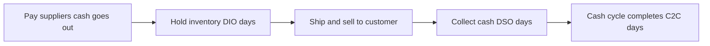

# Lecture 2 — Metrics & KPIs That Run the Business

> **Duration:** ~2 hours. **Outcome:** You can define, compute by hand, and interpret OTIF, fill rate (order/line/unit), perfect order, inventory turns (and days of inventory), and the cash-to-cash cycle time — and you can say, for each one, what operational lever it points to when it's bad.

A supply chain generates an overwhelming amount of activity — thousands of orders, shipments, receipts. **KPIs (key performance indicators)** compress that activity into a small number of numbers a manager can look at once a week and know whether to act. This lecture covers the five that show up on almost every operations dashboard on earth. Get the formulas *and* the intuition — a KPI you can compute but can't explain is just a number.

We work one running dataset for every example: 10 Crunch Gear wholesale orders shipped from the Memphis DC in a single week.

| order_id | promised_date | ship_date | qty_ordered | qty_shipped |
|---:|---|---|---:|---:|
| 1 | 2026-04-06 | 2026-04-06 | 100 | 100 |
| 2 | 2026-04-06 | 2026-04-08 | 60 | 60 |
| 3 | 2026-04-07 | 2026-04-07 | 200 | 190 |
| 4 | 2026-04-07 | 2026-04-07 | 80 | 80 |
| 5 | 2026-04-08 | 2026-04-10 | 120 | 100 |
| 6 | 2026-04-08 | 2026-04-08 | 150 | 150 |
| 7 | 2026-04-09 | 2026-04-09 | 90 | 90 |
| 8 | 2026-04-10 | 2026-04-11 | 70 | 70 |
| 9 | 2026-04-10 | 2026-04-10 | 110 | 110 |
| 10 | 2026-04-11 | 2026-04-11 | 130 | 120 |

Ten orders, two late (2, 5, 8 — check the dates), three short-shipped (3, 5, 10). We'll reuse it for every metric below.

## 1. On-Time In-Full (OTIF)

**OTIF** answers one question: *did the customer get exactly what they ordered, exactly when they were promised it?* It's a **compound, binary-per-order** metric — an order either fully qualifies or it doesn't. There's no partial credit.

```
OTIF % = (number of orders that were BOTH on-time AND in-full) / (total orders) × 100
```

- **On-time** — usually `ship_date <= promised_date` (or, in more mature operations, measured against the *delivery* date, not ship date — know which one your company uses, because they give different numbers).
- **In-full** — `qty_shipped >= qty_ordered` for every line on the order.

Walk the 10 rows: order 1 (on-time, full) ✓ · order 2 (**late**) ✗ · order 3 (**short**) ✗ · order 4 ✓ · order 5 (**late and short**) ✗ · order 6 ✓ · order 7 ✓ · order 8 (**late**) ✗ · order 9 ✓ · order 10 (**short**) ✗.

Qualifying orders: 1, 4, 6, 7, 9 → **5 of 10 → OTIF = 50%.**

OTIF is the single most-watched metric in a customer-facing operation because it's what the customer actually experiences — they don't care that you shipped 97% of units by volume if *their specific order* was late or incomplete. It's also unforgiving: one line short on an otherwise-perfect 500-unit order fails the *entire order*.

## 2. Fill rate — order, line, and unit

**Fill rate** measures completeness of shipment, at three different granularities that give meaningfully different numbers. Mixing them up is the single most common KPI reporting mistake in operations.

**Unit fill rate** — the fraction of *units* shipped vs. ordered, across everything:

```
Unit fill rate = (total units shipped) / (total units ordered) × 100
```

Sum ordered = 100+60+200+80+120+150+90+70+110+130 = **1,110**. Sum shipped = 100+60+190+80+100+150+90+70+110+120 = **1,070**.

```
Unit fill rate = 1,070 / 1,110 = 96.4%
```

**Order fill rate** — the fraction of *orders* that shipped completely in full (ignoring timing entirely):

```
Order fill rate = (orders fully shipped) / (total orders) × 100
```

Short orders were 3, 5, 10 → 7 of 10 shipped complete → **Order fill rate = 70%.**

**Line fill rate** — same idea at the individual order-line level, for multi-line orders (our table is one line per order, so it matches order fill rate here — in a real dataset with multiple SKUs per order it usually won't).

Notice the gap: **unit fill rate looks great (96.4%)** because the shortages were small relative to total volume, but **order fill rate (70%) and OTIF (50%) tell a much more honest story** about the customer experience. A dashboard that only shows unit fill rate can hide a real service problem — this exact trap is the subject of Challenge 1 this week.

## 3. Perfect order rate

**Perfect order** is the strictest metric on the dashboard — an order counts only if it clears *every* dimension of service:

```
Perfect order = on-time AND in-full AND damage-free AND accurately invoiced
```

The reason perfect order matters so much: these component rates **multiply**, they don't average. If each of four independent components runs at a respectable 95%:

```
0.95 × 0.95 × 0.95 × 0.95 = 0.8145  →  81.45%, not 95%
```

A business that thinks it's running at "95% quality" because each department reports 95% on its own metric is often actually delivering a perfect experience to only ~81% of customers — and that gap gets *worse*, not better, the more independent failure points you add (five components at 95% compounds to ~77%; six to ~74%). This is why mature operations track perfect order as its own KPI rather than assuming it from the parts — and why Challenge 1 this week hands you exactly this scenario.

## 4. Inventory turns (and days of inventory)

**Inventory turns** measures how many times a company sells and replaces its entire inventory in a period — a proxy for how efficiently capital tied up in stock is being used.

```
Inventory turns = Cost of Goods Sold (COGS) / Average Inventory Value
```

Both numbers use **cost**, not retail price — turns measures how efficiently you're moving inventory you paid for, not sales revenue. "Average" inventory (not a single snapshot) smooths out seasonal swings; a common simple version is `(beginning inventory + ending inventory) / 2`, though more rigorous versions average multiple points across the period.

**Worked example.** Crunch Gear's trailing-twelve-month figures: annual COGS = **$3,600,000**; average inventory value = **$600,000**.

```
Inventory turns = 3,600,000 / 600,000 = 6.0 turns per year
```

Turns is easier to feel as its inverse, **days of inventory (also called DIO — days inventory outstanding)**:

```
DIO = 365 / Inventory turns = 365 / 6.0 = 60.8 days
```

Crunch Gear holds, on average, about **61 days' worth of inventory** at any moment. Higher turns (more turns/year, fewer DIO days) generally means less cash tied up and less obsolescence/markdown risk — but turns *too* high, with no safety buffer, means you're one late shipment away from a stockout. Like everything in this course, there's a target range, not a "bigger is always better" rule — Week 5 (inventory management) builds the math for finding that target.

## 5. Cash-to-cash cycle time (C2C)

**Cash-to-cash cycle time** answers the question Lecture 1's "cash flow moves opposite to product" left hanging: *how many days does the company's cash stay tied up, from paying for inventory to collecting payment for it?*

```
C2C = DIO + DSO − DPO
```

- **DIO (Days Inventory Outstanding)** — from Section 4: how long inventory sits before it sells. `365 × Avg Inventory / COGS`.
- **DSO (Days Sales Outstanding)** — how long it takes to *collect cash* after a sale. `365 × Avg Accounts Receivable / Net Sales`.
- **DPO (Days Payable Outstanding)** — how long the company takes to *pay its own suppliers*. `365 × Avg Accounts Payable / COGS`.

DIO and DSO are days cash is **tied up** (money out the door, not yet back). DPO is days cash is **still in your pocket** (you owe it, but haven't paid yet) — that's why it's *subtracted*.

**Worked example**, continuing Crunch Gear's annual figures: COGS = $3,600,000, avg inventory = $600,000 (DIO = 60.8 days, from above); net sales = **$5,000,000**, avg accounts receivable = **$411,000**; avg accounts payable = **$296,000**.

```
DSO = 365 × 411,000 / 5,000,000 = 30.0 days
DPO = 365 × 296,000 / 3,600,000 = 30.0 days

C2C = 60.8 + 30.0 − 30.0 = 60.8 days
```

Crunch Gear's cash is tied up for about **61 days** on average — it pays for materials, holds inventory, ships and invoices, and collects payment, all before that cash cycles back to fund the next round of production. A **shorter** C2C means less working capital needed to run the same size of business (better for cash flow and growth funding); a company can shrink it by holding less inventory (lower DIO), collecting from customers faster (lower DSO), or negotiating longer payment terms with its own suppliers (higher DPO) — three very different levers, and a good operator knows which one they're actually pulling.


*Cash goes out to suppliers, sits tied up in inventory, then returns once the customer pays.*

## 6. What each KPI actually points to

| KPI | What it measures | The lever it points to when it's bad |
|---|---|---|
| **OTIF** | Did the customer get what they ordered, when promised? | Execution reliability — planning, production scheduling, carrier performance |
| **Fill rate** (unit/order/line) | How completely did we ship? | Inventory availability — stockouts, allocation, safety stock |
| **Perfect order** | Did *everything* go right on the order? | Cross-functional quality — packaging/damage, invoicing accuracy, *and* the above two |
| **Inventory turns / DIO** | How efficiently is capital tied up in stock being used? | Purchasing discipline, forecast accuracy, SKU rationalization |
| **Cash-to-cash cycle** | How long is cash tied up before it comes back? | Working capital strategy — inventory policy, collections, payment terms |

## 7. Why this is a query, not a spreadsheet formula

Every number in this lecture came from a table with columns and rows — exactly the shape of a database table. Once this data lives in PostgreSQL (Week 2 onward), OTIF stops being ten rows you eyeball and becomes one query:

```sql
SELECT
    ROUND(100.0 * SUM(CASE WHEN ship_date <= promised_date
                             AND qty_shipped >= qty_ordered
                        THEN 1 ELSE 0 END) / COUNT(*), 1) AS otif_pct
FROM shipments;
```

That query runs identically whether the table has 10 rows or 10 million. A spreadsheet with a thousand `IF()` formulas dragged down a thousand rows breaks the moment someone inserts a row in the wrong place — which is exactly why this course computes KPIs in SQL and pandas, never Excel, from Week 2 on. This week you're building the hand-math intuition so that SQL query above reads as *obvious*, not magic.

## 8. Check yourself

- Why can OTIF be 50% while unit fill rate is 96%, on the exact same ten orders?
- Name the three granularities of fill rate. Which one is most likely to hide a real service problem?
- If four independent quality components each run at 90%, what's the resulting perfect order rate — and why isn't it 90%?
- What's the difference between inventory turns and days of inventory (DIO)? How do you convert one to the other?
- Write the cash-to-cash formula from memory. Which two components add, and which one subtracts — and why?
- Name two different levers a company could pull to shorten its cash-to-cash cycle, and what each one costs elsewhere in the business.

If those are automatic, Lecture 3 zooms out from "is this order/period healthy?" to "is the network itself shaped correctly?"

## Further reading

- **ASCM Supply Chain Dictionary — "Perfect Order":** <https://www.ascm.org/learning-development/certifications-credentials/scmdictionary/> — search the term; ASCM's definition is the industry-standard one this lecture follows.
- **CSCMP — Supply Chain Management Definitions and Glossary** (search "cash-to-cash," "fill rate," "inventory turnover"): <https://cscmp.org/CSCMP/Educate/SCM_Definitions_and_Glossary_of_Terms.aspx>
- **Investopedia — "Cash Conversion Cycle":** <https://www.investopedia.com/terms/c/cashconversioncycle.asp> — a finance-side treatment of the same C2C formula, useful for seeing how supply chain and finance describe the identical number.
- **PostgreSQL — Aggregate Functions** (you'll want `SUM`, `AVG`, `COUNT` fluently by Week 2): <https://www.postgresql.org/docs/current/functions-aggregate.html>
