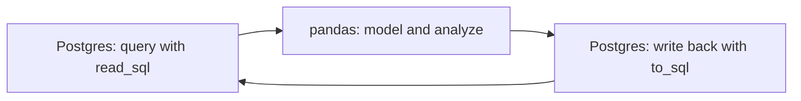

# The SQL-to-pandas Workflow

Lectures 1–2 stayed entirely inside the database. That's deliberate — you should be able to answer most operations questions without ever leaving SQL. But some work genuinely goes further than SQL comfortably reaches: a statistical model, a chart, an ad-hoc "what if" scenario you'll throw away in ten minutes. That's pandas' job. This lecture is about the *handoff* between the two — reading query results into a DataFrame, working there, and writing back — and about a discipline that keeps that handoff from quietly turning into "actually, now the spreadsheet-replacement problem this course keeps warning about, just in Python instead of Excel."

## 1. The rule, stated precisely

**SQL is the system of record. pandas is a workbench.** Anything that needs to be *true tomorrow* — an order, a shipment, an inventory balance — lives in Postgres, with the constraints from Lecture 1 protecting it. A DataFrame is scratch space: load it, transform it, look at it, maybe write a result back — and if your Python process crashed right now, nothing of lasting value would be lost, because nothing of lasting value should live *only* in a DataFrame.

This is a stricter rule than "use pandas for analysis," because it's specific about what pandas is not for: it's not a place to keep the one true copy of anything. If you find yourself maintaining a DataFrame across multiple script runs, editing it by hand, or treating a saved `.pkl`/`.csv` file as "where the real numbers live" — that's the spreadsheet anti-pattern again, just with a different file extension. The fix is always the same: write it to Postgres.

## 2. Reading a query into pandas

Two ways to connect, both worth knowing.

**With `psycopg2` (direct connection, works everywhere):**

```python
import pandas as pd
import psycopg2

conn = psycopg2.connect(dbname="crunch_chain", host="localhost")

otif_by_region = pd.read_sql("""
    SELECT
        o.region,
        SUM(ol.qty_ordered) AS units_ordered,
        SUM(COALESCE(sl.qty_shipped, 0)) AS units_shipped
    FROM order_lines ol
    JOIN orders o ON ol.order_id = o.order_id
    LEFT JOIN shipment_lines sl ON sl.order_line_id = ol.order_line_id
    GROUP BY o.region
""", conn)

print(otif_by_region)
conn.close()
```

**With SQLAlchemy (nicer for larger projects, handles connection pooling):**

```python
import pandas as pd
from sqlalchemy import create_engine

engine = create_engine("postgresql://localhost/crunch_chain")
otif_by_region = pd.read_sql("SELECT * FROM orders", engine)
```

**SQLite fallback (no server, just a file):**

```python
import pandas as pd
import sqlite3

conn = sqlite3.connect("crunch_chain.db")
orders = pd.read_sql("SELECT * FROM orders", conn)
```

`pd.read_sql(query, connection)` is the one function to remember: give it any valid SQL string and a connection, and it comes back as a DataFrame with column names and (mostly) correct dtypes inferred automatically. Notice something already: **the query text itself doesn't change based on which of the three connections you used.** That's worth dwelling on — the SQL you wrote in Lecture 2 is portable; only the three lines that establish a connection differ. This is a real, practical reason the data rule insists on SQL first: your analysis logic stops being tied to any particular Python library's quirks and lives instead in a language every one of your future tools can speak.

## 3. Why pull it into pandas at all, if SQL can already do `GROUP BY`?

Fair question — Section 2's `otif_by_region` query could've stopped in `psql`. pandas earns its place once you need something SQL genuinely isn't built for:

- **Statistical/ML modeling** — `scikit-learn`, `statsmodels`, and friends expect a DataFrame or NumPy array, not a SQL result set. Week 3's forecasting work lives here.
- **Charting** — `matplotlib`/`seaborn` plot DataFrames directly; SQL has no native charting.
- **Combining data from multiple sources** — joining a SQL query result against, say, a CSV a supplier emailed you, before either one is in the database yet.
- **Iterative, exploratory "what if"** — reshaping, pivoting, and re-slicing quickly in a notebook while you're still figuring out what question you're even asking, before it's worth writing a polished SQL query for.

None of Lecture 2's joins, `GROUP BY`s, or window functions needed pandas — and shouldn't have used it; SQL is faster and the database can use indexes pandas can't. The line is genuinely simple: **if the database can answer it, ask the database.** Reach for pandas only past that line.

## 4. A worked example: reconciling fill rate two ways

Compute unit fill rate in SQL (you already know how, from Lecture 2), then verify the *same* number independently in pandas, to build the habit Challenge 2 will test:

```python
import pandas as pd
import psycopg2

conn = psycopg2.connect(dbname="crunch_chain", host="localhost")

# Pull the raw, ungrouped detail -- let pandas do the aggregation, not SQL,
# so the two calculations are genuinely independent, not the same query twice.
detail = pd.read_sql("""
    SELECT
        ol.order_line_id,
        ol.qty_ordered,
        COALESCE(sl.qty_shipped, 0) AS qty_shipped
    FROM order_lines ol
    LEFT JOIN shipment_lines sl ON sl.order_line_id = ol.order_line_id
""", conn)
conn.close()

unit_fill_rate = detail["qty_shipped"].sum() / detail["qty_ordered"].sum()
print(f"Unit fill rate: {unit_fill_rate:.1%}")   # Unit fill rate: 98.4%
```

This matches Lecture 2's SQL answer exactly (98.4%) — which is the point of doing it twice: if it *hadn't* matched, that mismatch is a bug worth finding before you ship either number to a manager. Two independent paths to the same answer is one of the cheapest correctness checks available, and it's exactly the exercise Challenge 2 puts you through with a deliberately planted discrepancy.

**A trap to know about before you hit it:** if you'd instead written the pandas version as a `merge()` of `order_lines` and `shipment_lines` on `order_line_id`, and *any* order line matched more than one shipment line (which two of them do, in this dataset, thanks to no order here — but easily could, and does happen for shipments with multiple lines), a `pandas.merge()` behaves exactly like a SQL `JOIN`: it produces one output row per matching pair. Summing `qty_ordered` *after* a merge like that double-counts, in pandas, for the exact same fan-out reason Lecture 2 Section 1 warned about in SQL. The bug isn't SQL-specific or pandas-specific — it's a property of joins/merges themselves, and both tools need the same fix: aggregate before you fan out, or aggregate the correct grain deliberately.

## 5. Writing results back to Postgres

Once you've computed something in pandas worth keeping — say, a weekly KPI snapshot — write it back to the database instead of leaving it stranded in a notebook variable that vanishes when you close the kernel:

```python
from sqlalchemy import create_engine

engine = create_engine("postgresql://localhost/crunch_chain")

kpi_snapshot = pd.DataFrame({
    "metric":        ["otif_pct", "unit_fill_rate_pct", "order_fill_rate_pct"],
    "value":         [58.3, 98.4, 83.3],
    "period_start":  ["2026-03-01"] * 3,
    "period_end":    ["2026-03-31"] * 3,
})

kpi_snapshot.to_sql("kpi_snapshots", engine, if_exists="append", index=False)
```

`to_sql(table_name, engine, if_exists=..., index=False)` is the mirror image of `read_sql`. `if_exists="append"` adds rows to an existing table (the common case for a recurring snapshot); `if_exists="replace"` drops and recreates the table from the DataFrame's shape (useful once, dangerous in a loop — it'll silently wipe history if you run it on a schedule by mistake, so treat `"replace"` as a one-time setup action, not a habit). `index=False` matters: pandas' DataFrame index is a Python-side bookkeeping artifact, not a business column, and writing it to Postgres by default clutters your table with a meaningless `index` column — Exercise-and-challenge feedback consistently flags forgetting this.

Notice the shape of `kpi_snapshot` itself: it's not a spreadsheet-style wide table with one column per metric. It's **long/tidy** — one row per (metric, period) pair, a `metric` column naming *what* the number is, a `value` column holding the number itself. This shape is what makes `kpi_snapshots` trivially queryable later (`WHERE metric = 'otif_pct' ORDER BY period_start`) and trivially appendable every week without ever changing the table's column structure — the same reason relational databases prefer long/tidy layouts over the "one column per week" shape a spreadsheet naturally drifts toward.

## 6. Two pitfalls that only show up once real data crosses the boundary

Both of these look like edge cases in a lecture and become recurring, half-remembered bugs in real work if you don't name them once, deliberately, now.

**Dtype drift.** Postgres and pandas don't always agree on what a column *is*. A `NUMERIC(10,2)` column (used for `unit_price`, `cost_per_unit`, and every dollar figure in this week's schema) often comes back from `read_sql` as Python's `Decimal` type, not a plain `float` — which is exactly correct for money (floats lose precision in ways that matter for prices), but it means `Decimal` values won't silently mix with `float` arithmetic the way you might expect; you'll sometimes need `float(df["unit_price"])` or `df["unit_price"].astype(float)` before feeding a price column into a library that expects plain floats (most plotting and ML libraries do). A `DATE` column usually round-trips cleanly to pandas' `datetime64` dtype, but a `TIMESTAMP` with timezone information attached needs `.dt.tz_convert(...)` handled deliberately if you're comparing it against naive (timezone-unaware) dates elsewhere — mixing aware and naive datetimes in pandas raises an error rather than silently guessing, which is the right failure mode, but only if you were expecting it. The habit: after any `read_sql`, run `df.dtypes` once before doing arithmetic on a new column you haven't touched before. It costs one line and catches a category of bug that otherwise surfaces as a confusing `TypeError` three cells later.

**Building a query string from user input.** Nothing in this week's exercises does this, but the moment your own code starts building SQL dynamically — say, a function that takes a `region` argument and queries only that region — the wrong way is Python string formatting:

```python
# WRONG -- never do this
region = "Northeast"
query = f"SELECT * FROM orders WHERE region = '{region}'"
pd.read_sql(query, conn)
```

This is a **SQL injection** vulnerability the moment `region` comes from anywhere outside your own hardcoded script — a filename, a form field, an API parameter. The fix is **parameterized queries**, where the database driver substitutes the value safely instead of you splicing raw text into SQL:

```python
# RIGHT
query = "SELECT * FROM orders WHERE region = %s"   # psycopg2 / Postgres placeholder style
pd.read_sql(query, conn, params=("Northeast",))
```

`pd.read_sql`'s `params` argument passes values through the underlying driver's parameter-binding mechanism, which escapes them correctly no matter what they contain — including a value someone deliberately crafted to break out of a naive string-formatted query. This matters less inside a personal analysis notebook and matters enormously the moment any of this week's queries end up behind a web form, an internal tool, or an API endpoint — which, in a real operations analytics job, is exactly where KPI queries like this eventually land. Build the habit now, while the stakes are a lecture note, not an incident report.

## 7. The full loop, and why it never needs a spreadsheet

Put Sections 2–5 together and you have the entire pattern this course uses from here to Week 12:

1. **Query** Postgres for exactly the rows/columns you need (`read_sql`) — do as much filtering, joining, and aggregating in SQL as SQL can do.
2. **Model** in pandas — whatever SQL genuinely can't: statistics, ML, charts, quick reshaping.
3. **Write back** whatever's worth keeping (`to_sql`), in a long/tidy shape, so it's queryable by the next person (or the next week of you) without reopening a notebook.


*The read-model-write loop this course repeats every week — SQL stays the system of record.*

At no point does a `.xlsx` file enter this loop, and now you can say precisely why, instead of just citing the syllabus: a spreadsheet can't enforce the constraints from Lecture 1, can't be queried the way Lecture 2's joins and window functions require, and — this lecture's addition — even the *analysis* step that legitimately leaves SQL has a database-shaped destination waiting for it on the other side. pandas is the workbench between two visits to the same system of record, never a second, competing one.

**Next:** run [Exercise 2](../exercises/exercise-02-join-orders-to-shipments.md) and [Exercise 3](../exercises/exercise-03-rolling-inventory-with-windows.md) to build Lecture 2's queries yourself, then this lecture's read/write loop.
