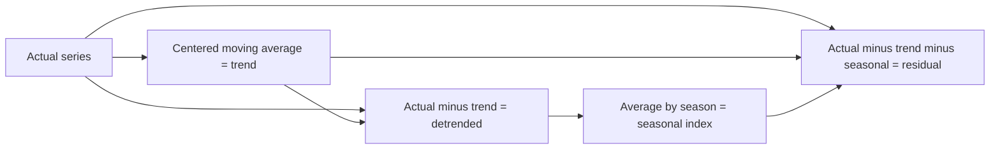
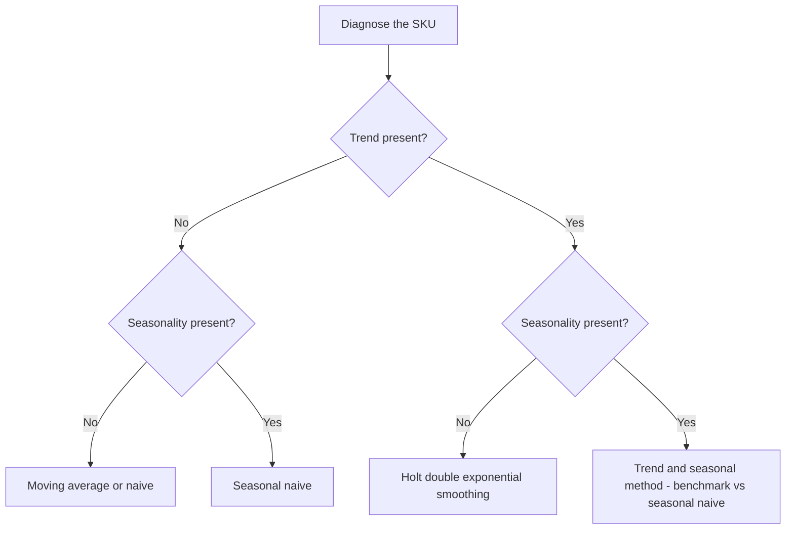

# Lecture 1 — Demand Patterns & Decomposition

> **Duration:** ~2 hours. **Outcome:** You can look at a raw demand series and name its level, trend, seasonality, and noise; you can decompose a series by hand on a small example and explain, precisely, the difference between additive and multiplicative decomposition; and you know, from real numbers, what each of this week's six SKUs looks like before you've plotted a single point.

Every forecasting method you'll learn this week and next is, underneath, an attempt to answer one question: **if I strip the noise out of this series, what's left, and does that "what's left" repeat?** This lecture gives you the vocabulary and the mechanics to answer that question by hand, so that every later method — moving average, exponential smoothing, eventually ML — is just a more automated way of doing what you're about to do with a pencil.

## 1. The four things inside every demand series

Any observed demand series `y_t` (units sold in period `t`) is usually described as the combination of four components:

| Component | Symbol | What it is | Example |
|-----------|--------|------------|---------|
| **Level** | `L` | The current baseline — "how much, roughly, per period, right now" | Alpine Shell Jacket sells ~130 units/week on average |
| **Trend** | `T` | A slow, sustained direction — growth or decline over many periods | Fleece Half-Zip is growing ~2 units/week faster every week |
| **Seasonality** | `S` | A pattern that **repeats on a fixed calendar cycle** | Jackets peak every December, trough every June |
| **Noise / residual** | `E` (or `ε`) | Whatever's left after you remove level, trend, and seasonality — the part you can't explain or predict | A one-off weather event, a stockout, random week-to-week wobble |

The whole point of decomposition is to separate these four so you can (a) understand *why* demand moves the way it does, and (b) forecast the first three — because, by definition, you cannot forecast noise. A forecast is a bet that trend + seasonality will repeat; the noise is the part every honest forecaster admits they'll miss.

**A critical distinction: seasonality vs. trend.** Both cause demand to move up and down, but seasonality **always returns to the same relative position** on a fixed cycle (every 52 weeks, every 12 months, every 7 days), while trend is a **one-directional drift that does not reset**. If Fleece Half-Zip demand keeps climbing December after December with no sign of coming back down, that's trend, not seasonality — the test is whether it snaps back at the far side of the cycle.

## 2. Additive vs. multiplicative decomposition

There are two standard ways to combine the four components. The choice matters, and it's not arbitrary.

### Additive model

```
y_t = L_t + T_t + S_t + E_t
```

Components are **added**. This says: "seasonality adds or subtracts a roughly *constant number of units*, regardless of how big the level currently is." Use additive decomposition when the size of the seasonal swing stays **roughly flat in absolute units** as the series grows or shrinks — e.g., "we always sell about 40 more units in December than the yearly average, whether the yearly average is 100 or 130."

### Multiplicative model

```
y_t = L_t × T_t × S_t × E_t
```

Components are **multiplied**. This says: "seasonality scales the level by a roughly constant *percentage*." Use multiplicative decomposition when the seasonal swing **grows in absolute size as the level grows** but stays a constant *proportion* — e.g., "December is always about 30% above the yearly average," so as the SKU sells more overall, the December bump gets bigger in raw units too, but stays ~30%.

### How to tell which one you have

Plot (or just scan) the series over multiple cycles. If the peaks and troughs stay the same *height* in absolute units regardless of the current level → additive. If the peaks and troughs get visibly bigger in absolute terms as the overall level rises → multiplicative. When genuinely unsure, additive is the safer default for a first pass — it's simpler to compute, easier to explain to a non-technical stakeholder ("December always adds about 40 units"), and this course uses it throughout Week 3. Multiplicative decomposition becomes more important in Week 4 once you're modeling SKUs with large growth trends stacked on strong seasonality — a case where "always +40 units" stops being true and "always +30%" keeps being true.

## 3. Decomposing by hand: a small worked example

Pencil-and-paper first, on numbers small enough to check by eye — then you'll trust the same mechanics on 104 noisy real weeks.

Say Crunch Gear's *total* company-wide demand (thousands of units), by quarter, for three years, looks like this:

| Quarter | Y1 | Y2 | Y3 |
|---------|---:|---:|---:|
| Q1 | 80 | 90 | 100 |
| Q2 | 95 | 105 | 115 |
| Q3 | 90 | 100 | 110 |
| Q4 | 135 | 150 | 160 |

Eyeballing it: Q4 is always the highest, Q1 always the lowest, and each year's numbers are a bit higher than the last. That's trend (rising ~10/year) plus seasonality (Q4 spikes, Q1 dips) plus a little noise. Let's extract them with **classical additive decomposition**, the oldest and still most-taught method.

### Step 1 — estimate the trend with a centered moving average

To isolate trend, average away the seasonal swing with a moving average whose window equals one full cycle (4 quarters here). Because 4 is even, there's no single "middle" quarter, so you use a **centered** average: average two consecutive 4-quarter windows together (this is the standard "2×4-MA" technique — it centers the trend estimate exactly on each quarter instead of leaving it half a period off).

Doing this arithmetic for every quarter (you'll do the SQL/pandas version in the exercises) produces:

| Quarter | Actual | Trend (centered MA) |
|---------|-------:|---------------------:|
| Y1-Q3 | 90 | 101.25 |
| Y1-Q4 | 135 | 103.75 |
| Y2-Q1 | 90 | 106.25 |
| Y2-Q2 | 105 | 109.38 |
| Y2-Q3 | 100 | 112.50 |
| Y2-Q4 | 150 | 115.00 |
| Y3-Q1 | 100 | 117.50 |
| Y3-Q2 | 115 | 120.00 |

Notice trend has no seasonal bump anymore — it climbs smoothly from ~101 to ~120 over two years, about **+2.5/quarter, +10/year**. The first two and last two quarters have no trend value: a centered moving average always loses `period/2` points off each end, because there aren't enough neighbors to center on. This is one of classical decomposition's real limitations — you lose data at the edges, exactly where a forecaster usually cares most (the most recent weeks).

### Step 2 — detrend, then average by season

Subtract the trend from the actual at each point where trend exists (`detrended = actual − trend`), then group the detrended values by quarter-of-year and average them. This gives a raw seasonal effect per quarter; finally, shift all four so they sum to (approximately) zero — that's the standard normalization that keeps the seasonal component from silently adding a hidden trend of its own.

The result, for this toy example:

| Quarter | Seasonal index |
|---------|---------------:|
| Q1 | **−16.8** |
| Q2 | **−4.6** |
| Q3 | **−11.8** |
| Q4 | **+33.2** |

Read this in plain English: "Q1 typically runs about 17 units below the trend line, Q4 typically runs about 33 units above it." That's an additive seasonal index — a fixed number of units, not a percentage, which is why this whole example used the additive model.

### Step 3 — recover the residual (noise)

```
residual_t = actual_t − trend_t − seasonal_t
```

Doing this for every quarter where trend is defined gives residuals all under about ±2 units — tiny, because this toy example was built to be almost noise-free on purpose. Your real SQL data this week will not be this clean; residuals of ±15–25 units on a series averaging 130 are completely normal for real retail demand. **A decomposition with zero residual is a red flag, not a win** — it usually means you've overfit the seasonal index to noise that was actually random, and it won't repeat next year.


*The three-step classical additive decomposition: estimate trend first, subtract it to get a seasonal index, then whatever is left over is the residual.*

## 4. What the six SKUs in `demand_history` actually look like

Run the sanity-check query from the [week README](../README.md) now if you haven't:

```sql
SELECT sku_id, MIN(units_sold), MAX(units_sold), ROUND(AVG(units_sold), 1) AS avg_units
FROM demand_history
GROUP BY sku_id
ORDER BY sku_id;
```

Here's what's actually driving those six rows — the ground truth, so you can check your own decomposition against it in the exercises instead of guessing whether you got it right:

- **`JCK-ALP-001` — Alpine Shell Jacket.** Level ~130 units/week, mild upward trend, **strong winter seasonality** (peaks early January, troughs late June/July), moderate noise. The workhorse example this whole week — clean enough to learn on, real enough to be honest about noise.
- **`JCK-STM-002` — Summit Down Jacket.** Lower base level but growing faster than the Alpine, same winter seasonality but with a much bigger swing, **plus two deliberate promo spikes** (a Black Friday week and a pre-Christmas push) that are *not* seasonality — they're one-off marketing events that happen to land near the seasonal peak and make it taller. Decomposition will fold these into "seasonal" unless you know to look for them; that's the point of Challenge 2.
- **`ACC-BEA-010` — Merino Beanie.** Flat trend, only mild winter seasonality, low volume, low noise — an easy, well-behaved series where almost any method will do fine. Useful as a control case.
- **`BAG-DAY-020` — Daypack 22L.** Flat trend, **essentially no seasonality**, moderate noise — an evergreen SKU people buy year-round for commuting and travel. If you try to fit a strong seasonal index here, you're fitting noise, not signal.
- **`FLC-ZIP-030` — Fleece Half-Zip.** The fastest-growing SKU in the set — clear upward trend, only mild seasonality (a small spring/fall shoulder bump), moderate noise. A trend-dominated series, the opposite failure mode from the Daypack: ignore the trend here and every forecast will run permanently low.
- **`SAN-TRL-040` — Trail Sandal.** **Summer seasonality** — the mirror image of the jackets, peaking in June/July and bottoming out near zero in December — plus a **declining trend** (this SKU is aging out of the catalog). The only SKU in the set where seasonality and trend pull in a way that makes the series hit zero some winter weeks; decide in the exercises how you'll handle units that go to (or near) zero.

Look at that list again: three different trend directions (up, flat, down), two opposite seasonal phases (winter peak, summer peak), one series with none at all, and one series with an event-driven spike layered on top of real seasonality. That's not an accident — it's the smallest set of SKUs that forces you to actually look at each series before choosing a method, instead of pattern-matching one formula onto everything in the catalog. That judgment call is exactly what Challenge 1 asks you to make explicit.

## 5. Why decomposition comes before forecasting, not instead of it

Decomposition by itself is **not** a forecast — it's a diagnosis. You now know, for each SKU, "does it have a trend, does it have seasonality, how noisy is it." What you do with that diagnosis is choose a forecasting method suited to it:

- No trend, no seasonality, moderate noise → a moving average or naive forecast is probably enough (Lecture 2).
- Strong, stable seasonality → seasonal naive (Lecture 2) is a shockingly strong baseline.
- Real trend, weak seasonality → you need a method that tracks trend, like Holt's double exponential smoothing (Lecture 3).
- Trend **and** strong seasonality together → you need both, and even then you should benchmark hard against seasonal naive, because — as you'll see with real numbers in Lecture 3 — the "smarter" method does not automatically win.


*Decomposition's trend/seasonality diagnosis is what points you at a forecasting method, not the other way around.*

That last point is the thesis of this entire week, so hold onto it: **decomposition tells you what's there; it does not tell you which method wins.** Only scoring on held-out weeks (Lecture 3, Exercise 3) tells you that.

## 6. Check yourself

- In one sentence, what's the difference between a trend and a seasonal pattern that happens to look similar over a short window?
- Why does a centered moving average lose data at both ends of the series?
- You detrend a series and its seasonal swing is ±5 units in year 1 and ±5 units in year 3, even though the level roughly doubled. Additive or multiplicative?
- Why is a residual of exactly zero for every period a warning sign rather than a triumph?
- Which of the six `demand_history` SKUs would you expect to have close to zero seasonal index, and why?
- Name the one SKU whose "seasonal peak" is partly contaminated by something that isn't seasonality at all.

If those are automatic, Lecture 2 turns the diagnosis into your first real forecasts — naive, seasonal naive, and moving average — pulled straight from this SQL table.

## Further reading

- **NIST/SEMATECH e-Handbook of Statistical Methods — "Seasonal Decomposition":** <https://www.itl.nist.gov/div898/handbook/pmc/section4/pmc443.htm>
- **Hyndman & Athanasopoulos, *Forecasting: Principles and Practice* — "Time series decomposition" (free online):** <https://otexts.com/fpp3/decomposition.html>
- **PostgreSQL — Window Functions (you'll use these for moving averages next lecture):** <https://www.postgresql.org/docs/current/tutorial-window.html>
