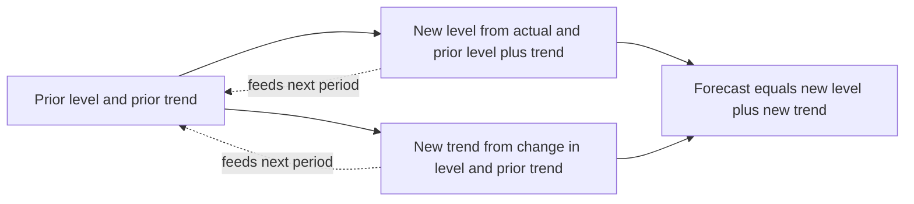
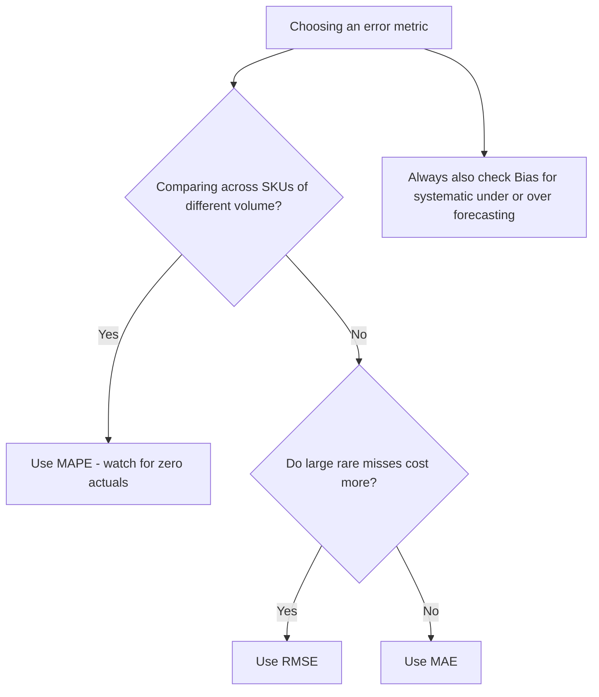

# Lecture 3 — Exponential Smoothing & Error Metrics

> **Duration:** ~2 hours. **Outcome:** You can build single exponential smoothing (SES) and double exponential smoothing (Holt's method) by hand in Python, tune α and β with real intuition for what each one trades off, and compute MAE, MAPE, RMSE, and bias correctly — including knowing exactly when MAPE quietly lies to you. By the end, you'll have a single master comparison table, built from real numbers, ranking every method from this week against the same 12-week holdout.

## 1. Single exponential smoothing (SES)

SES forecasts the next period as a weighted blend of the last actual observation and the last forecast:

```
ŷ_{t+1} = α · y_t + (1 − α) · ŷ_t
```

`α` (alpha) is the **smoothing parameter**, between 0 and 1. Unroll the recursion and you find SES is actually a weighted average of *every* past observation, with weights that shrink geometrically the further back you go: the most recent observation gets weight `α`, the one before it gets weight `α(1−α)`, the one before that `α(1−α)²`, and so on. That's the "exponential" in the name — exponentially decaying weights, computed with one line of arithmetic instead of you hand-picking a fixed window like last lecture's moving average.

- **High α (close to 1):** the forecast reacts fast to the latest observation — barely any smoothing. At α=1, SES degenerates exactly into the naive method from Lecture 2.
- **Low α (close to 0):** the forecast barely moves — heavy smoothing, slow to react, closer to "the long-run average."

There's no universally correct α; it's a genuine trade-off between responsiveness and stability, and picking it well is exactly what you tune against a holdout, same as `k` in a moving average.

**The critical limitation: SES has no concept of trend.** It smooths around whatever the current level is, but if the level itself is climbing, SES's forecast keeps landing behind it — every single period — because it never adjusts its *aim*, only its *position*. Watch this happen with real numbers next.

### SES on the Alpine Shell Jacket ramp

Using α=0.2 and α=0.4, seeded from the average of the first 8 weeks of the series, here's what SES forecasts for the same 12-week winter-ramp holdout from Lecture 2:

| week_start | actual | SES(α=0.2) | error | SES(α=0.4) | error |
|------------|-------:|------------:|------:|------------:|------:|
| 2024-10-07 | 138 | 102.7 | +35.3 | 110.5 | +27.5 |
| 2024-10-14 | 142 | 109.8 | +32.2 | 121.5 | +20.5 |
| 2024-10-21 | 153 | 116.2 | +36.8 | 129.7 | +23.3 |
| 2024-10-28 | 150 | 123.6 | +26.4 | 139.0 | +11.0 |
| 2024-11-04 | 164 | 128.9 | +35.1 | 143.4 | +20.6 |
| 2024-11-11 | 162 | 135.9 | +26.1 | 151.6 | +10.4 |
| 2024-11-18 | 165 | 141.1 | +23.9 | 155.8 | +9.2 |
| 2024-11-25 | 187 | 145.9 | +41.1 | 159.5 | +27.5 |
| 2024-12-02 | 176 | 154.1 | +21.9 | 170.5 | +5.5 |
| 2024-12-09 | 193 | 158.5 | +34.5 | 172.7 | +20.3 |
| 2024-12-16 | 207 | 165.4 | +41.6 | 180.8 | +26.2 |
| 2024-12-23 | 197 | 173.7 | +23.3 | 191.3 | +5.7 |

Every error is positive again, worse than moving average was — SES(0.2) has a mean error of **+31.5 units**, low every single week. That's not random noise, it's **systematic under-forecasting**, because SES is chasing a moving target with no idea it's moving. Higher α (0.4) helps — it reacts faster — but it's still chasing, not anticipating.

## 2. Double exponential smoothing (Holt's method)

Holt's method fixes exactly this gap by smoothing **two** things at once: the level and the trend.

```
Level:    L_t = α · y_t + (1 − α) · (L_{t-1} + T_{t-1})
Trend:    T_t = β · (L_t − L_{t-1}) + (1 − β) · T_{t-1}
Forecast: ŷ_{t+1} = L_t + T_t
```

Two smoothing parameters now: `α` controls how fast the level adapts (same idea as SES), and `β` (beta) controls how fast the *trend estimate itself* adapts. The forecast is level **plus** trend — so unlike SES, Holt's method actually projects forward along the direction the series has recently been moving, instead of aiming at where it already was.


*Holt's method updates level and trend each period, then feeds both forward into the next update.*

### Holt's method on the same ramp

With α=0.3, β=0.2 (seeded on the first 4 weeks — level from the first observation, trend from the average of the first three differences):

| week_start | actual | Holt forecast | error |
|------------|-------:|---------------:|------:|
| 2024-10-07 | 138 | 120.3 | +17.7 |
| 2024-10-14 | 142 | 131.5 | +10.5 |
| 2024-10-21 | 153 | 141.1 | +11.9 |
| 2024-10-28 | 150 | 151.9 | −1.9 |
| 2024-11-04 | 164 | 158.4 | +5.6 |
| 2024-11-11 | 162 | 167.5 | −5.5 |
| 2024-11-18 | 165 | 173.0 | −8.0 |
| 2024-11-25 | 187 | 177.2 | +9.8 |
| 2024-12-02 | 176 | 187.4 | −11.4 |
| 2024-12-09 | 193 | 190.5 | +2.5 |
| 2024-12-16 | 207 | 197.9 | +9.1 |
| 2024-12-23 | 197 | 207.9 | −10.9 |

Look at the sign of the errors now — they flip back and forth between positive and negative instead of being positive every single week. That's the signature of a method that's tracking the trend correctly: it overshoots as often as it undershoots, instead of being structurally behind. Mean absolute error drops to **8.7 units** — dramatically better than either SES setting, and closing in on seasonal naive's 7.7.

## 3. The four error metrics, defined precisely

You've been eyeballing "mean error" informally above. Here are the four real metrics, each measuring something different, each with a specific blind spot you need to know about before you trust it.

### Mean Absolute Error (MAE)

```
MAE = (1/n) · Σ |actual_i − forecast_i|
```

Average size of the miss, in the original units (here, units of jackets/week). Easy to explain to a planner: "we're off by about 8 units a week, on average." Treats an 8-unit overshoot and an 8-unit undershoot as equally bad, and treats every SKU's error in its own native scale — which makes MAE great for one SKU but useless for comparing error *across* SKUs of very different volumes (an MAE of 8 is terrible for a SKU that sells 10/week and fantastic for one that sells 1,000/week).

### Mean Absolute Percentage Error (MAPE)

```
MAPE = (100/n) · Σ |actual_i − forecast_i| / |actual_i|
```

Same idea as MAE, but expressed as a **percentage of the actual**, which is exactly what fixes MAE's cross-SKU comparison problem — a MAPE of 8% means the same thing whether the SKU sells 10 units or 1,000. This is why MAPE is the most commonly quoted forecast metric in industry.

**MAPE's real trap: it explodes, or becomes undefined, when actuals are near zero.** Look back at the Trail Sandal's December weeks: `2024-01-08` had **0 units sold**. Any forecast error on that week divided by an actual of 0 is a division by zero — MAPE is mathematically undefined there, and most software either throws an error, silently drops the row, or (worse) returns `inf`/`NaN` that then poisons an average. For a SKU like the Trail Sandal whose winter weeks legitimately hit zero, **MAPE cannot be used as-is** without a documented rule for near-zero actuals (common fixes: exclude those weeks and say so explicitly, or switch to MAE/RMSE for that SKU, or use a variant like weighted MAPE / MASE that doesn't divide by the actual). This isn't a hypothetical edge case for this course — it's baked into the real data you're working with this week, on purpose.

### Root Mean Squared Error (RMSE)

```
RMSE = √[ (1/n) · Σ (actual_i − forecast_i)² ]
```

Squares each error before averaging, then takes the square root to get back to the original units. Squaring means **big misses are punished disproportionately** — an error of 20 contributes 4× as much to the sum as an error of 10, not 2×. Use RMSE when large, rare misses (a stockout, a wildly wrong week) are more operationally costly than being consistently a little bit off — e.g., when a big single-week miss triggers an expensive emergency reorder or a stockout that RMSE-blind metrics would shrug off. RMSE is always ≥ MAE for the same series; the gap between them tells you something too — a big gap means your errors are uneven (a few large misses), a small gap means your errors are fairly uniform in size.

### Bias (Mean Error, signed)

```
Bias = (1/n) · Σ (actual_i − forecast_i)
```

This is the one metric above that does **not** take an absolute value. Positive bias means you are **systematically under-forecasting** (actuals keep coming in above the forecast — SES's problem all through this lecture). Negative bias means you are **systematically over-forecasting**. A bias near zero doesn't mean your forecast is accurate — it just means your over- and under-shoots are canceling out, which is why bias is always reported *alongside* MAE/RMSE, never instead of them. Operationally, bias is often the single most important number to a planner: consistent under-forecasting quietly drives stockouts and firefighting; consistent over-forecasting quietly drives excess inventory and markdowns. Two forecasts can have identical MAE and wildly different — and wildly different-consequence — bias.


*No single metric tells the whole story - pick based on what a planner actually cares about, then check bias regardless.*

## 4. The master comparison table

Same 12-week Alpine Shell Jacket holdout, every method from this week and last, scored on all four metrics:

| Method | MAE | RMSE | MAPE | Bias |
|--------|----:|-----:|-----:|-----:|
| SES (α=0.2) | 31.51 | 32.21 | 18.84% | +31.51 |
| Moving average (k=4) | 17.21 | 18.84 | 10.36% | +17.21 |
| SES (α=0.4) | 17.30 | 19.09 | 10.44% | +17.30 |
| Naive | 11.83 | 14.45 | 7.06% | +7.50 |
| Holt (α=0.3, β=0.2) | 8.72 | 9.68 | 5.32% | +2.45 |
| **Seasonal naive (t−52)** | **7.67** | **9.69** | **4.55%** | **+4.67** |

Read this table the way a forecasting lead actually would:

- **Every method has positive bias** on this holdout — that's expected and *not a bug*: this is the ramp into the winter peak, so every method that doesn't fully anticipate the seasonal surge will systematically land low. The *size* of the bias is what separates a good method from a bad one here.
- **Seasonal naive wins on three of four metrics**, and it's essentially free — one `LAG(x, 52)`, no fitting, no parameters to tune. That is this week's central lesson, delivered with real numbers instead of an assertion: on a strongly, stably seasonal series, the simplest calendar-aware method can beat every smoothing method, including one (Holt) with two tuned parameters and real trend-tracking.
- **Holt is close behind and has by far the lowest bias (+2.45)** — it's the best-*balanced* method here, even though it's not the single lowest-MAE one. Depending on what a planner cares about more (raw accuracy vs. avoiding systematic under-forecast), Holt or seasonal naive could each be the right production choice. This is a real trade-off, not a settled question — argue it yourself in Challenge 2.
- **SES(α=0.2) is the clear loser** — too slow to react, chasing a trend it structurally can't see coming. Notice, though, that simply raising α to 0.4 roughly halved its error — a reminder that a badly *tuned* simple method can look far worse than the method itself deserves. Always tune before you compare.

Do not treat this ranking as universal. It's the ranking **on this SKU, on this specific 12-week seasonal ramp.** Exercise 3 has you compute the same table for a flatter SKU (the Daypack) and a promo-contaminated one (the Summit Down Jacket), and the ranking changes. That's the entire reason this course insists: **score every method, every time, against a naive benchmark, before you decide anything.**

## 5. Check yourself

- Write the SES update formula from memory. What does it degenerate into at α=1?
- Why does SES structurally under-forecast a series with a positive trend, no matter how you tune α?
- What two things does Holt's method smooth that SES only smooths one of?
- Why is MAPE undefined (or exploding) on a week where actual demand is zero — and name the SKU in this week's data where that actually happens?
- A method has MAE=15 and bias=+15. What does that combination tell you about the *pattern* of its errors, beyond just their average size?
- On the Alpine Jacket's winter-ramp holdout, which method had the best balance of low error *and* low bias, and is that the same method that had the single lowest MAE?

## Further reading

- **Hyndman & Athanasopoulos, *Forecasting: Principles and Practice* — "Exponential smoothing":** <https://otexts.com/fpp3/expsmooth.html>
- **Hyndman & Athanasopoulos — "Evaluating forecast accuracy" (MAE/MAPE/RMSE, and why MAPE fails near zero):** <https://otexts.com/fpp3/accuracy.html>
- **NIST/SEMATECH e-Handbook — "Single Exponential Smoothing" & "Double Exponential Smoothing":** <https://www.itl.nist.gov/div898/handbook/pmc/section4/pmc431.htm>
