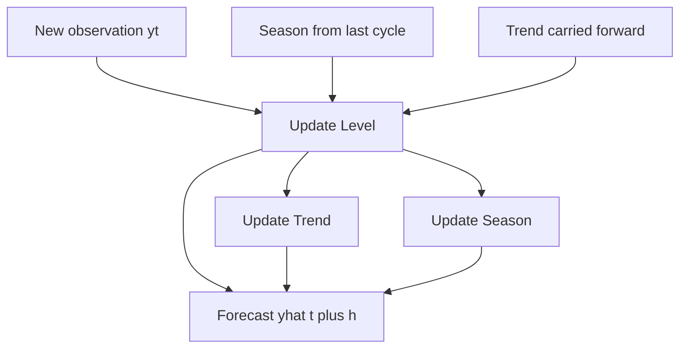
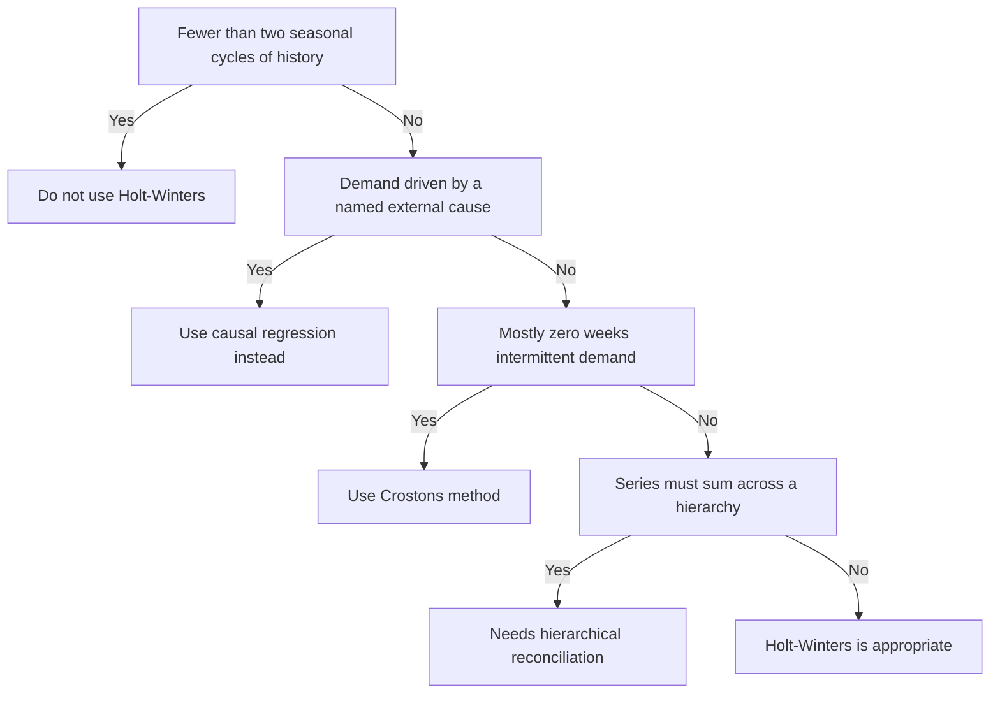

# Holt-Winters & Seasonality

Week 3 gave you simple exponential smoothing (SES): one smoothing equation, one parameter `alpha`, tracking a level that drifts slowly. SES is a great default and a terrible fit for one specific, common shape of demand: a series that is both **trending** (structurally rising or falling over time, not just noisy) and **seasonal** (repeating a shape every fixed number of periods — every 52 weeks, every 12 months, every 7 days). Point SES at a trended-and-seasonal series and it lags every peak, undershoots every trough, and its forecast horizon flattens into a straight line the moment you ask it to look more than a few periods ahead — because SES has nowhere to put "this always spikes in December" or "this has been growing 2 units a week for a year." Holt-Winters gives it three places to put exactly that.

## 1. Three components, three equations

Holt-Winters (formally: **triple exponential smoothing**, after Charles Holt and Peter Winters, 1960s) tracks three separate, slowly-updating pieces of the series instead of one:

- **Level** (`L`) — where the series would sit with trend and season stripped out. Same idea as SES's single smoothed value.
- **Trend** (`T`) — the structural slope: how much the level itself is rising or falling each period.
- **Season** (`S`) — a repeating additive or multiplicative offset, one value per position in the cycle (one per week-of-year, if `seasonal_periods=52`).

Each has its own smoothing weight — `alpha` for level, `beta` for trend, `gamma` for season — each between 0 and 1. A weight near 1 means "trust the newest observation almost completely, forget the past fast." A weight near 0 means "barely update this component — the historical estimate is already good and new noise shouldn't move it."



*Level, trend, and season each update from the other two, then combine into the forecast.*

**Additive form** (use when the seasonal swing stays roughly the same absolute size regardless of the trend level — our jacket data, and most retail demand at moderate growth rates):

```
Level:     L_t = alpha * (y_t - S_{t-m}) + (1 - alpha) * (L_{t-1} + T_{t-1})
Trend:     T_t = beta  * (L_t - L_{t-1})  + (1 - beta)  * T_{t-1}
Season:    S_t = gamma * (y_t - L_t)      + (1 - gamma) * S_{t-m}
Forecast:  yhat_{t+h} = L_t + h*T_t + S_{t+h-m}
```

`m` is the season length (52 for weekly-with-yearly-seasonality data). Read the level equation carefully: it blends the *deseasonalized* new observation (`y_t - S_{t-m}`, last period's seasonal estimate stripped out) with what the model already expected (`L_{t-1} + T_{t-1}`, last period's level carried forward by last period's trend). That's the whole trick — each equation only ever updates using the *other two* components held fixed, which is why the three interact and eventually settle into a stable read on the series' shape.

**Multiplicative form** swaps every `+`/`-` around the seasonal term for `*`/`/` — use it when the seasonal swing scales *with* the level (a SKU that does +40% at peak whether its baseline is 100 units or 1,000 units). Multiplicative also guarantees the model can't forecast a negative number, which additive can if a trough coincides with a low level — worth knowing if you ever see a nonsensical negative forecast out of an additive fit.

## 2. Fitting it: our trended, winter-peaking jacket

`JCK-100` (Alpine Shell Jacket), Northeast region, weekly units for three years — trending up ~0.35 units/week structurally, peaking every winter, with promo-driven spikes layered on top. This is exactly the shape SES cannot handle.

```python
import pandas as pd
from statsmodels.tsa.holtwinters import ExponentialSmoothing

df = pd.read_sql(
    "SELECT week_start, units FROM weekly_demand "
    "WHERE sku = 'JCK-100' AND region = 'Northeast' ORDER BY week_start",
    con=engine,
)
s = df.set_index("week_start")["units"]
s.index = pd.DatetimeIndex(s.index).to_period("W-MON").to_timestamp()
s = s.asfreq("W-MON")          # forces a strict weekly frequency — Holt-Winters needs one

train, test = s.iloc[:-13], s.iloc[-13:]   # holdout: last 13 weeks, same discipline as Week 3

fit = ExponentialSmoothing(
    train,
    trend="add", damped_trend=True,
    seasonal="add", seasonal_periods=52,
    initialization_method="estimated",
).fit(optimized=True, use_brute=True)

print(fit.params[["smoothing_level", "smoothing_trend", "smoothing_seasonal", "damping_trend"]])
```

On our data this converges to:

```
alpha (level)     0.103
beta  (trend)     0.103
gamma (season)    0.000
phi   (damping)   0.833
```

Two things worth stopping on:

**`gamma ≈ 0` is not a broken fit — it's a real finding.** It means: once the optimizer has a good read on the seasonal shape from the first couple of cycles, letting new observations nudge it further doesn't reduce error — the seasonal pattern in this data is *stable* year to year, so the best move is to barely touch it and let noise wash out rather than chase it. If you saw `gamma` pinned at 0 on a series where you *know* the seasonal shape is drifting (say, a SKU whose peak is shifting earlier every year as a promo calendar shifts), that would be the signal to distrust the fit or force a higher `gamma` — but here it's the model correctly recognizing a stable pattern. Don't assume `gamma ≈ 0` always means "no seasonality" — check the seasonal component values themselves (`fit.season_`) before concluding that; a flat *weight* and a flat *component* are different things.

**Damped trend (`phi = 0.833`)** multiplies the trend's contribution by `phi` at each step into the future, so a 13-week-ahead forecast doesn't extrapolate the trend at full strength forever — it tapers. This matters because a straight, undamped trend line is a dangerous thing to trust 6+ months out: it assumes whatever growth rate you measured over the last year continues forever, which is rarely true of real product demand (it plateaus, a competitor launches, the category matures). Damping is the built-in admission that "the trend is real, but I shouldn't bet the farm on it continuing indefinitely." Set `damped_trend=True` any time your forecast horizon is more than a few periods past what you've observed.

## 3. Scoring it against Week 3's baselines

Same holdout, same MAPE formula as Week 3 — this is the whole point of a consistent evaluation harness:

```python
import numpy as np

fc = fit.forecast(13)
mape = (np.abs((test.values - fc.values) / test.values)).mean() * 100
print(f"Holt-Winters MAPE: {mape:.2f}%")
```

| Model | 13-week holdout MAPE |
|---|---:|
| Seasonal naive (`y_t` = same week last year) | 17.31% |
| Simple exponential smoothing (level only, no trend/season) | 14.46% |
| **Holt-Winters (damped trend, additive season)** | **12.33%** |

Holt-Winters wins here, and *why* it wins is the teachable part: seasonal naive gets the seasonal shape right but completely ignores that the series has grown since a year ago — every forecast is roughly a full trend-year too low. SES tracks the recent level well but has no seasonal component at all, so it forecasts a flat line into a series that's about to swing up for winter. Holt-Winters is the first model this course has shown you that can hold *both* facts at once. That's the entire argument for triple exponential smoothing over its simpler cousins: it's not "better" in the abstract, it's better **specifically when the series has both a trend and a stable season**, which you check by looking at the plot before you pick a model, not after.

## 4. A hard prerequisite: two full seasonal cycles, minimum

Try fitting Holt-Winters on a series shorter than `2 * seasonal_periods` and `statsmodels` refuses outright:

```
ValueError: Cannot compute initial seasonals using heuristic method
with less than two full seasonal cycles in the data.
```

This isn't a software limitation you can configure around — it's a real statistical constraint. With `seasonal_periods=52`, the model needs to see the seasonal pattern repeat at least twice to tell the difference between "this week is unusually high because of the season" and "this week is unusually high because the whole series happens to be trending up right now." One cycle can't distinguish trend from season; two (barely) can; three or more (which is why this week's data spans 156 weeks) gives the optimizer enough signal to fit `gamma` with any confidence. If a SKU in your own work has under two years of weekly history, Holt-Winters with `seasonal_periods=52` is off the table — fall back to SES with a manually-applied seasonal index, or wait for more data, or use monthly buckets (`seasonal_periods=12`) if that gets you to two cycles faster.

## 5. Diagnosing the fit, not just trusting it

Three checks before you ship a Holt-Winters forecast:

**Residual plot.** Plot `train - fit.fittedvalues`. It should look like noise scattered around zero with no visible pattern — a residual plot with a remaining wave shape means the seasonal component didn't fully capture the seasonality (wrong `seasonal_periods`, or the series has two overlapping seasonal cycles, e.g., weekly *and* day-of-month, that one seasonal term can't represent).

```python
resid = train - fit.fittedvalues
resid.plot(title="Holt-Winters residuals — should look like noise")
```

**Error growth with horizon.** Compute MAPE separately for weeks 1–4, 5–8, 9–13 of the holdout instead of one blended number. A model that's accurate at 1 week out and falls apart by week 13 is telling you something real: trust it for near-term replenishment decisions, distrust it for a 3-month capacity plan. This is more informative than a single blended MAPE and takes one extra line of code.

**Compare `seasonal="add"` vs. `seasonal="mul"`.** Fit both, compare holdout MAPE. On this jacket data, additive wins (its seasonal swing is a roughly fixed number of units regardless of trend level); a fast-growing SKU where the swing scales with volume would favor multiplicative. Don't guess — fit both in under a minute and let the holdout decide.

## 6. Prediction intervals, not just a point forecast

A single forecast number invites false confidence. `statsmodels` can simulate the fitted model forward to get a distribution of plausible outcomes, which is what you actually want for a safety-stock or capacity decision (more on this in Week 5):

```python
sims = fit.simulate(nsimulations=13, repetitions=500, error="add")
lower = sims.quantile(0.05, axis=1)
upper = sims.quantile(0.95, axis=1)
```

Report a range (`[lower, upper]`) alongside the point forecast whenever the forecast feeds a decision with real cost on both sides of being wrong — which, in this course, is every decision. A planner who only ever sees a point forecast has no way to reason about how much buffer to hold; a planner who sees "182 units, 90% interval [140, 231]" can.

## 7. When Holt-Winters is the wrong tool

- **Fewer than two seasonal cycles of history** — see §4. No amount of tuning fixes insufficient data.
- **Demand driven mainly by an external cause you can name** — price, promotion, a competitor stockout. Holt-Winters only ever looks at the series' own past values; if promotions move more volume than the calendar does, you need Lecture 2's regression approach, which can take a promo flag as an explicit input.
- **Intermittent demand** (mostly zeros, occasional spikes) — the level/trend/season decomposition assumes a roughly continuous series. A SKU with 65% zero-weeks needs Croston's method (Challenge 1), not Holt-Winters.
- **A hierarchy of series that must sum correctly** — fitting Holt-Winters independently per SKU and per region gives you numbers that, added up, usually don't match a Holt-Winters fit on the total. That's Challenge 2's problem, not this lecture's.



*Working through the four disqualifiers before trusting a Holt-Winters fit.*

Next: [Lecture 2 — Causal & Feature-Based Forecasting](./02-causal-and-feature-based-forecasting.md), where price and promotions — not just the calendar — become forecast inputs.
