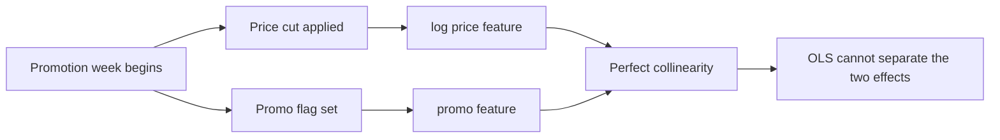

# Causal & Feature-Based Forecasting

Every model so far — naive, moving average, SES, Holt-Winters — is a **time-series model**: it only ever looks at the series' own past values (and, for Holt-Winters, the calendar position within a cycle). None of them can answer "what happens to demand if we run a promotion next week?" because none of them have any concept of *promotion* as an input — they only know what demand did, not *why*. This lecture turns demand history into a **supervised learning problem**: one row per week, a target column (`units`), and a set of feature columns (price, promotion, calendar position) that *cause* demand to move. That reframing is what makes regression — and every ML method in Lecture 3 — able to answer "what if" questions that a pure time-series model structurally cannot.

## 1. From a series to a feature matrix

A time series is one column indexed by date. A supervised-learning table is many columns, one row per date, each column a candidate explanation:

```python
import pandas as pd, numpy as np

df = pd.read_sql(
    "SELECT week_start, units, unit_price, promo_flag, holiday_flag "
    "FROM weekly_demand WHERE sku = 'JCK-100' AND region = 'Northeast' "
    "ORDER BY week_start",
    con=engine,
)
d = df.copy()
d["t"] = np.arange(len(d))                                   # linear trend term
d["weekofyear"] = pd.to_datetime(d["week_start"]).dt.isocalendar().week.astype(int)
d["sin52"] = np.sin(2 * np.pi * d["weekofyear"] / 52)         # calendar position, smooth
d["cos52"] = np.cos(2 * np.pi * d["weekofyear"] / 52)         # (sin+cos pair avoids a week-53 seam)
d["log_price"] = np.log(d["unit_price"])                      # log price → coefficient reads as %-elasticity
d["promo"] = d["promo_flag"].astype(int)
d["holiday"] = d["holiday_flag"].astype(int)
```

**Why `sin`/`cos` instead of a raw `weekofyear` integer?** A raw integer tells the model week 52 and week 1 are 51 apart, when on a calendar they're adjacent (December into January). Wrapping week-of-year onto a circle with a sine/cosine pair fixes that discontinuity — this is the standard trick ("cyclical encoding") any time a feature genuinely wraps around, and it will come back in Lecture 3 for the ML features too.

**Why `log(price)` instead of raw price?** A coefficient on raw price reads as "N units per dollar," which isn't comparable across SKUs with different price points. A coefficient on **log** price reads as roughly "N units per 1% price change" — a semi-elasticity — which *is* comparable, and is the standard way economists and pricing teams report price sensitivity.

## 2. Fit it — and get a coefficient that's backwards

```python
import statsmodels.api as sm

X = d[["t", "log_price", "promo", "holiday", "sin52", "cos52"]]
X = sm.add_constant(X)
y = d["units"]

train = d["t"] < len(d) - 13
model = sm.OLS(y[train], X[train]).fit()
print(model.summary())
```

The fit looks strong — R² = 0.94 on training data — and every coefficient is statistically significant. But look at the sign on price:

```
              coef    std err       t      P>|t|
log_price   34.7126     0.482     72.038    0.000
promo       52.8188     3.607     14.642    0.000
```

**A positive coefficient on price says "raising the price sells more units."** That's economically backwards for a normal good, and if you shipped this model's coefficient to a pricing team as "price elasticity," you'd be handing them a number that recommends the opposite of what's actually true. Before touching the model further: **always sanity-check a causal coefficient's sign against domain knowledge before trusting its magnitude.** A statistically significant coefficient with the wrong sign is not a strong result — it's a red flag.

## 3. Diagnosing why: collinearity between price and promo

The cause here is structural, and it's worth finding with a real diagnostic rather than just eyeballing it — **variance inflation factor (VIF)**, which measures how much a feature's variance is inflated because it's linearly predictable from the *other* features:

```python
from statsmodels.stats.outliers_influence import variance_inflation_factor

vif = pd.DataFrame({
    "feature": X.columns,
    "VIF": [variance_inflation_factor(X.values, i) for i in range(X.shape[1])],
})
print(vif)
```

```
  feature    VIF
  log_price   inf
  promo       inf
```

An infinite VIF means **perfect collinearity** — one feature is an exact linear function of another. Check the correlation directly and it's obvious why:

```python
d["log_price"].corr(d["promo"])   # -0.9999999999999999
```

In this dataset, every promo week is *also* a price-cut week (from $129 to $99) — by construction, promotion and price move together with zero independent variation. That means OLS cannot tell "the promo dummy's effect" apart from "the price cut's effect" — it's mathematically the same question asked twice, and the solver arbitrarily splits one combined effect across two redundant columns, producing coefficients that are individually meaningless even though the *combined* prediction is fine. This is the single most common way causal regressions go wrong in real operations data: promotions almost always *bundle* a price cut with a display placement, extra marketing, and sometimes a bundle deal, all launching in the same week — so any one of those levers, modeled alone, will pick up credit that actually belongs to the others.



*One real-world cause splitting into two redundant columns confuses the regression.*

**The fix here: drop the redundant column and keep the one you can act on independently.** Since `promo` and `log_price` carry the same information in this data, keep `log_price` alone — it's the more granular signal (a continuous price rather than a 0/1 flag) — and re-fit:

```python
X2 = d[["t", "log_price", "holiday", "sin52", "cos52"]]
X2 = sm.add_constant(X2)
model2 = sm.OLS(y[train], X2[train]).fit()
```

```
              coef    std err       t      P>|t|
log_price  -164.8352    13.716    -12.018    0.000
```

Now the sign is right, and the magnitude is interpretable: `-164.8` per unit of `log(price)` means roughly **a 1% price increase predicts −1.65 units/week** on a series averaging ~192 units/week — about a −0.9% demand response per +1% price change (a semi-elasticity a bit below 1 in magnitude: this SKU is price-*inelastic*, consistent with a mid-market outdoor jacket with loyal buyers). R² and holdout accuracy are **unchanged** (0.938 train R², 6.89% holdout MAPE, identical to the broken model) — dropping a perfectly redundant column never costs you predictive power, because it wasn't adding any information the model didn't already have through its twin. What it costs you, if you leave it in, is the ability to *interpret* the coefficient at all.

**The general lesson, independent of this dataset:** a regression can have excellent fit and useless — or actively misleading — coefficients at the same time. Fit quality (R², holdout MAPE) tells you whether the model predicts well. It tells you *nothing* about whether any individual coefficient means what it looks like it means. Those are two different questions, and feature-based forecasting requires answering both, every time, before you let anyone treat a coefficient as "the effect of X."

## 4. Scoring the fixed model against the holdout

```python
pred = model2.predict(X2[~train])
actual = y[~train]
mape = (np.abs((actual.values - pred.values) / actual.values)).mean() * 100
print(f"Regression holdout MAPE: {mape:.2f}%")   # 6.89%
```

| Model | 13-week holdout MAPE |
|---|---:|
| Seasonal naive (Week 3) | 17.31% |
| Holt-Winters (Lecture 1) | 12.33% |
| **Regression on price + calendar features** | **6.89%** |

The regression wins by a wide margin here — but notice *why*: this particular SKU's demand is genuinely driven by price and a strong, stable annual cycle that `sin52`/`cos52` capture cleanly, so a model that's handed those exact drivers as inputs has an advantage no time-series-only model can match. That advantage evaporates the moment you don't know next week's price or promotion plan in advance. **Regression forecasts require you to supply future values of every feature** — you must already know next week's planned price and promo calendar to forecast next week's demand. That's realistic for price and promo (merchandising sets those calendars weeks ahead) but not for every feature you might want to include — you can't forecast next week's *weather* to feed a weather-driven demand model unless you also have a weather forecast, and forecast-of-a-forecast error compounds.

## 5. What to include, and a caution about overfitting the feature list

Good candidate features for operations demand:

- **Price** (log-transformed) — almost always available in advance from the pricing calendar.
- **Promotion flags** — but watch for exactly the collinearity trap above; if promo always bundles with a price cut, you likely only need one of the two.
- **Calendar position** (`sin`/`cos` of week-of-year, day-of-week, or day-of-month) — captures recurring seasonality without needing a full Holt-Winters seasonal component.
- **Holidays** — a dummy per holiday, or per holiday-week, if demand shifts around it (Thanksgiving pulls grocery demand earlier in the week, for instance).
- **A trend term** (`t`) — only if you believe the trend is structural (real, ongoing category growth) rather than a temporary blip; an unnecessary trend term will extrapolate a growth rate that was actually a one-off spike.

Resist the urge to throw in every column you have. Each added feature is one more coefficient the model must estimate from a finite amount of data, and one more chance to introduce collinearity like the one above. A feature-based model with 5 well-chosen, independently-varying drivers usually **out-generalizes** one with 20 loosely-related columns, even if the 20-column model's *training* R² looks higher — that gap between training fit and holdout accuracy is the overfitting Lecture 3 will teach you to detect systematically with rolling-origin backtesting.

Next: [Lecture 3 — ML Forecasting & Backtesting](./03-ml-forecasting-and-backtesting.md), where a tree ensemble learns nonlinear interactions between these same features — and you learn to backtest it so its reported accuracy isn't a mirage.
