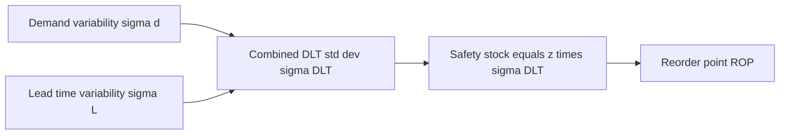

# Lecture 2 — Safety Stock & Service Levels

> **Duration:** ~2 hours. **Outcome:** you can distinguish cycle-service level from fill rate, compute the standard deviation of demand during lead time from separate demand and lead-time variability, size safety stock to a target service level using a z-score, and compute a reorder point — all in SQL and pandas.

Lecture 1 assumed demand and lead time were perfectly known, which let EOQ answer "how much do we order." It said nothing about "when do we order," because in a world with zero uncertainty, you'd simply order exactly when you were about to hit zero and the replacement would arrive exactly on time. Nothing at Crunch Gear works that way — daily demand for a wool beanie bounces around, and the supplier's 9-day lead time is sometimes 7 days, sometimes 13. **Safety stock** is the buffer you carry specifically to absorb that uncertainty, and this lecture is about sizing it precisely instead of guessing.

## 1. Two different definitions of "service level"

People say "service level" casually, but there are (at least) two mathematically different things it can mean, and mixing them up produces stocking policies that are quietly wrong.

### Cycle-service level (CSL)

**The probability that you do *not* stock out during one replenishment cycle** (the period from placing an order to the next order's arrival). A 95% CSL means: across 100 reorder cycles, you expect to run out of stock in about 5 of them — it does not matter whether that stockout was 1 unit short or 200 units short. CSL is an **event probability** — did a stockout happen at all, yes or no.

### Fill rate

**The fraction of *units of demand* satisfied immediately from stock**, across all demand, not per cycle. A 95% fill rate means 95% of all units ordered by customers over the year shipped immediately; the other 5% were backordered or lost. Fill rate is a **magnitude** measure — a cycle that stocks out by 1 unit barely dents the fill rate; a cycle that stocks out by 200 units dents it a lot.

**These numbers are not the same, and fill rate is almost always higher than CSL for the same policy**, because most stockouts, when they happen, are small relative to the total volume moving through the SKU. We'll see this concretely in section 5. Which one you should target depends on the business: a B2C site quoting "in stock" needs to think hard about CSL (customers see *a* stockout, not its size); a B2B distributor filling multi-unit orders cares more about fill rate (a partially-filled order is still mostly a good outcome). **This week's exercises and mini-project target cycle-service level**, the more common default and the simpler one to reason about — but you should know both exist and why they diverge, because a stakeholder will eventually ask for "99% service level" without specifying which one they mean, and you'll need to ask.

## 2. Demand during lead time — the thing that can actually run out

Safety stock exists to cover uncertainty **during the lead time** — the window between placing a reorder and the replacement arriving. Before the order is placed, you have plenty of runway; after it arrives, you're refilled. It's specifically the demand that shows up *while you're waiting* that safety stock has to absorb.

**Demand during lead time (DLT)** is itself a random variable, and its uncertainty comes from **two independent sources**:

1. **Demand variability** — daily demand isn't constant; it has a standard deviation `σ_d`.
2. **Lead-time variability** — the supplier doesn't always deliver in exactly `L` days; lead time itself has a standard deviation `σ_L`.

If daily demand and lead time are independent and both roughly normal, the combined standard deviation of demand during lead time is:

```
σ_DLT = sqrt( L * σ_d²  +  d̄² * σ_L² )
```

where `d̄` is mean daily demand and `L` is mean lead time in days. Read the two terms:

- `L * σ_d²` — demand variability, scaled up by how many days you're exposed to it (more days waiting = more chances for demand to run hot).
- `d̄² * σ_L²` — lead-time variability, scaled by how much demand typically flows *per day* (a volatile lead time is worse for a fast-moving SKU than a slow one, because more average daily volume gets multiplied by the lead-time swing).

**In most real operations, the second term dominates.** A supplier who's late by 3 days on a fast-moving SKU exposes you to 3 extra days of full-rate demand — often a bigger hit than day-to-day demand noise. This is exactly why supplier reliability (Week 6) matters as much as demand forecasting (Weeks 3–4) to how much safety stock you end up carrying.


*How two independent sources of uncertainty combine into safety stock and the reorder point.*

## 3. Sizing safety stock to a z-target

Assume demand during lead time is approximately normal (a reasonable assumption for most retail SKUs with `d̄` not too close to zero; for very slow movers, use the newsvendor approach from Lecture 3 instead). Then safety stock is simply:

```
SS = z * σ_DLT
```

where `z` is the number of standard deviations above the mean that puts you at your target cycle-service level, read off the standard normal distribution.

| Target CSL | z |
|---|---|
| 50% | 0.00 |
| 80% | 0.84 |
| 85% | 1.04 |
| 90% | 1.28 |
| 95% | 1.645 |
| 97.5% | 1.96 |
| 98% | 2.05 |
| 99% | 2.33 |
| 99.5% | 2.58 |
| 99.9% | 3.09 |

Notice how `z` **accelerates** as the target service level climbs — going from 95% to 99% adds about 0.69 to `z`, but going from 99% to 99.9% adds about 0.76 more, for a smaller absolute gain in service. This is the mathematical reason "just carry more safety stock to be safe" gets expensive fast: **the marginal cost of the last percentage point of service is always the highest.** A 99.9% service level costs roughly **1.9x** the safety stock of a 95% target for the same SKU (3.09/1.645 ≈ 1.88) — for a difference of less than 5 percentage points of service.

## 4. The reorder point

Once you have safety stock, the **reorder point (ROP)** — the inventory level that triggers a new order — is just the expected demand during lead time, plus the buffer:

```
ROP = d̄ * L  +  SS  =  d̄ * L  +  z * σ_DLT
```

`d̄ * L` covers the *expected* demand while you wait for the replacement order; `SS` covers the chance that actual demand during that wait runs above expectation.

## 5. Worked example — Insulated Water Bottle (SKU 8)

| Input | Value |
|---|---|
| Annual demand `D` | 12,000 units/year |
| Mean daily demand `d̄` | 12,000 / 365 ≈ 32.88 units/day |
| Daily demand std dev `σ_d` | 22.0 units |
| Mean lead time `L` | 15 days |
| Lead-time std dev `σ_L` | 2.0 days |

**Step 1 — combined DLT standard deviation:**

```
σ_DLT = sqrt(L * σ_d² + d̄² * σ_L²)
      = sqrt(15 * 22.0² + 32.88² * 2.0²)
      = sqrt(15 * 484 + 1081.1 * 4)
      = sqrt(7,260 + 4,324.4)
      = sqrt(11,584.4)
      ≈ 107.6 units
```

**Step 2 — safety stock at a 95% cycle-service level** (`z` = 1.645):

```
SS = 1.645 * 107.6 ≈ 177.0 units
```

**Step 3 — reorder point:**

```
ROP = d̄*L + SS = (32.88 * 15) + 177.0 = 493.2 + 177.0 ≈ 670 units
```

**Reading it in plain English:** when Crunch Gear's on-hand-plus-on-order count of Insulated Water Bottles drops to 670 units, place a new order. 493 of those units cover expected demand during the ~15-day wait; the extra 177 units are the buffer against a supplier running late or demand running hot.

**Now push the target to 99%** (`z` = 2.33) and watch the cost of extra service:

```
SS_99 = 2.33 * 107.6 ≈ 250.7 units      (+42% more safety stock than the 95% target)
ROP_99 = 493.2 + 250.7 ≈ 744 units
```

Going from 95% to 99% service costs **74 extra units** of standing safety stock for this one SKU. At `H = i*C = 0.20*18 = $3.60`/unit/year, that's `74 * 3.60 ≈ $266/year` in extra holding cost — on just one of ten SKUs — to buy 4 percentage points of service. Multiply that pattern across a real catalog of thousands of SKUs and "let's just be safe and target 99%" turns into a very expensive sentence.

## 6. Fill rate — why it's a harder number

CSL asks "did we stock out, yes/no." Fill rate asks "of all units demanded, what fraction shipped?" — which requires knowing not just *whether* you ran short but *by how much*, on average, when you do. That expected shortfall per cycle uses the **standard normal loss function**:

```
L(z) = φ(z) - z * (1 - Φ(z))
```

where `φ` is the standard normal density and `Φ` is the standard normal CDF. Then:

```
Expected shortage per cycle ≈ σ_DLT * L(z)
Fill rate ≈ 1 - (Expected shortage per cycle) / Q
```

For SKU 8 at `z` = 1.645 (95% CSL) and its EOQ (`Q* ≈ 632` units, from Lecture 1's method): `L(1.645) ≈ 0.0209`, so expected shortage per cycle `≈ 107.6 * 0.0209 ≈ 2.25 units`, and:

```
Fill rate ≈ 1 - 2.25/632 ≈ 0.9964 → 99.6%
```

**A 95% cycle-service level produced a 99.6% fill rate.** This is the general pattern: because `Q` is usually much larger than the typical shortfall, most stockouts are small relative to total volume, so fill rate reads much higher than CSL for the same policy. You won't compute `L(z)` by hand in the exercises — `scipy.stats.norm` gives it to you directly:

```python
from scipy.stats import norm

def normal_loss(z):
    return norm.pdf(z) - z * (1 - norm.cdf(z))

def fill_rate(z, sigma_dlt, Q):
    expected_shortage = sigma_dlt * normal_loss(z)
    return 1 - expected_shortage / Q
```

## 7. Computing safety stock and ROP for the whole catalog

**SQL** — everything except the normal `z`-value, which SQL doesn't compute natively, so you pass it in as a parameter per target service level:

```sql
-- Safety stock and ROP at a 95% cycle-service level, z = 1.645
SELECT
    sku_id,
    sku_name,
    ROUND(annual_demand / 365.0, 2)                                   AS daily_demand,
    ROUND(
        SQRT(
            lead_time_days * POWER(demand_std_daily, 2)
            + POWER(annual_demand / 365.0, 2) * POWER(lead_time_std_days, 2)
        ), 1
    )                                                                  AS sigma_dlt,
    ROUND(
        1.645 * SQRT(
            lead_time_days * POWER(demand_std_daily, 2)
            + POWER(annual_demand / 365.0, 2) * POWER(lead_time_std_days, 2)
        ), 0
    )                                                                  AS safety_stock,
    ROUND(
        (annual_demand / 365.0) * lead_time_days
        + 1.645 * SQRT(
            lead_time_days * POWER(demand_std_daily, 2)
            + POWER(annual_demand / 365.0, 2) * POWER(lead_time_std_days, 2)
        ), 0
    )                                                                  AS reorder_point
FROM skus
ORDER BY sku_id;
```

**pandas** — cleaner, and lets you sweep multiple service levels at once with `scipy.stats.norm.ppf`:

```python
from scipy.stats import norm

skus["daily_demand"] = skus["annual_demand"] / 365
skus["sigma_dlt"] = np.sqrt(
    skus["lead_time_days"] * skus["demand_std_daily"] ** 2
    + skus["daily_demand"] ** 2 * skus["lead_time_std_days"] ** 2
)

for csl in [0.90, 0.95, 0.99]:
    z = norm.ppf(csl)
    skus[f"ss_{int(csl*100)}"] = z * skus["sigma_dlt"]
    skus[f"rop_{int(csl*100)}"] = skus["daily_demand"] * skus["lead_time_days"] + skus[f"ss_{int(csl*100)}"]

print(skus[["sku_name", "sigma_dlt", "ss_90", "ss_95", "ss_99"]].round(1))
```

`norm.ppf(0.95)` returns 1.6448..., matching the table in section 3 — that's the "percent point function," the inverse of the CDF, exactly the tool for turning a target probability into a z-score.

## 8. Check yourself

- In your own words, what's the difference between cycle-service level and fill rate? Which one is usually the higher number, and why?
- Why does `σ_DLT` depend on *both* demand variability and lead-time variability, and why does lead-time variability usually matter more?
- What does the reorder point formula `ROP = d̄*L + SS` represent in plain English — what does each term cover?
- Why does `z` grow faster than the service-level target as you push toward 99.9%? What does that mean for the cost of "just being extra safe"?
- If you doubled a SKU's lead-time standard deviation `σ_L` and left everything else the same, would `σ_DLT`, and therefore safety stock, more than double, less than double, or exactly double? (Hint: look at where `σ_L` sits inside the square root.)

Lecture 3 takes the ROP you just learned to compute and turns it into an actual **reorder policy** — and introduces the newsvendor model for the one case where "reorder" doesn't apply at all.

## Further reading

- **SciPy — `scipy.stats.norm` (pdf, cdf, ppf):** <https://docs.scipy.org/doc/scipy/reference/generated/scipy.stats.norm.html>
- **PostgreSQL — Mathematical functions:** <https://www.postgresql.org/docs/current/functions-math.html>
- **APICS/ASCM — Safety stock and service level definitions:** <https://www.ascm.org/>
