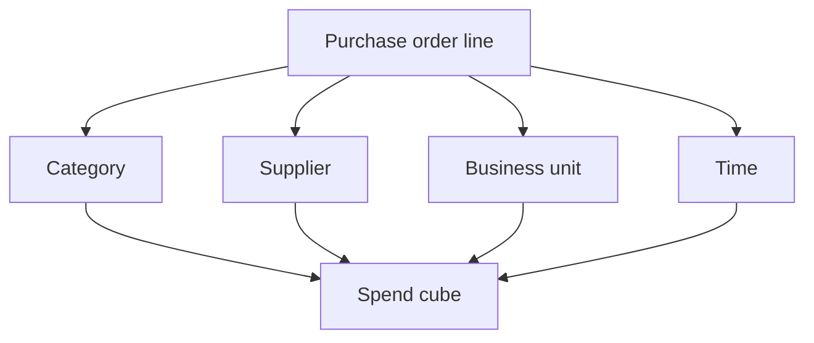
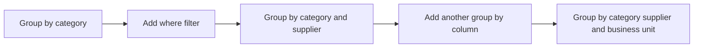

# Lecture 1 — Spend Analysis & the Spend Cube

> **Duration:** ~2 hours. **Outcome:** You can build a spend cube in SQL — slicing purchase-order data by category, supplier, business unit, and time — and use it to find tail spend and maverick buying with real numbers, not a gut sense of "we probably spend too much with too many vendors."

Ask a VP of Procurement "how much do we spend, and with whom?" and you'd expect an instant answer. In most companies you don't get one — spend data is scattered across dozens of suppliers' invoices, three ERPs from two acquisitions, and at least one shared drive with a filename like `spend_FINAL_v3_useThisOne.xlsx`. **Spend analysis** is the discipline of pulling that scattered activity into one clean table and slicing it until the picture is obvious. The tool you build to do the slicing is called a **spend cube**, and this week you build one in SQL, on the seed data set up in this week's [README](../README.md).

## 1. What a spend cube actually is

A "cube" is a mental model, not a special database object: it's spend data you can slice along several independent **dimensions** at once — typically **category** (what was bought), **supplier** (who it was bought from), **business unit** (who bought it), and **time** (when). The "cube" metaphor comes from picturing those dimensions as the edges of a 3D or 4D box; in practice you build it as one clean, denormalized table and slice it with `GROUP BY`.


*Four independent dimensions, captured at the transaction level, combine into the spend cube.*

Our seed table, `purchase_orders`, is already shaped correctly — one row per PO line, with a category, supplier, business unit, and date already attached. This is the single most important habit in spend analysis: **capture the dimensions at the transaction level**, not after the fact. If your ERP lets a buyer create a PO with no category code, someone will, and your spend cube will have an "Uncategorized" slice that quietly swallows 20% of spend. (Real spend-analytics vendors spend most of their effort on **spend classification** — using rules or ML to backfill category codes onto messy historical AP data that was never tagged at time of purchase. You're spared that here because the seed data was tagged correctly from day one — treat that as the standard to hold your own systems to, not the norm you should expect.)

## 2. The first cut: total spend, no slicing

Always start here. It's the number every other number in this lecture will be a fraction of.

```sql
SELECT SUM(qty_ordered * unit_price) AS total_spend
FROM purchase_orders;
```

```
 total_spend
-------------
   843610.00
```

Crunch Gear spent **$843,610** with outside suppliers in Q1 2026. Note what this number deliberately excludes: freight is tracked separately in `freight_cost` and isn't part of "spend" in the classic procurement sense (spend = what you pay suppliers for goods/services; freight is often managed and reported by logistics, even though Lecture 3 folds it back in for total cost of ownership). Keep dimensions and cost categories that answer *different questions* in *separate columns* — don't collapse them into one number too early.

## 3. Slicing by category — the taxonomy view

A **category taxonomy** is the classification scheme procurement uses to group similar spend — usually 2–3 levels deep (e.g., "Direct Materials → Fabric → Technical Shells"). Our seed data uses a flat, single-level taxonomy for simplicity: `Fabric`, `CMT` (Cut-Make-Trim — the labor to sew garments), `Trims` (buttons, zippers, hardware), `Packaging`, and `MRO / Indirect` (maintenance/repair/operating supplies and other non-production purchases).

```sql
SELECT
    category,
    ROUND(SUM(qty_ordered * unit_price), 2) AS category_spend,
    ROUND(100.0 * SUM(qty_ordered * unit_price)
          / SUM(SUM(qty_ordered * unit_price)) OVER (), 1) AS pct_of_total
FROM purchase_orders
GROUP BY category
ORDER BY category_spend DESC;
```

```
    category     | category_spend | pct_of_total
------------------+-----------------+--------------
 Fabric           |       560000.00 |         66.4
 CMT              |       207450.00 |         24.6
 Packaging        |        40150.00 |          4.8
 Trims            |        32010.00 |          3.8
 MRO / Indirect   |         4000.00 |          0.5
```

`SUM(...) OVER ()` is a **window function** (Week 4) computing a grand total *without collapsing the rows* — it lets you compute "percent of total" in the same query instead of a second pass. Two-thirds of Crunch Gear's Q1 spend is raw fabric, another quarter is the labor to sew it into jackets — together, materials + CMT are 91% of everything the company buys. That's not a surprise for an apparel manufacturer, but it tells you exactly where analytical effort belongs: a 2% price improvement on Fabric is worth roughly **$11,200** this quarter; the same 2% on MRO/Indirect is worth **$80**. Category spend concentration is the first thing that should shape where you spend your own time this week.

## 4. Slicing by supplier — and finding the 80/20

Now the other dimension: who did the money go to?

```sql
SELECT
    supplier,
    ROUND(SUM(qty_ordered * unit_price), 2) AS supplier_spend
FROM purchase_orders
GROUP BY supplier
ORDER BY supplier_spend DESC;
```

Fifteen distinct suppliers received Crunch Gear's Q1 spend. Ranked from largest to smallest, with a running (cumulative) percentage — this is the **Pareto view**, named for the 80/20 rule (Vilfredo Pareto, observing that ~80% of Italy's land was owned by ~20% of the population):

```sql
WITH ranked AS (
    SELECT
        supplier,
        SUM(qty_ordered * unit_price) AS supplier_spend
    FROM purchase_orders
    GROUP BY supplier
)
SELECT
    supplier,
    ROUND(supplier_spend, 2) AS supplier_spend,
    ROUND(100.0 * SUM(supplier_spend) OVER (ORDER BY supplier_spend DESC)
          / SUM(supplier_spend) OVER (), 1) AS cumulative_pct
FROM ranked
ORDER BY supplier_spend DESC;
```

```
        supplier         | supplier_spend | cumulative_pct
--------------------------+-----------------+-----------------
 Alpine Weave Mills       |       351000.00 |            41.6
 Everest Textile Co.      |       157260.00 |            60.2
 Andes Stitch Works       |       101080.00 |            72.2
 Pacific Rim Garments     |        78250.00 |            81.5
 Highland Fabric Group    |        51740.00 |            87.6
 Northstar Apparel Mfg    |        28120.00 |            91.0
 EcoPack Solutions        |        21250.00 |            93.5
 ButtonWorks Supply       |        19920.00 |            95.9
 CartonWorks Inc          |        18900.00 |            98.1
 Zephyr Hardware Co.      |        12090.00 |            99.5
 QuickFix Facilities      |         1325.00 |            99.7
 Ace Industrial Parts     |         1135.00 |            99.8
 Rapid Print Co           |          610.00 |            99.9
 OfficeSupply Direct      |          550.00 |           100.0
 Bolt & Nut Supply Co     |          380.00 |           100.0
```

Look at the `cumulative_pct` column: the **top 4 of 15 suppliers (27% of the vendor base) account for 81.5% of spend.** This is the classic Pareto pattern spend analysts look for in every category. It matters for two opposite reasons:

- **Concentration risk** — 41.6% of total spend rides on a single fabric mill, Alpine Weave Mills. If Alpine has a fire, a quality escape, or a labor dispute, Crunch Gear doesn't have a "slightly worse quarter" — it has a production stoppage. Lecture 3 and this week's challenges build the dual-sourcing analysis that answers "how much of this concentration is worth paying to reduce?"
- **Leverage opportunity** — the flip side of concentration is negotiating power. A supplier that's 41.6% of your Fabric spend has a lot to lose if you walk; that's real leverage in a price or terms negotiation, if you choose to use it.

## 5. Tail spend and maverick buying

The bottom of that same list — the 11 suppliers below Pacific Rim Garments, together just **18.5%** of spend — is what procurement calls **tail spend**: a long tail of small, fragmented purchases spread across many vendors, none individually large enough to justify a negotiated contract, a preferred-supplier agreement, or even much scrutiny.

Tail spend isn't inherently bad — someone genuinely needs a $290 office-supply order sometimes — but it's where **maverick buying** hides: purchases made outside negotiated contracts and preferred-supplier agreements, at whatever price a one-off vendor happens to quote, with no volume leverage and no quality vetting. Our seed data flags this explicitly with `maverick_buy`:

```sql
SELECT
    COUNT(*) AS maverick_po_count,
    COUNT(DISTINCT supplier) AS distinct_maverick_suppliers,
    ROUND(SUM(qty_ordered * unit_price), 2) AS maverick_spend,
    ROUND(100.0 * SUM(qty_ordered * unit_price)
          / (SELECT SUM(qty_ordered * unit_price) FROM purchase_orders), 2) AS pct_of_total_spend
FROM purchase_orders
WHERE maverick_buy = TRUE;
```

```
 maverick_po_count | distinct_maverick_suppliers | maverick_spend | pct_of_total_spend
--------------------+------------------------------+-----------------+---------------------
                  8 |                            5 |         4000.00 |                0.47
```

Eight purchase orders, five different one-off vendors, less than half a percent of total spend — this looks trivial in dollars, and by itself it is. But the diagnostic value of tracking maverick buying isn't the dollar amount of *this* quarter's instances — it's the **pattern**: every one of these went through a different vendor with no negotiated rate, no consolidated invoice, and (in a real ERP) usually no purchase-order approval workflow at all, just an expense report. If this pattern is allowed to scale — if "MRO / Indirect" grows from 0.5% of spend to 8% of spend as the company grows, still scattered across dozens of uncontracted vendors — the company is quietly leaving 10–20% savings on the table that **category consolidation** (negotiating one contract with one or two preferred MRO vendors) would have captured for free. Spotting the *pattern* early, while the dollars are still small, is the whole point of watching this slice every quarter.

## 6. Slicing by business unit and by month

Two more dimensions, same technique — swap the `GROUP BY` column:

```sql
SELECT business_unit, ROUND(SUM(qty_ordered * unit_price), 2) AS bu_spend
FROM purchase_orders
GROUP BY business_unit
ORDER BY bu_spend DESC;
```

```
   business_unit   | bu_spend
--------------------+-----------
 Outerwear          | 767380.00
 Fulfillment & Ops  |  44150.00
 Accessories        |  32080.00
```

```sql
SELECT
    DATE_TRUNC('month', order_date)::date AS spend_month,   -- SQLite: strftime('%Y-%m', order_date)
    ROUND(SUM(qty_ordered * unit_price), 2) AS monthly_spend
FROM purchase_orders
GROUP BY spend_month
ORDER BY spend_month;
```

Outerwear is 91% of all spend — expected, since it's Crunch Gear's core product line, but worth stating in dollars rather than assumption: if a cost-reduction initiative needs a home, Outerwear is where the dollars are. The month-over-month view (which you'll finish in Exercise 1) answers a different question: is spend flat, seasonal, or trending — the first signal you'd need before negotiating volume-based pricing tiers with a supplier.

## 7. Building the full cube: multiple dimensions at once

Real spend cubes cross two or more dimensions in one query, so you can ask compound questions like "which supplier is driving Outerwear's Fabric spend, and is it concentrated or spread out?"

```sql
SELECT
    business_unit,
    category,
    supplier,
    ROUND(SUM(qty_ordered * unit_price), 2) AS spend
FROM purchase_orders
WHERE business_unit = 'Outerwear' AND category = 'Fabric'
GROUP BY business_unit, category, supplier
ORDER BY spend DESC;
```

This is the pattern behind every "drill-down" you've seen in a BI dashboard — start broad (`GROUP BY category`), then add a `WHERE` filter and another `GROUP BY` column to zoom in. You'll build the full multi-dimensional cube — category × supplier × business unit × month, all in one result set using `GROUPING SETS` or `ROLLUP` — in Exercise 1.


*Drilling down: start broad, filter, then add grouping columns to zoom in.*

## 8. Check yourself

- What's the difference between a spend *category* and a spend *cube*? Could you have one without the other?
- Why does the lecture compute "percent of total spend" with a window function instead of two separate queries?
- Crunch Gear's top 4 suppliers are 81.5% of spend. Is that concentration a problem, an opportunity, both, or neither — and what would you need to know to decide?
- What makes a purchase "maverick" — is it about the dollar amount, the supplier, or something else?
- If MRO/Indirect tail spend grew from 0.5% to 8% of total spend next year with the same fragmentation pattern, what specific procurement action would you recommend, and roughly how much would you expect it to save?

If those are automatic, Lecture 2 moves from "where does the money go" to "which suppliers are actually worth the money" — building the weighted scorecard that turns raw order-and-receipt data into a single defensible supplier score.

## Further reading

- **CIPS (Chartered Institute of Procurement & Supply) — "What is Spend Analysis?":** <https://www.cips.org/intelligence-hub/procurement/spend-analysis> — a practitioner-level overview of spend analysis as a discipline, including classification and taxonomy design.
- **ISM (Institute for Supply Management) — Glossary, "Tail Spend" and "Maverick Buying":** <https://www.ismworld.org/supply-management-news-and-reports/news-publications/inside-supply-management-magazine/glossary-of-key-supply-chain-terms/> — standard industry definitions this lecture follows.
- **PostgreSQL — Window Functions:** <https://www.postgresql.org/docs/current/tutorial-window.html> — the `SUM(...) OVER (...)` pattern used throughout this lecture.
- **PostgreSQL — `GROUPING SETS`, `CUBE`, and `ROLLUP`:** <https://www.postgresql.org/docs/current/queries-table-expressions.html#QUERIES-GROUPING-SETS> — the real multi-dimensional cube syntax you'll use in Exercise 1.
