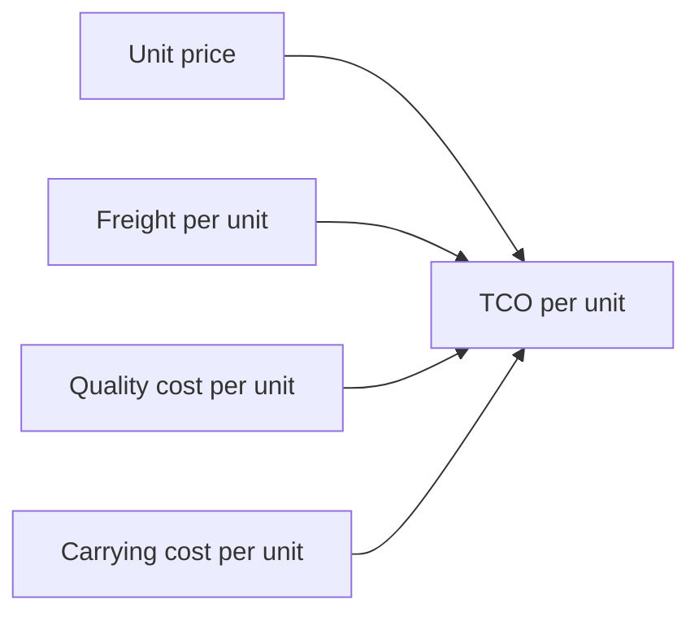

# Lecture 3 — Total Cost of Ownership & Sourcing Strategy

> **Duration:** ~2 hours. **Outcome:** You can build a total-cost-of-ownership (TCO) model that adds freight, quality cost, and inventory-carrying cost to unit price; quantify exactly how much extra safety stock a supplier's lead-time variability forces onto you; and reason clearly about single- vs. multi-source trade-offs.

Lecture 2 scored Pacific Rim Garments below Andes Stitch Works — but Pacific Rim's unit price ($20.867) is genuinely lower than Andes's ($22.462). If a category manager only looks at the price column, Pacific Rim wins easily. **Total cost of ownership (TCO)** is the discipline of refusing to stop at unit price — it asks what a purchase *actually costs* once you add every cost the low unit price is hiding. Sometimes TCO flips the decision entirely. Sometimes, like today's example, it doesn't flip the decision but *changes how confident you should be in it*. Both outcomes are useful, and you need the model to tell them apart.

## 1. What unit price leaves out

A purchase order's unit price captures exactly one thing: what you pay the supplier per unit, at the moment of shipment. It says nothing about:

- **Freight** — inbound transportation cost, which varies by supplier location, shipment size, and mode, and is billed separately from the goods themselves.
- **Quality cost** — the cost of every defective unit that has to be reworked, replaced, or (worse) makes it all the way to a customer as a return.
- **Carrying cost of extra safety stock** — the inventory a supplier's *lead-time variability*, not just their average lead time, forces you to hold as a buffer against uncertainty. This is the least visible TCO component and the one this lecture spends the most time on, because it's the one almost nobody accounts for informally.

```
TCO per unit = unit price + freight per unit + quality cost per unit + carrying cost per unit
```


*Total cost of ownership adds three hidden costs on top of unit price.*

We build this for the same two CMT suppliers Lecture 2 scored: **Andes Stitch Works** and **Pacific Rim Garments**.

## 2. Freight and quality cost per unit

Both are straightforward aggregations over the seed data:

```sql
SELECT
    supplier,
    ROUND(SUM(freight_cost) / SUM(qty_ordered), 3) AS freight_per_unit,
    ROUND(100.0 * SUM(defect_qty) / SUM(qty_received), 2) AS defect_rate_pct
FROM purchase_orders
WHERE supplier IN ('Andes Stitch Works', 'Pacific Rim Garments')
GROUP BY supplier;
```

```
       supplier         | freight_per_unit | defect_rate_pct
-------------------------+-------------------+------------------
 Andes Stitch Works       |             1.400 |             0.92
 Pacific Rim Garments     |             1.400 |             3.51
```

Freight per unit is identical between the two — both ship from a similar region at similar shipment sizes, so freight isn't the differentiator here (it won't always wash out this cleanly; always check). Quality cost is where they diverge sharply. Turning defect rate into a dollar figure requires one business assumption: **what does a defective unit actually cost to deal with?** For units caught by Crunch Gear's own inbound QC before they reach a customer, assume a **rework/replacement cost of $18 per defective unit** (labor and material to repair or remake the garment):

```
quality cost per unit = defect_rate × rework_cost_per_defect
Andes:        0.0092 × $18.00 = $0.166
Pacific Rim:  0.0351 × $18.00 = $0.631
```

Already, Pacific Rim's per-unit quality cost is nearly 4x Andes's — small in absolute dollars, but the direction matters: the price advantage is being eaten by something the PO price never showed.

## 3. Lead-time risk → safety stock → carrying cost (the hidden one)

This is the TCO component almost nobody computes informally, and it's a direct callback to Week 5's inventory math. A supplier who is *consistently* 30 days out is easy to plan around — you order 30 days ahead, every time, and hold minimal buffer. A supplier who *averages* 30 days but swings between 20 and 45 forces you to hold extra **safety stock** just to protect against the unpredictable slow shipments, even though the *average* looks fine.


*Lead-time variability cascades into extra safety stock and carrying cost, even when the average lead time looks fine.*

The safety-stock formula for lead-time variability (holding demand roughly constant, which is reasonable at Crunch Gear's scale for CMT-sourced jackets):

```
Safety stock = z × daily_demand × σ_lead_time
```

- **z** — the number of standard deviations of buffer for your target service level. z = 1.65 corresponds to a 95% service level (95% of the time, the buffer covers the lead-time swing without stocking out) — this is the same z-score logic Week 5 used for demand-side safety stock, just pointed at supply-side variability instead.
- **daily_demand** — Crunch Gear's planning team estimates roughly **50 CMT-sourced jackets/day** of downstream demand across styles sourced from this pair of suppliers.
- **σ_lead_time** — the standard deviation of actual lead time (`receipt_date - order_date`) computed in Lecture 2, Section 2.

```
Andes:       SS = 1.65 × 50 × 2.31 =  190.5 units
Pacific Rim: SS = 1.65 × 50 × 3.79 =  312.3 units
```

Sourcing from Pacific Rim instead of Andes requires **~122 more units of safety stock** at the same service level — purely because Pacific Rim's lead time swings more, not because their *average* lead time is worse (in fact Andes's average lead time, 29.7 days, is *shorter* than Pacific Rim's 31.3 — this is entirely a variability effect, not a speed effect).

Turn that into a dollar carrying cost using an **annual carrying cost rate** — the cost of capital, storage, insurance, and obsolescence risk tied up in a unit of inventory for a year, commonly 20–30% of unit cost in apparel. We'll use **25%**:

```
carrying cost per unit = (safety_stock_units × unit_price × carry_rate) / annual_volume

Andes:       (190.5 × $22.462 × 0.25) / 18,000  = $0.059
Pacific Rim: (312.3 × $20.867 × 0.25) / 15,000  = $0.109
```

(`annual_volume` annualizes each supplier's Q1 order quantity ×4 — a simplifying assumption for this worked example; a real model would use an actual annual forecast.)

## 4. The full TCO comparison

Putting all four components together:

| Component | Andes Stitch Works | Pacific Rim Garments |
|---|---:|---:|
| Unit price | $22.462 | $20.867 |
| Freight per unit | $1.400 | $1.400 |
| Quality cost per unit | $0.166 | $0.631 |
| Carrying cost per unit | $0.059 | $0.109 |
| **TCO per unit** | **$24.088** | **$23.007** |

**Pacific Rim is still cheaper on a TCO basis** — $23.007 vs. $24.088, a $1.081 gap. But look at what happened to the *size* of that gap: the raw unit-price difference was **$1.595** ($22.462 − $20.867); once freight, quality, and carrying cost are added, the true gap narrows to **$1.081** — a **32% reduction** in Pacific Rim's apparent advantage. This is the realistic, common outcome of a TCO exercise: it rarely reverses a decision outright, but it **routinely changes how big the decision actually is**, which changes what it's worth negotiating over. A category manager who saw "$1.60 cheaper per unit" and assumed that was locked-in savings was overstating the real benefit by half.

## 5. Stress-testing the assumption: what if defects reach the customer?

The $18 rework cost assumed every defect gets caught by Crunch Gear's own inbound QC. Real quality escapes sometimes slip past QC and reach a customer as a return — and a customer-facing defect costs far more than a rework: refund or replacement, reverse logistics, customer-service time, and a harder-to-quantify hit to brand trust. Suppose **30% of defects escape QC** and reach a customer, at an estimated **$45 per escaped-defect cost**, while the remaining 70% are still caught internally at $18:

```
quality cost per unit = defect_rate × [(1 − escape_rate) × $18 + escape_rate × $45]

Andes:       0.0092 × [(0.70 × 18) + (0.30 × 45)] = 0.0092 × 26.10 = $0.240
Pacific Rim: 0.0351 × [(0.70 × 18) + (0.30 × 45)] = 0.0351 × 26.10 = $0.916
```

Recomputing full TCO with this risk-adjusted quality cost:

| Component | Andes Stitch Works | Pacific Rim Garments |
|---|---:|---:|
| Unit price + freight | $23.862 | $22.267 |
| Quality cost (risk-adjusted) | $0.240 | $0.916 |
| Carrying cost | $0.059 | $0.109 |
| **TCO per unit** | **$24.161** | **$23.292** |

Pacific Rim *still* comes out cheaper — the underlying price gap is simply large enough to absorb a fairly severe quality-risk assumption. That's a real, useful finding: it tells the category manager the decision is **robust** to reasonable changes in the quality-cost assumption, not fragile. (Challenge 2 this week asks you to find the exact "breakeven" escape cost at which the decision *would* flip — a sensitivity analysis, and a much more rigorous answer than "TCO says go with the cheap one" or "TCO says go with the expensive one.")

## 6. Single-source vs. multi-source: the trade-off TCO doesn't capture alone

Even a rock-solid TCO number in Pacific Rim's favor doesn't automatically mean "give Pacific Rim 100% of the volume." TCO compares suppliers **as if you had to pick exactly one**, but real sourcing strategy usually asks a different question: *how should volume be split?*

- **Single-sourcing** (one supplier, all the volume) maximizes your negotiating leverage and often earns the best unit price through volume commitments — but it also maximizes **concentration risk** (Lecture 1, Section 4): a factory fire, a labor dispute, or a failed quality audit at your one supplier stops production entirely, with no fallback.
- **Dual-sourcing** (splitting volume, e.g., 70/30 or 60/40, across two qualified suppliers) sacrifices some per-unit price leverage — smaller volume commitments to each supplier usually mean smaller discounts — but buys **supply continuity**: if one supplier fails, the other can (partially) absorb the gap while you requalify a replacement.

There's no universally correct answer — it depends on the category's risk profile (how hard would this be to replace on short notice?), the cost of the price premium you'd pay for dual-sourcing, and how much production disruption the business could tolerate. What TCO analysis gives you is the **price of the risk you're choosing to accept or avoid** — Andes's TCO premium of $1.081/unit is, among other things, the price of *not* being 100% dependent on Pacific Rim's higher variability. Whether that's worth paying is a business judgment TCO informs but doesn't make for you. This week's Challenge 1 (Supplier Award Allocation) puts you in exactly this seat, with a third supplier and hard capacity constraints added to the mix.

## 7. Check yourself

- Name the four components of the TCO model built in this lecture. Which one does a simple unit-price comparison miss most often in practice?
- Why does lead-time *variability* (not average lead time) drive the safety-stock calculation? Could a supplier with a longer average lead time still require *less* safety stock than a faster but less consistent one?
- Andes's TCO premium over Pacific Rim narrowed from $1.595 (unit price only) to $1.081 (full TCO) to $0.869 (risk-adjusted TCO). What does that pattern — a shrinking but persistent gap — tell you, versus if the gap had flipped sign entirely?
- What's the difference between "TCO says Supplier A is cheaper" and "the business should single-source with Supplier A"? Name one factor that could justify paying Supplier B's TCO premium anyway.
- If Crunch Gear's daily demand for CMT-sourced jackets doubled to 100/day, what would happen to the safety-stock gap between Andes and Pacific Rim in absolute units? (Recompute using Section 3's formula.)

If those are automatic, you're ready for this week's challenges and mini-project, which put the spend cube, scorecard, and TCO model to work on a real sourcing decision with capacity constraints and dollar-denominated trade-offs.

## Further reading

- **ISM (Institute for Supply Management) — "Total Cost of Ownership":** <https://www.ismworld.org/supply-management-news-and-reports/news-publications/inside-supply-management-magazine/glossary-of-key-supply-chain-terms/> — search the term for the standard industry definition this lecture follows.
- **Gartner — "Total Cost of Ownership (TCO)" (search the glossary):** <https://www.gartner.com/en/information-technology/glossary> — a widely cited TCO framework, originally IT-focused but directly applicable to supplier TCO.
- **APICS/ASCM — Safety Stock and Service Level:** <https://www.ascm.org/learning-development/certifications-credentials/scmdictionary/> — search "safety stock"; the same z-score/service-level framework used in Week 5 and reapplied here to supply-side variability.
- **PostgreSQL — `STDDEV_SAMP` and other statistical aggregates:** <https://www.postgresql.org/docs/current/functions-aggregate.html>
