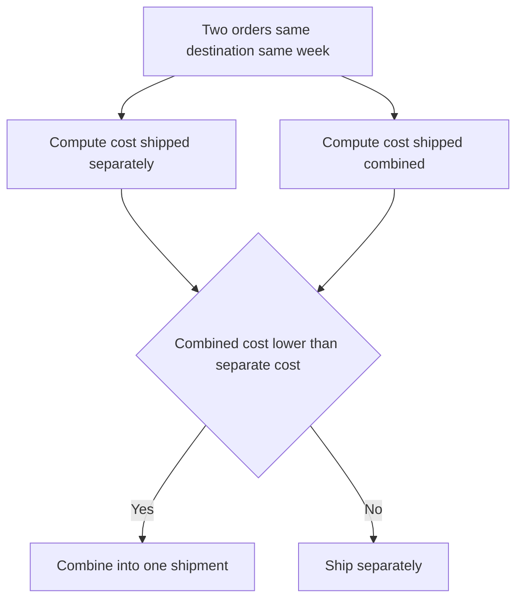

# Lecture 1 — Transportation Modes & Cost

> **Duration:** ~2 hours. **Outcome:** You can name the six modes Crunch Gear uses, explain what drives cost within each one, compute where a shipment crosses a weight break, and compute cost-per-unit-shipped so you can compare a Parcel box to an Ocean container on the same footing.

Every dollar in a freight bill traces back to one of a handful of drivers: how heavy the shipment is, how far it travels, how fast it needs to get there, and how efficiently it shares a truck/plane/ship with other freight. Learn those drivers once and every carrier invoice, rate sheet, and mode decision for the rest of your career stops looking like a black box.

## 1. The six modes, in one table

| Mode | Typical shipment size | Typical speed | Priced by | When you'd use it |
|------|-----------------------|---------------|-----------|--------------------|
| **Parcel** | 1–70 lb, one box | 1–5 days | weight + dimensional (DIM) weight, zone | DTC orders, small wholesale top-offs |
| **LTL** (less-than-truckload) | 150–10,000 lb, part of a trailer | 1–5 days | weight class × distance, on a rate curve | Wholesale orders too big for parcel, too small for a full truck |
| **FTL** (full truckload) | 10,000–45,000 lb, whole trailer | 1–3 days | flat rate per mile (or per load) | Large wholesale orders, DC-to-DC replenishment |
| **Intermodal** | 15,000–44,000 lb, a container | 3–7 days | rate per container-mile, cheaper than FTL over distance | Long-haul (1,000+ mi) DC-to-DC lanes where a few extra days is fine |
| **Ocean** | 18,000+ lb, a container | 20–40+ days | rate per container or per cwt, cheapest per pound by far | Import of fabric or finished goods from overseas mills |
| **Air** | 100–5,000 lb | 1–5 days | rate per lb, the most expensive by far | Rush imports, expedited replenishment when a stockout is worse than the freight bill |

Crunch Gear's `shipments` table (from the [week setup](../README.md)) uses all six. Run this to see the shape:

```sql
SELECT mode, COUNT(*) AS n_shipments, ROUND(AVG(freight_cost),2) AS avg_cost
FROM shipments
GROUP BY mode
ORDER BY avg_cost DESC;
```

```
 mode        | n_shipments | avg_cost
-------------+-------------+----------
 Air         |           3 |  6089.80
 FTL         |          29 |  2258.81
 Ocean       |           3 |  2098.08
 Intermodal  |          11 |  1994.53
 LTL         |          26 |  1222.65
 Parcel      |          52 |    30.52
```

Don't read that as "Air is the most expensive mode, avoid it" — Air shipments in this data are small emergency lots (1,000–2,000 lb) crossing 8,100 miles in 4 days, which is a completely different job than a 24,000-lb FTL run 200 miles down the highway. **Average cost per shipment is almost meaningless across modes; cost per pound is what lets you compare them.** That's Section 3.

## 2. Cost drivers inside a mode

### Parcel — weight, dimensional (DIM) weight, and zone

Parcel carriers charge the **greater of actual weight or dimensional weight**:

```
DIM weight (lb) = (length_in × width_in × height_in) / DIM_divisor
```

A common divisor is 139 (US domestic). A jacket box that's 20"×16"×10" has a volume of 3,200 in³, so `DIM weight = 3200 / 139 ≈ 23 lb` — if the actual jackets inside weigh only 9 lb, the carrier bills you for 23. This is why apparel — bulky, light — gets hit by DIM weight constantly, and why packaging engineers who shrink a box by an inch on each side can save real money at scale. **Zone** (how many carrier hub-to-hub hops between origin and destination ZIP) is the other lever — Parcel rate cards are literally a grid of weight rows × zone columns.

### LTL — freight class, weight breaks, and the rate curve

LTL pricing starts from a **freight class** (1–500, sometimes called an NMFC class) based on density, handling difficulty, and liability — apparel is typically class 100–125 (moderate density, easy to handle). Within a class, the **per-cwt (per hundredweight) rate drops as shipment weight crosses published break points**:

| Weight break | Typical rate per cwt (illustrative) | 500 lb costs | 2,000 lb costs |
|---|---|---|---|
| L5C (< 500 lb) | $38.00/cwt | $190.00 | — |
| M5C (500–999 lb) | $24.50/cwt | — | — |
| 1M (1,000–1,999 lb) | $17.20/cwt | — | — |
| 2M (2,000–4,999 lb) | $12.90/cwt | — | $258.00 |

Notice the trap: **a 2,000-lb shipment at the 2M rate ($258.00) can cost less than a 1,999-lb shipment billed at the 1M rate** (`1999 × 0.01 × 17.20 ≈ $343.83`). This is why experienced shippers sometimes **round a shipment up to the next break point on purpose** — pad an order to hit 2,000 lb and pay less than shipping 1,999 lb would cost. It looks irrational until you've seen the rate curve.

### FTL — rate per mile, not weight

Once you've paid for the whole trailer, adding more weight (up to the ~45,000 lb legal limit) is **free** — FTL is priced per mile (or as a flat lane rate), not per pound. That flips the optimization: for FTL, the question isn't "how do we minimize weight," it's **"how do we maximize what we cube out or weigh out per truck"** — an under-filled FTL truck is money left on the table.

```sql
-- FTL shipments on the Austin East -> Houston lane: cost is close to flat per trip,
-- but cost PER POUND drops hard as the truck fills up
SELECT shipment_id, weight_lbs, freight_cost,
       ROUND(freight_cost / weight_lbs, 4) AS cost_per_lb
FROM shipments
WHERE lane_id = 'AUS-HOU' AND mode = 'FTL'
ORDER BY weight_lbs;
```

A half-empty FTL truck (10,700 lb) on that lane runs about **$0.088/lb**; a nearly full one (24,100 lb, 38,800 lb) runs closer to **$0.05–0.07/lb** — same truck, same driver, same fuel, twice the freight, and the marginal pound is almost free. This is the whole argument for load consolidation.

### Intermodal — cheaper than FTL, slower than FTL

Intermodal moves a container by truck to a rail yard, by rail across the long-haul distance, then by truck again to the destination — trading 1–3 extra transit days for a meaningfully lower rate per mile than FTL over long distances (1,000+ miles). Below ~500 miles the extra handling (two drayage legs plus the rail transfer) usually erases the savings, which is why you rarely see intermodal on short lanes.

### Ocean — cheapest per pound, slowest by far

```sql
SELECT origin, destination, mode, weight_lbs, freight_cost, promised_transit_days
FROM shipments
WHERE mode IN ('Ocean','Air') AND origin = 'Hai Phong, Vietnam'
ORDER BY mode, ship_date;
```

The Hai Phong → Austin East Ocean shipments move ~20,000–25,000 lb for roughly **$0.10/lb** in ~34 days. The Air shipments on the *same lane* move 1,000–2,000 lb for roughly **$3.60–4.00/lb** in 4 days — a **35-40x** cost-per-pound premium to save 30 days. Ocean is the default for planned replenishment; Air only earns its cost when a stockout, a missed launch date, or a contractual penalty would cost Crunch Gear more than the freight premium. That trade-off is the whole subject of Lecture 3.

### Air — rate per pound, priced for speed

Air cargo is priced almost purely on weight (and DIM weight, same idea as Parcel) because the scarce resource is aircraft cargo-hold space, which is small and expensive to operate. There's essentially no "weight break" discount worth chasing on Air — you pay for speed, full stop.

## 3. Cost-per-unit-shipped — the number that makes modes comparable

Because a Parcel box, an LTL pallet, an FTL trailer, and an Ocean container all carry wildly different quantities, comparing **total freight cost** across them is meaningless. Compute **cost per unit shipped** instead:

```
cost_per_unit = freight_cost / units_shipped
```

```sql
SELECT mode,
       SUM(freight_cost)                              AS total_cost,
       SUM(units_shipped)                              AS total_units,
       ROUND(SUM(freight_cost) / SUM(units_shipped), 4) AS cost_per_unit
FROM shipments
GROUP BY mode
ORDER BY cost_per_unit DESC;
```

This single query answers the question a VP actually cares about: "what does it cost us, per garment, to move product by each mode?" — not "what's our average invoice," which conflates shipment size with mode efficiency. You'll build the full lane-level version of this query in [Exercise 1](../exercises/exercise-01-cost-per-lane.md).

## 4. Weight/volume breaks in practice: the "should I split or combine this order" decision

Because per-unit cost falls as a shipment gets heavier (within a mode, up to the next mode's threshold), a planner constantly faces a version of this question: *"Two wholesale orders are going to the same city this week — should I ship them separately or combine them into one truck?"*

Worked example. Two LTL orders to Denver, CO, 900 lb each, both quoted at the M5C break (~$24.50/cwt):

```
Separate: 2 × (900 × 0.01 × 24.50) = 2 × $220.50 = $441.00
Combined: 1,800 lb crosses into the 1M break (~$17.20/cwt)
          1800 × 0.01 × 17.20        = $309.60
Savings by combining: $441.00 - $309.60 = $131.40 (about 30%)
```

Combining orders that are going to the same place in the same week, whenever the shipping schedule allows it, is one of the cheapest wins in transportation — no negotiation with a carrier required, just better order-batching logic. This is exactly the kind of "obvious in hindsight, invisible in a spreadsheet, obvious in a GROUP BY" pattern SQL is built to surface — which is why we never do this analysis in Excel.


*Deciding whether two same-week orders to the same city should ship separately or get combined onto one truck.*

## 5. Putting it together: reading a lane's mode mix

```sql
SELECT lane_id, mode, COUNT(*) AS n, SUM(weight_lbs) AS total_lb,
       ROUND(SUM(freight_cost),2) AS total_cost,
       ROUND(SUM(freight_cost)/SUM(weight_lbs), 4) AS cost_per_lb
FROM shipments
WHERE lane_id = 'MEM-AUS'
GROUP BY lane_id, mode
ORDER BY cost_per_lb;
```

The Memphis DC → Austin East lane (`MEM-AUS`) carries **Parcel, FTL, and Intermodal** shipments in the same six weeks — small DTC top-offs by Parcel, full-truck replenishment by FTL, and a couple of Intermodal loads where a few extra transit days were acceptable. No single mode is "the" mode for a lane; the right question is always "the right mode for *this* shipment," which depends on its weight and how urgently it's needed. That's Lecture 3.

## 6. Check yourself

- Why is average cost per shipment a poor way to compare modes, and what should you compute instead?
- A parcel box weighs 9 lb but measures 20"×16"×10". Using a DIM divisor of 139, what does the carrier actually bill for?
- Why can a 2,000-lb LTL shipment sometimes cost *less* than a 1,999-lb shipment on the same lane?
- Why is FTL priced per mile instead of per pound, and what does that imply about under-filled trucks?
- Name one situation where paying a 35x cost-per-pound premium for Air over Ocean is the financially correct call.
- Below roughly what distance does intermodal usually stop being worth it compared to FTL, and why?

If those are automatic, Lecture 2 turns from "which mode" to "in what order do we visit these stops" — the vehicle routing problem.

## Further reading

- **FMCSA — Household Goods & Freight glossary (freight class, NMFC basics):** <https://www.fmcsa.dot.gov/>
- **U.S. DOT Bureau of Transportation Statistics — Freight Facts and Figures:** <https://www.bts.gov/product/freight-facts-and-figures>
- **Council of Supply Chain Management Professionals — glossary of logistics terms:** <https://cscmp.org/CSCMP/Educate/SCM_Definitions_and_Glossary_of_Terms.aspx>
