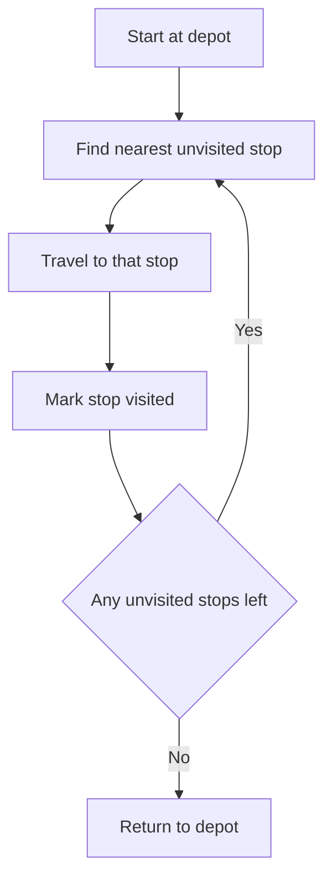

# Lecture 2 — Routing & the Vehicle Routing Problem

> **Duration:** ~2 hours. **Outcome:** You can state the vehicle routing problem precisely, name its common variants, and build a route with the nearest-neighbor heuristic — in Python, reading stops from SQL — for both a single unconstrained vehicle and a capacity-constrained fleet.

Lecture 1 answered "which mode." This lecture answers a different question: once a truck is loaded and headed out to make deliveries, **in what order should it visit its stops** to drive the fewest miles? That's the vehicle routing problem, and it shows up anywhere a vehicle visits more than one stop per trip — last-mile delivery, field-service technicians, school buses, garbage trucks.

## 1. The problem, stated precisely

**The Vehicle Routing Problem (VRP):** given a depot, a set of customer stops each with a known demand, and one or more vehicles each with a fixed capacity, find the set of routes — each starting and ending at the depot — that serves every customer exactly once, respects every vehicle's capacity, and minimizes total distance (or cost, or time).

When there's exactly one vehicle with unlimited capacity, this collapses to the classic **Traveling Salesman Problem (TSP)**: visit every stop once and return to the start, minimizing total distance. The VRP is the TSP's practical big sibling — real fleets have more than one truck, and every truck has a weight or cube limit.

### Why it's hard

The number of possible orderings of `n` stops is `(n-1)!/2` (fixing the depot as start/end and ignoring direction). For our 12-stop Austin East network, that's `11!/2 = 19,958,400` possible single-vehicle routes — and that's *before* you consider splitting the stops across multiple trucks. Checking every option (**brute force**) is exact but explodes instantly; the VRP is what computer scientists call **NP-hard** — no known algorithm solves every instance quickly as it grows. In practice, you don't need the mathematically perfect route — you need a *good* route, fast, and you re-run it every morning. That's what **heuristics** are for: reliable, fast rules that get you close to optimal, not guaranteed to hit it exactly.

## 2. Common VRP variants (know the vocabulary)

| Variant | What's different | Real example |
|---|---|---|
| **TSP** | One vehicle, unlimited capacity | A single sales rep visiting every account once |
| **CVRP** (Capacitated VRP) | Multiple vehicles, each with a max capacity | Crunch Gear's 4-truck Austin East delivery run this week |
| **VRPTW** (VRP with Time Windows) | Each stop must be visited within a delivery window | A retailer that only accepts deliveries 8–10am |
| **MDVRP** (Multi-Depot VRP) | More than one starting depot | Routing all three Crunch Gear DCs' local runs together |
| **PDVRP** (Pickup-and-Delivery VRP) | Some stops drop off, others pick up (e.g., returns) | A route that delivers new inventory and collects damaged-goods returns |

This week we build the **CVRP** — the variant Crunch Gear actually has: one depot (Austin East), twelve stops with known demand, and a fleet of trucks that each cap out at 120 cases. Naming the variant correctly matters in a real job: reaching for a plain TSP solver on a problem that's actually a CVRP with time windows will give you routes that look great and are operationally impossible.

## 3. Distance: the simplification we're making

Real routing software (Google OR-Tools, a TMS, a mapping API) computes distance — or better, *drive time* — along the actual road network. That's the right way to do it in production. For learning the *algorithm*, we use **straight-line (Euclidean) distance** between (x, y) coordinates, which keeps the arithmetic transparent without changing how nearest-neighbor or savings actually work:

```
distance(A, B) = sqrt( (x_A - x_B)^2 + (y_A - y_B)^2 )
```

```python
import math
import sqlite3
import pandas as pd

conn = sqlite3.connect("crunch_chain_wk7.db")
stops = pd.read_sql("SELECT * FROM delivery_stops ORDER BY stop_id", conn)

def dist(a_id, b_id):
    a = stops.loc[stops.stop_id == a_id].iloc[0]
    b = stops.loc[stops.stop_id == b_id].iloc[0]
    return math.hypot(a.x_miles - b.x_miles, a.y_miles - b.y_miles)

print(round(dist(0, 1), 2))   # depot -> Round Rock Trailhead Outfitters
```

`dist(0, 1)` should print **17.0** — Round Rock sits at (8, 15), and `sqrt(8² + 15²) = sqrt(64 + 225) = sqrt(289) = 17.0` exactly. (Pythagorean triples show up in teaching data on purpose — a good way to sanity-check your distance function before trusting it on the rest of the network.)

## 4. The nearest-neighbor heuristic

**Nearest-neighbor (NN)** is the simplest routing heuristic there is: start at the depot, repeatedly go to the *closest unvisited stop*, and return to the depot once everything's visited.


*The nearest-neighbor heuristic repeatedly hops to the closest unvisited stop until every stop is visited, then closes the loop back to the depot.*

```python
def nearest_neighbor_route(stop_ids, start=0):
    unvisited = set(stop_ids) - {start}
    route = [start]
    current = start
    total = 0.0
    while unvisited:
        nxt = min(unvisited, key=lambda s: dist(current, s))
        total += dist(current, nxt)
        route.append(nxt)
        unvisited.discard(nxt)
        current = nxt
    total += dist(current, start)
    route.append(start)
    return route, total

all_stops = stops.stop_id.tolist()
route, total_miles = nearest_neighbor_route(all_stops)
print(route)
print(round(total_miles, 1))
```

Ignoring truck capacity for a moment (pretend one infinitely large truck could do the whole run), nearest-neighbor produces:

```
[0, 11, 10, 4, 5, 9, 8, 12, 1, 3, 2, 6, 7, 0]
total distance: 243.8 miles
```

In plain names: **Austin East DC → Buda → Kyle → San Marcos → New Braunfels → Lockhart → Bastrop → Pflugerville → Round Rock → Georgetown → Cedar Park → San Antonio North → San Antonio South → back to Austin East DC.**

### Why nearest-neighbor isn't optimal

Look closely at that route: it zigzags out past Bastrop and Pflugerville (east/northeast of the depot) to reach Round Rock and Georgetown (north), then doubles back southwest through Cedar Park to San Antonio (due south) — a long, roundabout finish. NN is *greedy*: it always takes the cheapest **next** step, with no memory of where that leaves it stranded later. The route it leaves for last is often the expensive one, because the algorithm never looks ahead. This is the central weakness that the savings algorithm (Lecture 3 preview, and [Challenge 1](../challenges/challenge-01-savings-algorithm-routing.md)) is built to fix.

## 5. Adding the real constraint: truck capacity (CVRP)

Crunch Gear's trucks cap out at **120 cases**. A single-truck NN route ignores that Round Rock (42) + Georgetown (28) + San Antonio North (60) alone already exceed 120 cases combined with anything else — you cannot serve all twelve stops with one truck no matter how you order them (total demand is 409 cases; `409 / 120 = 3.4`, so **at least 4 trucks** are required even in the best case).

A capacitated nearest-neighbor extends the rule: keep adding the nearest *still-affordable* stop to the current truck's route; when nothing unvisited fits in the remaining capacity, close out that truck's route back to the depot and start the next truck.

```python
CAPACITY = 120

def capacitated_nearest_neighbor(stop_ids, demand, capacity, start=0):
    unvisited = set(stop_ids) - {start}
    routes = []
    while unvisited:
        route = [start]
        cap_left = capacity
        current = start
        while True:
            feasible = [s for s in unvisited if demand[s] <= cap_left]
            if not feasible:
                break
            nxt = min(feasible, key=lambda s: dist(current, s))
            route.append(nxt)
            cap_left -= demand[nxt]
            unvisited.discard(nxt)
            current = nxt
        route.append(start)
        routes.append(route)
    return routes

demand = dict(zip(stops.stop_id, stops.demand_cases))
routes = capacitated_nearest_neighbor(all_stops, demand, CAPACITY)
for r in routes:
    load = sum(demand[s] for s in r if s != 0)
    print(r, "load:", load)
```

This produces **4 truck routes** totaling **345.7 miles** — more than the unconstrained 243.8-mile figure, which makes sense: splitting one big loop into four capacity-limited loops means more trips back to the depot. That 345.7-mile number is your baseline. [Exercise 2](../exercises/exercise-02-nearest-neighbor-routing.md) has you build and verify it yourself; [Challenge 1](../challenges/challenge-01-savings-algorithm-routing.md) has you beat it with a smarter algorithm.

## 6. A first look at the savings algorithm (preview)

The **Clarke-Wright savings algorithm** starts from the opposite end: imagine *every* stop gets its own dedicated round-trip from the depot (maximally wasteful), then greedily **merges** pairs of routes wherever merging saves the most distance, stopping when no merge is left that respects truck capacity. The "savings" of merging stop `i` and stop `j` onto one route is:

```
savings(i, j) = dist(depot, i) + dist(depot, j) - dist(i, j)
```

— the miles you avoid by visiting `i` and `j` back-to-back on one truck instead of sending two separate trucks. Merge the highest-savings pairs first, respecting that a route can only be merged onto at its two open ends, and that the combined load can't exceed capacity. We build the full implementation in [Challenge 1](../challenges/challenge-01-savings-algorithm-routing.md) — it consistently beats nearest-neighbor on this network because it reasons about *pairs* of stops relative to the depot, not just "what's closest right now."

## 7. Check yourself

- In your own words, what's the difference between the TSP and the CVRP?
- Crunch Gear's network has 12 stops and 409 total cases of demand with 120-case trucks. What's the *minimum possible* number of trucks, and why can't fewer ever work no matter how clever the routing?
- Why does straight-line (Euclidean) distance make sense for *learning* the algorithm but not for a production routing system?
- Describe, in one sentence, why nearest-neighbor can end up with an expensive, roundabout final leg.
- What does `savings(i, j)` measure, in plain English?
- Name the VRP variant you'd reach for if San Antonio North could only receive deliveries between 8am and 10am.

If those are automatic, Lecture 3 moves from *how* to route trucks to *who* should carry the freight in the first place — scoring carriers on cost and reliability.

## Further reading

- **Clarke, G. & Wright, J.W. (1964), "Scheduling of Vehicles from a Central Depot to a Number of Delivery Points"** — the original savings-algorithm paper, *Operations Research* 12(4).
- **Google OR-Tools — Vehicle Routing Problem guide (free, open source):** <https://developers.google.com/optimization/routing/vrp>
- **Toth, P. & Vigo, D., "Vehicle Routing: Problems, Methods, and Applications"** (SIAM) — the standard academic reference, most university libraries carry it.
