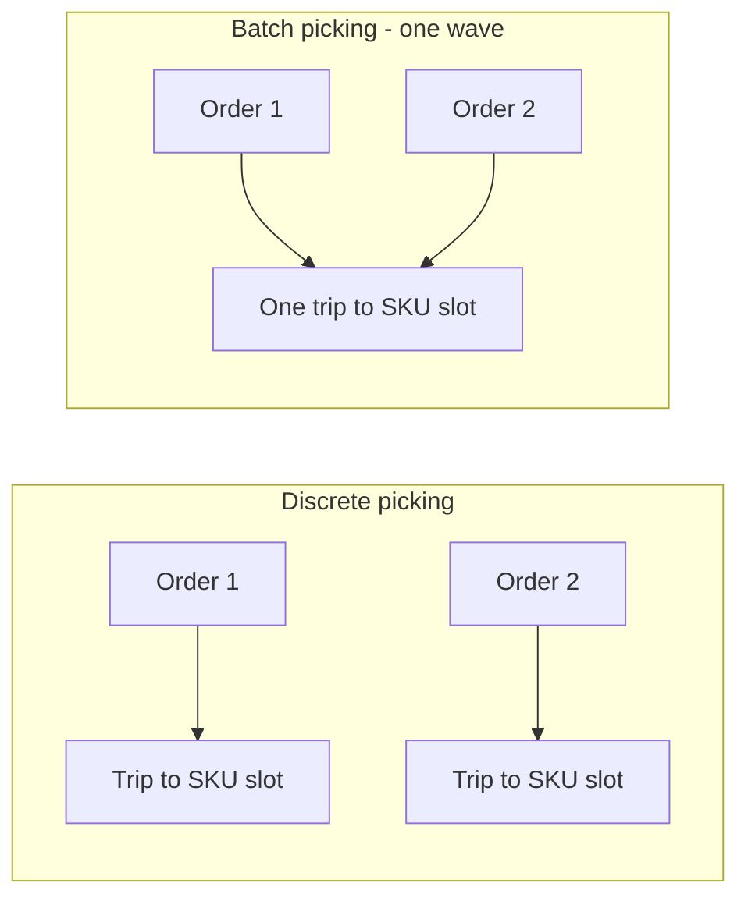

# Lecture 3 — Order Batching & Labor Planning

> **Duration:** ~2 hours. **Outcome:** You can batch a set of orders into a pick wave and quantify the trip reduction, size a picking crew to a stated throughput target, and report the three numbers a fulfillment manager tracks every day — throughput, order cycle time, and pick productivity.

Lecture 2 fixed *where* things are stored. This lecture fixes *how many trips it takes to pick them* — a second, independent lever, stackable on top of the first. Then it turns both into the thing an operations manager actually has to answer for: how many people do I need on the floor today?

## 1. Discrete picking vs. batch picking

**Discrete (single-order) picking**: a picker takes one order, walks to every slot that order needs, returns to pack, done. Simple to manage, easy to make one order's SLA — but if five different orders each need a trip to the same popular SKU, that SKU's slot gets visited five separate times in a shift.

**Batch (wave) picking**: a picker (or a cart with several totes) is assigned a **group of orders released together** — a "wave" — and visits each **distinct slot only once per wave**, placing the right quantity into each order's tote as they pass. If five orders in the same wave all need the same SKU, that slot gets visited **once**, not five times.

The trip-count difference is the entire value proposition. Formally, for a wave of orders:

```
discrete_trips = total pick lines in the wave  (one trip per line)
batched_trips  = number of DISTINCT (slot) locations touched by the wave
```

Batching only helps when orders in the same wave overlap in what they need — which, for any warehouse whose top SKUs are ordered constantly (exactly what Lecture 2's ABC analysis showed you), is the normal case, not the exception.


*Two orders needing the same SKU cost two trips discrete but one trip batched.*

## 2. A real day, both ways

Take **June 4, 2025** from this week's `pick_lines` table — a representative busy day at Austin East DC:

```sql
SELECT COUNT(DISTINCT order_id) AS n_orders,
       COUNT(*)                 AS n_lines,
       COUNT(DISTINCT sku_id)   AS n_distinct_skus
FROM pick_lines
WHERE order_date = '2025-06-04';
```

```
 n_orders | n_lines | n_distinct_skus
----------+---------+-------------------
        7 |      26 |               11
```

Seven orders, 26 order lines, but only **11 distinct SKUs** among them — meaning several SKUs repeat across multiple orders that day. Using the velocity-based slot distances from Lecture 2's re-slot:

```sql
WITH day_lines AS (
    SELECT DISTINCT sku_id FROM pick_lines WHERE order_date = '2025-06-04'
),
day_all_lines AS (
    SELECT sku_id FROM pick_lines WHERE order_date = '2025-06-04'
)
SELECT
    (SELECT SUM(2 * w.distance_ft) FROM day_all_lines l
        JOIN warehouse_slots w ON w.current_sku_id = l.sku_id) AS discrete_travel_ft,
    (SELECT SUM(2 * w.distance_ft) FROM day_lines l
        JOIN warehouse_slots w ON w.current_sku_id = l.sku_id) AS batched_travel_ft;
```

```
 discrete_travel_ft | batched_travel_ft
---------------------+---------------------
                2302 |               1310
```

**Discrete picking** (one trip per line, 26 trips) costs **2,302 feet**. **Batch picking** the same day as one wave (11 trips, one per distinct SKU) costs **1,310 feet** — a **43% cut in travel**, from re-sequencing trips, with the exact same slots, the exact same orders, the exact same picks. Slotting and batching are genuinely separate levers: Lecture 2 changed *where* things are; this section changes *how trips are grouped*, and the two savings stack.

## 3. Batching across the whole month

Run the same distinct-vs-total comparison across all 20 days in this week's seed data (one wave per day, which is the simplest possible batching policy — real DCs often run several smaller waves per day, which changes the numbers but not the mechanics):

```
 total pick lines (discrete trip count)     : 225
 total distinct (day, sku) stops (batched)  : 131
 total travel, discrete picking             : 77.1 picker-minutes
 total travel, batched (1 wave/day) picking : 54.4 picker-minutes
 travel-time reduction from batching        : 22.8 minutes (29.6%)
```

*(Travel-minutes assume the Lecture 2 re-slot and a 250 ft/minute walking-and-searching pace — the same conversion Lecture 2 used.)* Batching alone — leaving the slotting exactly as Lecture 2 left it — saves another **22.8 minutes** across the month on top of the 100+ minutes slotting already saved. Stack the two fixes (velocity slotting **and** wave batching) against where Austin East DC started (alphabetical slotting, one-order-at-a-time picking) and total labor time for this month's 225 lines drops from **222.9 minutes to 99.4 minutes — a 55.4% reduction** with no new equipment and no new hires. That combined number is exactly what the mini-project asks you to reproduce and defend end-to-end.

## 4. Sizing a batch — the trade-off

Bigger waves mean more consolidation (more chances for orders to share a slot) but also mean:

- **More totes per cart** — a picker can physically carry only so many order-totes at once (a common cart holds 6–12).
- **Longer wave-release latency** — an order sitting in a wave that hasn't been released yet is an order not yet moving toward its ship deadline. A wave of 50 orders released once every 4 hours delays the *last* order added to it far more than a wave of 10 orders released every 45 minutes.
- **Sortation complexity** — someone (or some machine) still has to make sure each picked unit lands in the *correct* order's tote at the pack station.

There's no universal "right" wave size — it's a trade-off between travel efficiency (bigger is better) and order cycle time (smaller is faster to release). Exercise 3 has you build a simple greedy batching heuristic and test it at a few different wave sizes to see this trade-off directly, in numbers, not in the abstract.

## 5. Sizing picking labor to a throughput target

Once you know your **pick rate** (lines processed per labor-hour, from Sections 2–3's math), sizing a crew is direct arithmetic:

```
required_picker_minutes = order_volume_in_lines × avg_minutes_per_line
pickers_needed          = required_picker_minutes ÷ productive_minutes_per_shift
```

**Worked example.** Suppose Crunch Gear's forecasting team (Weeks 3–4) projects **850 order lines** for an upcoming Saturday promotion at Austin East DC. Using the batched-picking benchmark this lecture just measured — **99.4 minutes of total labor for 225 lines**, i.e. **0.442 minutes/line** — and an 8-hour shift with a 30-minute break (**7.5 productive hours = 450 minutes** per picker):

```python
import math

lines_forecast = 850
min_per_line = 99.4 / 225          # 0.4418 min/line, from this week's measured batched rate
required_min = lines_forecast * min_per_line
productive_min_per_shift = 7.5 * 60  # 450

pickers_exact = required_min / productive_min_per_shift
pickers_needed = math.ceil(pickers_exact)   # always round UP -- a fraction of a picker isn't schedulable
print(round(required_min, 1), "picker-minutes required")
print(round(pickers_exact, 2), "pickers exactly -> schedule", pickers_needed)
```

```
375.6 picker-minutes required
0.83 pickers exactly -> schedule 1
```

**Always round up, never down** — a "0.83 of a picker" is not a real thing you can schedule, and rounding down a labor plan is how promised ship dates get missed. In this case a single well-staffed picker with a full shift comfortably clears the projected volume — but notice how close 375.6 minutes sits to a picker's 450-minute shift; there's very little slack for a bad day, a scanner outage, or a picker calling in sick. **A staffing plan that lands right at 100% utilization with zero slack is not a real staffing plan** — real ops managers pad target utilization to 80–85% of a shift's productive time specifically so the plan survives a normal bad day. Challenge 2 has you build this exact calculation for a much larger peak-day scenario, where the "round up to 1" comfort margin disappears and the staffing decision actually matters.

## 6. The three numbers a fulfillment manager reports

Every DC operations review comes back to the same three metrics, in the same order, every single day:

### Throughput
**How much work moved through the building in a given time window** — usually reported as **orders/hour**, **lines/hour**, or **units/hour**, at the whole-DC level. It answers "are we keeping up with demand?"

```sql
SELECT order_date,
       COUNT(DISTINCT order_id) AS orders,
       COUNT(*)                 AS lines,
       SUM(qty_picked)          AS units
FROM pick_lines
GROUP BY order_date
ORDER BY order_date;
```

Throughput is a **rate**, not a total — "1,200 lines" means nothing without a time window attached. "1,200 lines in an 8-hour shift" (150 lines/hour) is a throughput number you can compare, staff against, and forecast from.

### Order cycle time
**The elapsed time from when an order is released to the floor to when it ships** — the sum of pick time, pack time, any queue/wait time between steps, and shipping-dock time. This is the metric a *customer* feels, indirectly, through your promised ship/delivery window.

**Worked example** — one order's timestamps through the flow:

| Event | Timestamp | Elapsed since release |
|-------|-----------|-------------------------|
| Order released to pick queue | 9:14 AM | 0 min |
| Picking started | 9:22 AM | 8 min (queue wait) |
| Picking completed | 9:41 AM | 27 min |
| Packing completed | 9:53 AM | 39 min |
| Staged at shipping dock | 10:05 AM | 51 min |
| Loaded on outbound truck | 11:30 AM | 136 min |

**Order cycle time for this order: 136 minutes**, from release to physically leaving the building. Notice most of that time (85 of the 136 minutes) was **waiting for the outbound truck**, not picking or packing — a classic finding once you actually measure cycle time end-to-end: the pick itself is rarely the whole story, and a warehouse that's "fast at picking" can still have a slow overall cycle time if orders sit staged waiting on a truck. A DC tracks the **average and the p95 (95th-percentile)** cycle time, because the average hides exactly the kind of long-tail delay this example shows — a handful of orders that wait a very long time for a truck can be invisible in an average while still blowing every SLA that depends on the worst case, not the typical case.

### Pick productivity
**Output per unit of picking labor** — usually **lines/hour** or **units/hour per picker**. This is the number the labor-sizing formula in Section 5 is built from, and it's the number you audit *after the fact* to check whether your staffing model matched reality:

```sql
-- if a real pick_events log tracked picker_id and pick timestamps, productivity would be:
SELECT picker_id,
       COUNT(*) AS lines_picked,
       SUM(qty_picked) AS units_picked,
       ROUND(COUNT(*) / (SUM(pick_duration_seconds) / 3600.0), 1) AS lines_per_hour
FROM pick_events
GROUP BY picker_id
ORDER BY lines_per_hour DESC;
```

This week's `pick_lines` table doesn't carry a `picker_id` or a duration column (that level of instrumentation is a real WMS feature, not something this teaching dataset needs), but the *concept* — output divided by labor time — is exactly what Section 5's `0.442 minutes/line` benchmark already computed in reverse. **Pick rate and pick productivity are the same number, viewed from two directions**: the labor planner uses it to predict how many people a target volume needs; the operations manager uses it after the fact to check whether the floor actually hit that rate.

## 7. Putting it together — the labor planning loop

A real fulfillment operation runs this loop continuously, not once a quarter:

1. **Forecast** order volume for the period ahead (Weeks 3–4's tools).
2. **Measure** the current pick rate (Section 5/6) from actual, recent pick data.
3. **Compute** required picker-hours from forecast ÷ pick rate.
4. **Schedule** enough pickers, padded to a realistic utilization target (80–85%, Section 5).
5. **Track** actual throughput, cycle time, and productivity against the plan, in real time.
6. **Adjust** — pull in overflow labor, delay a lower-priority wave, or (if this becomes a pattern, not a one-off) revisit the slotting plan from Lecture 2, because if pick rate keeps coming in worse than the benchmark, the first thing to re-check is whether the warehouse has drifted back out of a good slotting configuration.

That loop — forecast, measure, compute, schedule, track, adjust — is the mini-project in miniature, and it's the actual daily job of a warehouse operations analyst. Exercises 1–3 build each piece in isolation; the mini-project runs the whole loop against Austin East DC's real numbers.
