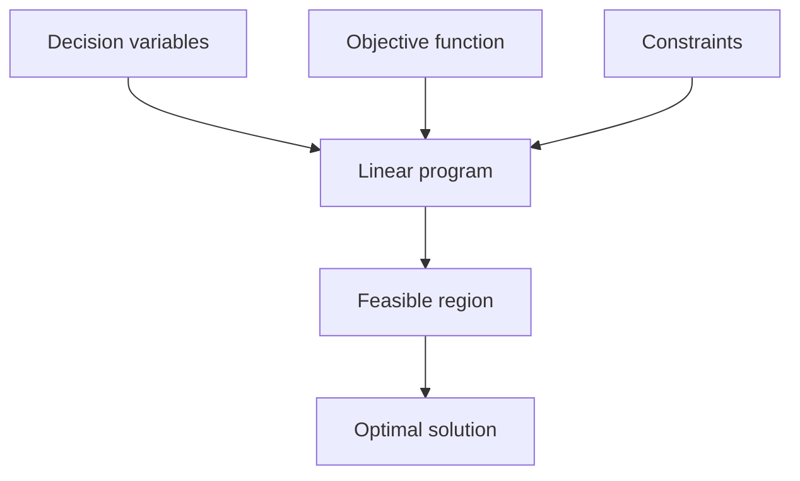
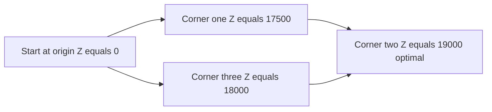

# Lecture 1 — Intro to Linear Programming

> **Duration:** ~2 hours. **Outcome:** You can take a plain-English resource-allocation problem, write it as decision variables + an objective + constraints, solve it two ways (PuLP and SciPy `linprog`), and explain — with a picture — what "optimal" actually means.

Every week so far in this course has ended with a *recommendation*: reorder this much, pick this supplier, route this truck this way. Most of those recommendations came from a formula or a heuristic — EOQ, a scorecard, nearest-neighbor. This week you learn the tool that sits underneath a huge share of real operations software: **linear programming (LP)**, a method that finds the mathematically best answer to a resource-allocation problem, guaranteed, not just a good one. Where a heuristic gets you *close*, LP gets you *exact* — provided you can state the problem as linear equations, which is most of the work and most of this lecture.

## 1. Why optimization, and why now

Every prior week in this course answered "how much" with a formula that assumed one thing varies at a time — EOQ trades off order cost against holding cost; the newsvendor model trades off underage against overage. Real operations problems usually have **many** things varying at once, tied together by shared limits: three plants that share a total production capacity, and orders that have to add up to exactly what customers need. There's no single formula for "the best way to split 15,000 units of demand across three plants with nine different shipping costs" — you need a method that searches the space of every possible split and proves which one is cheapest. That's optimization.

**Optimization**, formally, is the general problem of finding the best value of a *decision* subject to *limits*. **Linear programming** is the special case where the objective and every constraint are **linear** — no squared terms, no products of two decision variables, no if/then logic. It sounds restrictive, but an enormous share of real supply-chain decisions — sourcing splits, shipping plans, blending, staffing levels — are naturally linear, which is exactly why LP is the workhorse it is.

## 2. The three pieces of every LP

Every linear program, no matter how big, is built from exactly three things. Learn to spot these three in any word problem and you can formulate almost anything.

### Decision variables — what can you actually choose?

The **decision variables** are the quantities you're free to set. Ask: *if I could turn any knob, what would it be?* For Crunch Gear this week: how many jackets to produce, how many units to ship down a given lane, whether to open a given warehouse. Give each one a short algebraic name (`x1`, `x2`, or something readable like `tents`, `bags`) and be explicit about its **units** — "units per week," "dollars," "binary yes/no" — sloppy units are the #1 source of formulation bugs.

### The objective function — what are you optimizing?

The **objective** is a single linear expression in the decision variables that you want to **maximize** (profit, service level) or **minimize** (cost, distance, time). It is *linear* because it's a sum of `(coefficient × variable)` terms with no variable multiplied by another variable and no variable raised to a power.

$$Z = 70x_1 + 30x_2$$

Read this as: "profit equals \$70 for every unit of `x1` plus \$30 for every unit of `x2`." Nothing more complicated than that is allowed in a *linear* program — if profit-per-unit changed depending on volume (a discount at scale), the model would stop being linear and you'd need a different technique.

### Constraints — what limits you?

**Constraints** are linear (in)equalities that decision variables must satisfy: capacity limits, demand requirements, non-negativity. Each constraint is also a straight line (or plane, in more than two dimensions) — that's the other half of what "linear" buys you.

$$6x_1 + 3x_2 \le 2400 \qquad \text{(fabric yards available)}$$
$$5x_1 + 2x_2 \le 1800 \qquad \text{(sewing machine hours available)}$$
$$x_1, x_2 \ge 0 \qquad \text{(non-negativity — can't produce a negative quantity)}$$

Non-negativity looks trivial but it's a real constraint the solver needs — without it, a solver mathematically "sees" no reason not to produce -500 units of something if that happened to help the objective.


*The three building blocks of every LP combine into a feasible region, then an optimal solution.*

## 3. A full worked example — production mix

**Crunch Gear** makes two products in its El Paso plant: the **Trailhead Jacket** and the **Alpine Backpack**. Each unit consumes shared resources, and each earns a different profit contribution:

| Product | Fabric (yd) | Stitching (hr) | Profit/unit |
|---|---:|---:|---:|
| Trailhead Jacket (`x1`) | 3 | 4 | $50 |
| Alpine Backpack (`x2`) | 2 | 2 | $30 |
| **Available this week** | **1,200 yd** | **1,400 hr** | |

**Question:** how many of each should the plant produce to maximize profit?

**Formulation:**

$$\text{maximize } Z = 50x_1 + 30x_2$$
$$\text{subject to } 3x_1 + 2x_2 \le 1200 \quad \text{(fabric)}$$
$$4x_1 + 2x_2 \le 1400 \quad \text{(stitching)}$$
$$x_1, x_2 \ge 0$$

That's the whole model. Everything else — solving it — is mechanical, which is the point: formulation is where the thinking happens; solving is what you delegate to a computer.

## 4. The geometry of LP — why the answer is always a corner

With exactly two decision variables you can *see* an LP. Each constraint is a line; "≤" shades the region on one side of it. The **feasible region** is the overlap of every shaded half-plane — every point in it satisfies every constraint simultaneously.

Plot the two constraints above (axes: `x1` = jackets, `x2` = backpacks):

- Fabric line `3x1 + 2x2 = 1200` passes through `(400, 0)` and `(0, 600)`.
- Stitching line `4x1 + 2x2 = 1400` passes through `(350, 0)` and `(0, 700)`.

The feasible region is a four-sided polygon (a "polytope" in higher dimensions) bounded by the two axes and the two constraint lines, with corners — mathematicians call them **vertices**, everyone else calls them **corner points** — at `(0,0)`, `(350,0)`, the intersection of the two slanted lines, and `(0,600)`.

**The fundamental theorem of linear programming:** if an optimal solution exists, at least one optimal solution occurs at a **corner point** of the feasible region. This is *why* LP is solvable at all — instead of checking infinitely many points in the region, you only ever need to check the (finite) corners. The **simplex method**, invented by George Dantzig in 1947 and still the conceptual backbone of most LP solvers, does exactly that: it walks from corner to corner, always moving to a neighboring corner that improves the objective, until no neighbor improves it — at which point it has *proven* optimality, not just found a good answer.


*Simplex walks from corner to corner, always improving Z, until no neighbor improves further.*

**Find the binding corner by hand.** Solve the two constraint lines as simultaneous equations:

$$3x_1 + 2x_2 = 1200$$
$$4x_1 + 2x_2 = 1400$$

Subtract the first from the second: $x_1 = 200$. Substitute back: $3(200) + 2x_2 = 1200 \Rightarrow x_2 = 300$.

Now evaluate the objective at **every** corner:

| Corner | $Z = 50x_1 + 30x_2$ |
|---|---:|
| $(0, 0)$ | $0 |
| $(350, 0)$ — stitching binds first on the x-axis | $17{,}500 |
| $(200, 300)$ — both constraints bind | **$19,000** |
| $(0, 600)$ — fabric binds first on the y-axis | $18,000 |

The maximum is at $(200, 300)$: produce **200 jackets and 300 backpacks** for a maximum weekly profit of **$19,000**, using every yard of fabric and every stitching hour available. Both constraints are **binding** (used up completely) at the optimum — that's not a coincidence; the optimum of a well-formed LP almost always sits where at least `n` constraints intersect (`n` = number of decision variables).

## 5. Solving it in PuLP

Checking every corner by hand does not scale past two or three variables. PuLP wraps the open-source CBC solver so you never do this by hand again:

```python
from pulp import LpProblem, LpVariable, LpMaximize, lpSum, LpStatus, value

# 1. Create the problem — direction matters
prob = LpProblem("crunch_gear_production_mix", LpMaximize)

# 2. Decision variables — lowBound=0 enforces non-negativity
x1 = LpVariable("jackets", lowBound=0)
x2 = LpVariable("backpacks", lowBound=0)

# 3. Objective — the FIRST expression added to a PuLP problem is the objective
prob += 50 * x1 + 30 * x2, "total_profit"

# 4. Constraints — every subsequent += is a constraint
prob += 3 * x1 + 2 * x2 <= 1200, "fabric_yards"
prob += 4 * x1 + 2 * x2 <= 1400, "stitching_hours"

# 5. Solve
prob.solve()

print("Status:", LpStatus[prob.status])
print("Jackets:", x1.value())
print("Backpacks:", x2.value())
print("Max profit:", value(prob.objective))
```

Output:

```
Status: Optimal
Jackets: 200.0
Backpacks: 300.0
Max profit: 19000.0
```

Matches the hand solution exactly — that's the point of working through the geometry first: you now know *why* the solver said what it said, instead of trusting a black box.

## 6. Solving it in SciPy

`scipy.optimize.linprog` is the other standard tool — lower-level than PuLP (you build raw matrices instead of writing algebraic expressions), and useful when you want a pure-numeric pipeline without PuLP's modeling layer. **SciPy's `linprog` only minimizes** — to maximize, negate the objective coefficients and minimize that, then flip the sign of the result back.

```python
from scipy.optimize import linprog

# linprog MINIMIZES, so negate profit coefficients to effectively maximize
c = [-50, -30]                 # coefficients of x1, x2 (negated)

# A_ub @ x <= b_ub  — every constraint must be written in this "<=" form
A_ub = [[3, 2],                # fabric
        [4, 2]]                # stitching
b_ub = [1200, 1400]

bounds = [(0, None), (0, None)]   # x1 >= 0, x2 >= 0 (None = no upper bound)

result = linprog(c, A_ub=A_ub, b_ub=b_ub, bounds=bounds, method="highs")

print(result.x)                    # [200. 300.]
print(-result.fun)                 # 19000.0  (negate back to get the max)
```

`method="highs"` selects the modern HiGHS solver (SciPy's default since 1.9, and the one you should always ask for explicitly) — a dual simplex / interior-point solver that is dramatically faster than SciPy's older methods on anything beyond toy problems.

**PuLP vs. SciPy, when to reach for which:** PuLP reads like algebra (`3 * x1 + 2 * x2 <= 1200`) and is easier to get right on complex, hand-formulated models — use it for this week's transportation and facility-location problems, where you're writing the model yourself. SciPy wants matrices (`A_ub`, `b_ub`) and shines when the model is already being *generated* programmatically from a DataFrame — you'll feel that difference by Lecture 2.

## 7. Reading a solution: binding vs. slack constraints

A constraint is **binding** (or "tight" / "active") at the optimum if it holds with equality — every unit of that resource is used. A constraint has **slack** if there's room left over. In the jackets/backpacks example both constraints bound at $(200,300)$ with zero slack. Change the stitching-hours limit from 1400 to 2000 hours and re-solve:

```python
prob2 = LpProblem("more_stitching_hours", LpMaximize)
x1 = LpVariable("jackets", lowBound=0)
x2 = LpVariable("backpacks", lowBound=0)
prob2 += 50 * x1 + 30 * x2
prob2 += 3 * x1 + 2 * x2 <= 1200
prob2 += 4 * x1 + 2 * x2 <= 2000
prob2.solve()
print(x1.value(), x2.value(), value(prob2.objective))
# 0.0 600.0 18000.0 — fabric alone now determines the answer; stitching has slack
```

Notice profit *fell* to $18,000 even though you *relaxed* a constraint — that's not a bug. With more stitching hours available, fabric becomes the only binding limit, and the optimal mix shifts entirely to backpacks (which use less fabric per dollar of profit). The lesson: **relaxing one constraint can change which variables are even worth producing**, not just how much slack there is. This kind of "what changes if a limit changes" question is exactly what **shadow prices** answer precisely, and that's Lecture 2's subject.

## 8. Infeasible and unbounded problems

Two failure modes worth recognizing immediately when a solver reports them:

- **Infeasible** — no point satisfies every constraint simultaneously (e.g., you require `x1 >= 500` but the fabric constraint caps `x1` at 400). PuLP reports `LpStatus[prob.status]` as `"Infeasible"`. Nearly always means you mis-transcribed a constraint or the constraints genuinely contradict a real-world limit you forgot to relax.
- **Unbounded** — the objective can be improved forever without hitting any constraint (e.g., you maximize profit but forgot to cap a resource that profit depends on). Reported as `"Unbounded"`. Always means a missing constraint, never a real business answer — no real resource is infinite.

Always check `LpStatus[prob.status] == "Optimal"` before trusting `.value()` output in real code; a script that silently prints `None` for every variable on an infeasible problem is a bug waiting to be shipped.

## 9. Check yourself

- Name the three pieces of every LP, in your own words.
- Why must the objective and every constraint be *linear* — no variable multiplied by another variable?
- What is a "corner point," and why does the optimal solution always sit at one?
- Why does `scipy.optimize.linprog` need you to negate the objective for a maximization problem?
- What does it mean for a constraint to be "binding"? Give an example from the jackets/backpacks problem.
- What's the difference between an infeasible and an unbounded LP, and what does each usually mean in practice?

If those are solid, Lecture 2 applies exactly this machinery to the problem that shows up more than any other in supply chain: moving product from many sources to many destinations at minimum cost.

## Further reading

- **PuLP documentation:** <https://coin-or.github.io/pulp/>
- **SciPy `linprog` reference:** <https://docs.scipy.org/doc/scipy/reference/generated/scipy.optimize.linprog.html>
- **HiGHS solver (used by SciPy's `method="highs"`):** <https://highs.dev/>
- **Dantzig, "Linear Programming and Extensions"** — the field's founding text, for when you want the full theory behind the simplex method.
