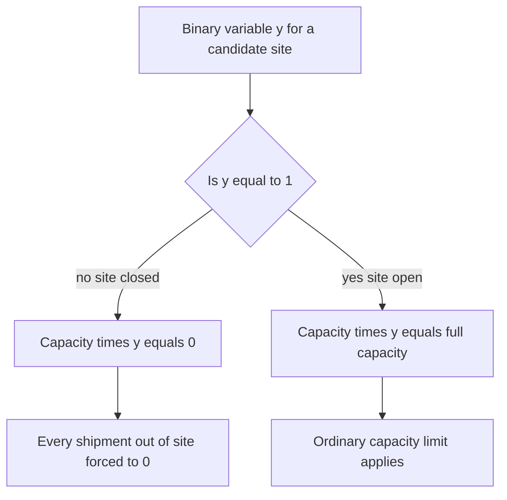
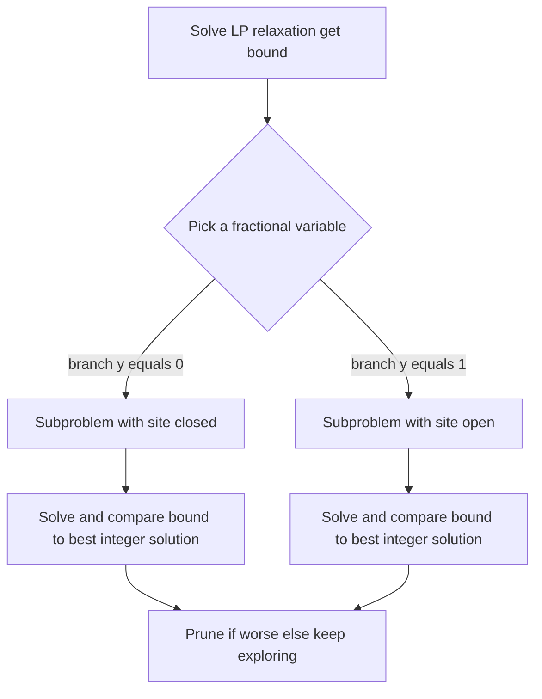

# Lecture 3 — Facility Location & Mixed-Integer Programming

> **Duration:** ~2 hours. **Outcome:** You can add binary open/close decisions to a network-flow model, explain precisely why that pushes the problem outside pure LP into mixed-integer programming (MIP), solve a capacitated facility-location problem in PuLP, and read a solved MIP's answer the same rigorous way you read an LP's.

Lecture 2 assumed Crunch Gear's three distribution centers already exist and asked only *how much* should flow across each lane. This lecture asks a bigger question: *should Austin East DC even exist?* Every DC carries a large fixed cost — lease, staffing, systems — whether it ships one unit or a million. Deciding which facilities to keep, close, or open is one of the highest-leverage decisions in a network, and it needs a different kind of variable than anything in Lectures 1–2.

## 1. Why "how much to build" needs a different kind of variable

In the transportation problem, $x_{ij}$ (units shipped) was **continuous** — 4,237.6 units is a perfectly sensible answer for a monthly average, and the solver was free to pick any non-negative real number. A facility decision is different in kind: a DC is either **open or it isn't**. There's no such thing as "62% open." If you solved a facility-location problem as a plain LP and let a variable $y \in [0, 1]$ represent "how open" a DC is, the solver would happily return $y = 0.62$ — a mathematically valid but operationally meaningless answer. You cannot lease 62% of a warehouse.

The fix: restrict certain variables to the integers — usually just $\{0, 1\}$, called **binary variables**. A problem that mixes continuous variables (how much to ship) with integer or binary variables (whether to open) is a **mixed-integer program (MIP)**. Every MIP is otherwise built exactly like an LP — same idea of an objective and constraints — with one added rule per variable: *this one may only take whole-number (or 0/1) values.*

## 2. The capacitated facility-location problem

Crunch Gear is reconsidering its DC footprint. Instead of assuming Austin East, Memphis, and Reno all stay open, it wants to evaluate **four candidate sites** — the three current DCs plus a new candidate, **Phoenix** — and decide which subset to actually operate, trading off each site's fixed monthly cost against its shipping costs to three demand regions.

**Candidate DCs:**

| Candidate | Fixed cost / month | Capacity (units) |
|---|---:|---:|
| Austin East (`AE`) | $80,000 | 7,000 |
| Memphis (`MEM`) | $65,000 | 6,000 |
| Reno (`RNO`) | $70,000 | 5,000 |
| Phoenix (`PHX`) — new candidate | $55,000 | 6,000 |

**Demand regions:**

| Region | Monthly demand (units) |
|---|---:|
| West | 5,000 |
| Central | 6,000 |
| East | 4,000 |
| **Total** | **15,000** |

**Variable shipping cost per unit ($):**

| Candidate \ Region | West | Central | East |
|---|---:|---:|---:|
| AE | 5 | 3 | 6 |
| MEM | 7 | 2 | 4 |
| RNO | 2 | 6 | 8 |
| PHX | 3 | 5 | 7 |

**The question:** which candidates should be open, and how should flow route from the open ones to the three regions, to minimize **fixed cost + variable shipping cost** combined?

Notice the trap built into this data on purpose: Austin East is the *most expensive* candidate to keep open. Intuition says "it's our current DC, obviously keep it" — this lecture exists precisely because intuition and the optimal answer aren't always the same thing, and only a model that weighs fixed cost against shipping cost for **every** candidate simultaneously can tell you which.

## 3. Formulating the model

**Decision variables — two kinds, on purpose:**

- $y_k \in \{0, 1\}$ for each candidate $k$ — **binary**: 1 if candidate $k$ is open, 0 if closed.
- $x_{kr} \ge 0$ for each (candidate, region) pair — **continuous**: units shipped from candidate $k$ to region $r$.

**Objective — minimize fixed cost of open sites plus variable shipping cost:**

$$\text{minimize } Z = \sum_{k} f_k \, y_k \;+\; \sum_{k} \sum_{r} c_{kr} \, x_{kr}$$

where $f_k$ is candidate $k$'s fixed cost and $c_{kr}$ is the per-unit cost from $k$ to $r$.

**Demand constraints — every region's demand must be met, from whichever sites are open:**

$$\sum_{k} x_{kr} \ge \text{demand}_r \quad \text{for every region } r$$

**Capacity constraints — a site can only ship if it's open, and only up to its capacity:**

$$\sum_{r} x_{kr} \le \text{capacity}_k \cdot y_k \quad \text{for every candidate } k$$

**This last constraint is the whole trick of facility-location modeling.** Read it carefully: if $y_k = 0$ (closed), the right-hand side becomes $\text{capacity}_k \times 0 = 0$, which forces every $x_{kr}$ out of that candidate to zero — a closed site cannot ship anything, automatically, with no extra logic needed. If $y_k = 1$ (open), the constraint becomes the ordinary capacity limit from Lecture 2. One constraint, two behaviors, purely from multiplying capacity by a binary variable. This pattern — **linking a continuous variable's availability to a binary "on" switch by multiplying capacity by the binary** — is the single most reusable trick in this whole lecture; you'll use it again the moment any real model has an "only if we chose to do X" clause.


*Multiplying capacity by the binary open switch turns the constraint on or off automatically.*

## 4. Solving it in PuLP

```python
from pulp import LpProblem, LpVariable, LpMinimize, LpBinary, lpSum, LpStatus, value

candidates = {
    "AE":  {"fixed": 80000, "capacity": 7000},
    "MEM": {"fixed": 65000, "capacity": 6000},
    "RNO": {"fixed": 70000, "capacity": 5000},
    "PHX": {"fixed": 55000, "capacity": 6000},
}
regions = {"West": 5000, "Central": 6000, "East": 4000}

cost = {
    ("AE","West"): 5,  ("AE","Central"): 3,  ("AE","East"): 6,
    ("MEM","West"): 7, ("MEM","Central"): 2, ("MEM","East"): 4,
    ("RNO","West"): 2, ("RNO","Central"): 6, ("RNO","East"): 8,
    ("PHX","West"): 3, ("PHX","Central"): 5, ("PHX","East"): 7,
}

prob = LpProblem("crunch_gear_facility_location", LpMinimize)

# Binary open/close decision, one per candidate
y = {k: LpVariable(f"open_{k}", cat=LpBinary) for k in candidates}

# Continuous shipping flow, one per (candidate, region)
x = {(k, r): LpVariable(f"ship_{k}_{r}", lowBound=0) for k in candidates for r in regions}

# Objective: fixed cost of open sites + variable shipping cost
prob += (
    lpSum(candidates[k]["fixed"] * y[k] for k in candidates)
    + lpSum(cost[k, r] * x[k, r] for k in candidates for r in regions)
), "total_network_cost"

# Demand: every region fully served
for r in regions:
    prob += lpSum(x[k, r] for k in candidates) >= regions[r], f"demand_{r}"

# Capacity, gated by whether the site is open
for k in candidates:
    prob += lpSum(x[k, r] for r in regions) <= candidates[k]["capacity"] * y[k], f"capacity_{k}"

prob.solve()

print("Status:", LpStatus[prob.status])
for k in candidates:
    print(f"{k}: {'OPEN' if y[k].value() == 1 else 'closed'}")
for (k, r), var in x.items():
    if var.value() and var.value() > 0:
        print(f"  {k} -> {r}: {var.value():.0f} units")
print("Total monthly cost: $", value(prob.objective))
```

Solved output:

```
Status: Optimal
AE: closed
MEM: OPEN
RNO: OPEN
PHX: OPEN
  RNO -> West: 5000 units
  MEM -> Central: 6000 units
  PHX -> East: 4000 units
Total monthly cost: $ 240000.0
```

**Read the punchline.** The solver **closes Austin East** — the incumbent, and the one your intuition would probably keep — and opens the new Phoenix candidate instead. Total cost: **$240,000/month** (\$190,000 fixed for the three open sites + \$50,000 variable shipping), beating every other combination, including keeping the status quo of Austin East + Memphis + Reno (which prices out at \$257,000/month — \$17,000/month more expensive). Austin East's fixed cost (\$80,000, the highest of the four) simply isn't earned back by any shipping-cost advantage it offers; Phoenix is \$25,000/month cheaper to run and still covers the network at competitive lane rates. This is exactly the kind of result that's very hard to see by staring at a cost table, and completely mechanical once it's a solved MIP.

## 5. Why this needed MIP, concretely

Try relaxing $y_k$ from binary to continuous ($0 \le y_k \le 1$) and re-solving — this is called the **LP relaxation** of a MIP, and it's a genuinely useful diagnostic, not just an academic exercise:

```python
y_relaxed = {k: LpVariable(f"open_{k}", lowBound=0, upBound=1) for k in candidates}  # no cat=LpBinary
```

The LP relaxation can (and often does) return fractional values like $y_{AE} = 0.4$ — "40% open." That number has no operational meaning; you cannot partially staff, partially lease, or partially build a distribution center. **This is the exact test for whether a real-world decision needs MIP**: if a fractional value for a variable would be nonsense in the real world (open/close, build/don't-build, assign-to-exactly-one-of-these), the variable must be integer or binary, and the problem is a MIP, not an LP. If a fractional value is perfectly fine (units shipped, hours worked, dollars spent), continuous is correct and faster to solve.

**Why "faster" matters here:** LPs solve in polynomial time — the simplex or interior-point methods reliably solve LPs with millions of variables. MIPs are, in the general case, dramatically harder (formally NP-hard) — the solver can't just walk between corners the way simplex does, because the "corners" that respect integrality aren't a smooth set of points. Instead it uses **branch and bound**: solve the LP relaxation first (ignoring integrality) to get a bound on the best possible answer, then pick a fractional variable, "branch" into two subproblems (try $y_k = 0$ and try $y_k = 1$ separately), and recursively repeat — pruning any branch whose LP-relaxation bound is already worse than the best integer solution found so far. For a handful of binary variables, as here, this finishes in milliseconds; for thousands, real MIPs can take minutes or hours even on good solver hardware, which is *why* modeling only the variables that truly need to be integer (and leaving everything else continuous) matters for anything beyond a lecture-sized example.


*Branch and bound repeatedly splits on a fractional variable, pruning branches that cannot beat the best integer solution found so far.*

## 6. SciPy's MIP support

SciPy also solves MIPs, via `scipy.optimize.milp` (added in SciPy 1.9), using the same HiGHS solver backend as `linprog`. It needs integrality specified per-variable as an array rather than PuLP's per-variable `cat=LpBinary`:

```python
from scipy.optimize import milp, LinearConstraint, Bounds
import numpy as np

# Variable order: [y_AE, y_MEM, y_RNO, y_PHX] — binary only, for illustration
c = [80000, 65000, 70000, 55000]           # fixed costs (minimize)
integrality = np.array([1, 1, 1, 1])        # 1 = must be integer for every variable listed
bounds = Bounds(lb=0, ub=1)                 # combined with integrality, this means "binary"

# A full facility-location model needs the shipping variables too — this snippet shows
# only the integrality mechanics; PuLP's algebraic style scales far more readably
# once continuous shipping variables join the binary ones, which is why this course
# leans on PuLP for every MIP this week.
```

For anything past a toy illustration, PuLP's algebraic constraint-building (Section 4) stays readable as models grow; `milp`'s array-based interface is worth knowing exists, but you won't hand-build a full facility-location model in it this week.

## 7. Check yourself

- Why can't the "open/close a DC" decision be modeled as a plain continuous variable between 0 and 1?
- Explain, in your own words, why `capacity_k * y_k` on the right side of the capacity constraint correctly forces a closed site's shipments to zero.
- What is the "LP relaxation" of a MIP, and what diagnostic question does solving it answer?
- In the solved example, why does the solver close Austin East despite it being the incumbent DC?
- Name one real decision (not in this lecture) that would need a binary variable, and one that wouldn't.
- Why are MIPs generally much harder to solve than LPs of the same size?

Both challenges this week push this exact modeling pattern further — multiple products sharing capacity, and multiple time periods with inventory carried between them. The mini-project asks you to run the transportation problem from Lecture 2 end-to-end against real SQL tables, in and out.

## Further reading

- **PuLP — integer and binary variables:** <https://coin-or.github.io/pulp/main/pulp.html#pulp.LpVariable>
- **SciPy `milp` reference:** <https://docs.scipy.org/doc/scipy/reference/generated/scipy.optimize.milp.html>
- **NEOS Guide — Mixed-Integer Linear Programming:** <https://neos-guide.org/case-studies/milp/>
- **Wikipedia — Facility location problem:** <https://en.wikipedia.org/wiki/Facility_location_problem>
