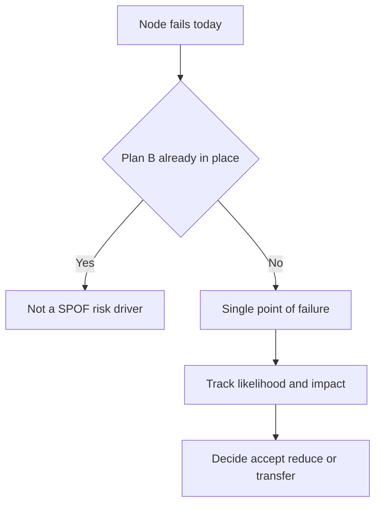
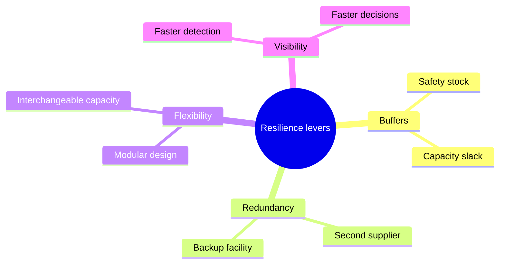

# Lecture 1 — Supply Chain Risk & Resilience

> **Duration:** ~2 hours. **Outcome:** You can name the categories of supply chain risk, identify a single point of failure (SPOF) in a real network, score a risk on likelihood × impact, and name the four resilience levers you'd reach for to reduce a given risk's expected cost.

Every network you've built this course — Crunch Gear's three DCs, its supplier base, its carrier mix — has an invisible property that never showed up in a forecast or an EOQ formula: **how much of the network's throughput depends on any single node not failing.** That property is what this lecture teaches you to see, name, and score.

## 1. What "risk" means here — and what it doesn't

In casual use, "risk" means "something bad might happen." In supply chain analytics, risk is a specific, computable quantity:

```
Expected annual loss = likelihood (events per year) × impact (cost per event)
```

This is deliberately the same shape as an insurance premium calculation, because it answers the same question an insurer asks: *how much should you be willing to spend, per year, to make this risk go away?* A risk with a 20% annual likelihood and a $200,000 impact has the same expected annual loss ($40,000) as a risk with a 2% annual likelihood and a $2,000,000 impact — but you'd manage those two very differently, which is exactly why likelihood and impact are tracked as two separate numbers, not collapsed into one score too early.

**What risk management is *not*:** it's not "eliminate all risk" (impossible, and the attempt is usually more expensive than the risk itself) and it's not "buy insurance and stop thinking about it" (insurance transfers *financial* impact; it does nothing about the days of stalled fulfillment while you wait on a claim). Real resilience work is about **choosing, deliberately, which risks to accept, which to reduce, and which to transfer** — and being able to defend that choice with a number.

## 2. A risk taxonomy for a physical network

Six categories cover almost everything that can hit a supply chain like Crunch Gear's:

| Category | What it covers | Crunch Gear example |
|---|---|---|
| **Supplier** | A vendor stops delivering — quality failure, financial collapse, capacity loss, fire | Andes Stitch Works (sole CMT line for Outerwear) |
| **Facility** | A DC, plant, or port is damaged, closed, or loses power | Austin East DC (single ERCOT grid connection, no generator) |
| **Transportation** | A carrier, mode, lane, or interchange is disrupted | Regional Class-I rail interchange (all Intermodal volume) |
| **Cyber / System** | The software the network runs on is compromised or down | Order Management System (single instance, no hot failover) |
| **Geopolitical** | Tariffs, trade policy, sanctions, political instability at a sourcing location | Vietnam trade policy on CM imports |
| **Demand** | Concentration risk on the revenue side — one customer, one channel, one region | A single wholesale account carrying 22% of revenue |

Notice this taxonomy is symmetric: **supply-side** risk (suppliers, facilities, transportation, systems) gets most of the attention in a risk-and-resilience lecture, but **demand-side concentration** — one customer, one region, one channel — is a real single point of failure too, and it's the one most often left off a "supply chain risk register" because it doesn't feel like a supply chain problem. It is one. If that account is lost, the network you built to serve it doesn't disappear, but the demand that justified its capacity does.

## 3. The single point of failure (SPOF)

A **single point of failure** is any node or lane whose loss stops (or badly degrades) a function the network has no other way to perform. The test is simple and worth internalizing as a habit, not a formula: **"if this node went to zero tomorrow, is there a Plan B already in place, or would we be improvising?"**


*The SPOF test: a missing Plan B turns a node failure into a tracked risk that needs a decision.*

Run that test against Crunch Gear's `network_risk_register`:

```sql
SELECT node_name, node_type, risk_description, annual_volume_share_pct
FROM network_risk_register
WHERE single_point_of_failure = TRUE
ORDER BY annual_volume_share_pct DESC NULLS LAST;
```

```
 node_name                    | node_type | annual_volume_share_pct
-------------------------------+-----------+--------------------------
 Order Management System       | System    |                      100
 SkyBridge Air Cargo            | Carrier   |                      100
 Northstar Apparel Mfg          | Supplier  |                      100
 Pacific Rim Ocean Lines        | Carrier   |                      100
 Hai Phong CM Region            | Facility  |                       60
 Vietnam Trade Policy           | Market    |                       60
 ButtonWorks Supply             | Supplier  |                       55
 Austin East DC                 | Facility  |                       45
 Andes Stitch Works             | Supplier  |                       35
 Regional Rail Interchange      | Carrier   |                       28
 Top Wholesale Account          | Market    |                       22
```

Eleven of Crunch Gear's sixteen tracked risks are SPOFs. That's not alarming by itself — **every network has SPOFs; the question is whether their likelihood × impact is being tracked and whether the ones that matter have a mitigation plan.** `Northstar Apparel Mfg` is a SPOF at 100% of Accessories CMT volume, but it's also tagged `Mitigated` in the register (Accessories is a small enough line that a second CMT source was already qualified) — a SPOF with a Plan B in your back pocket is a completely different risk posture than a SPOF with none. `Order Management System` is a SPOF at 100% of *order release network-wide* and it's tagged `None` — that's the kind of row that should make a risk review nervous.

## 4. Scoring: the likelihood × impact matrix

Score every risk on two 1–5 scales:

- **Likelihood** — how often, realistically, does an event like this happen in a year? (1 = once a decade or rarer, 3 = roughly once every 2–3 years, 5 = expect it most years)
- **Impact** — if it happens, how bad is one event? (1 = barely noticeable, 3 = a bad week, 5 = a bad quarter with lasting customer damage)

`risk_score = likelihood × impact`, computed directly in SQL:

```sql
SELECT node_name, risk_category, likelihood, impact,
       likelihood * impact AS risk_score,
       single_point_of_failure, mitigation_status
FROM network_risk_register
ORDER BY risk_score DESC
LIMIT 6;
```

```
 node_name              | risk_category | likelihood | impact | risk_score | single_point_of_failure | mitigation_status
-------------------------+---------------+------------+--------+------------+--------------------------+--------------------
 Hai Phong CM Region      | Geopolitical  |          4 |      5 |         20 | TRUE                     | None
 Austin East DC           | Facility      |          3 |      5 |         15 | TRUE                     | None
 Andes Stitch Works       | Supplier      |          3 |      4 |         12 | TRUE                     | Partial
 Vietnam Trade Policy     | Geopolitical  |          3 |      4 |         12 | TRUE                     | None
 Order Management System  | Cyber         |          2 |      5 |         10 | TRUE                     | None
 Memphis DC               | Facility      |          3 |      3 |          9 | FALSE                    | Partial
```

`Hai Phong CM Region` tops the list at a score of 20 — it's a SPOF (the entire offshore CM footprint sits in one region), it's hit multiple times a year by typhoon season (likelihood 4), and losing it for any stretch would be severe (impact 5, because it's not one supplier, it's the whole import lane). That's the row a resilience plan should start with, and it's exactly what Challenge 1 asks you to fix.

## 5. Reading the matrix as four quadrants

Plot every risk on a 5×5 grid (likelihood on one axis, impact on the other) and four zones fall out naturally:

| | **Low impact (1–2)** | **High impact (3–5)** |
|---|---|---|
| **Low likelihood (1–2)** | **Accept.** Log it, review annually, spend nothing today. | **Insure / transfer.** Rare but severe — often cheaper to transfer (insurance, contractual liability shifting) than to engineer around. |
| **High likelihood (3–5)** | **Monitor / absorb.** Happens often but each event is small — build it into routine buffers, don't over-engineer. | **Mitigate now.** The must-fix quadrant — frequent *and* severe. This is where `Hai Phong CM Region` and `Austin East DC` sit. |

The matrix is a **prioritization tool, not a prediction** — a likelihood of "3" doesn't mean an event lands with 3-in-5 odds this year, it's a coarse bucket meant to force a conversation about relative priority when you have sixteen risks and a finite mitigation budget. Don't let a stakeholder treat the numeric score as more precise than it is; its job is to produce a ranked list, and the ranked list is the useful part.

## 6. Four resilience levers

Once a risk is identified as worth mitigating, there are exactly four levers, and picking the right one (or combination) is the actual skill:


*The four levers available to reduce a risk's expected cost, once it's worth mitigating.*

### Buffers (safety stock, capacity slack, time)
The lever you already know from [Week 5](../../week-05-inventory-management-eoq-and-safety-stock/) — hold enough inventory, capacity, or schedule slack to absorb a disruption without customers noticing. Cheapest to implement, but it's a *cost that runs every single day* whether or not the disruption ever happens — you're paying the carrying cost of the buffer 365 days a year to protect against an event that might strike once every 3 years.

### Redundancy (dual/multi-sourcing, backup facilities, backup carriers)
Qualify a second supplier, a second carrier, a second facility — so a SPOF stops being a SPOF. More expensive to set up (qualification cost, sometimes a price premium for the backup source) but it removes the risk structurally instead of just buying time against it. `Northstar Apparel Mfg`'s `Mitigated` status in the register is exactly this lever already pulled.

### Flexibility (interchangeable capacity, postponement, modular product design)
Build the network so capacity can shift to where it's needed — a DC that can flex between regions, a product design where the same base component serves multiple SKUs so a shortage in one doesn't idle the others. Often the most expensive lever to build but the cheapest to *operate* once built, because it doesn't sit idle waiting for a disruption the way a dedicated buffer or backup does.

### Visibility (faster detection, faster decisions)
The lever this week's other two lectures are entirely about: the faster you *know* something's wrong, the smaller the window in which the disruption is invisible and therefore unmanaged. A disruption detected on day 2 and one detected on day 12 can have identical root causes and wildly different costs, purely because of how long the network kept running blind. Visibility doesn't prevent a disruption or shrink its severity — it shrinks the time before someone starts responding to it, which is often the single biggest lever available and the cheapest one to build.

**Worked example — matching the lever to the risk:**

- `Hai Phong CM Region` (score 20, geopolitical/facility, one entire offshore region): buffers alone won't fix a genuine multi-week port closure — you'd exhaust them. This needs **redundancy** (a second CM region, painful and slow to stand up) blended with **buffers** (enough safety stock to survive the typical closure length while the redundant capacity isn't yet needed) — which is exactly the trade-off Challenge 1 asks you to cost out.
- `Order Management System` (score 10, cyber, zero redundancy): buffers don't apply to a software outage. This is a pure **redundancy** problem (a documented manual order-release fallback, or a genuine hot-standby system) plus **visibility** (a monitoring alert the moment the system degrades, not the moment it's fully down).
- `Austin East Regional Labor Market` (score 9, facility/labor, not a SPOF): this is a recurring, moderate risk, not a single catastrophic event — **flexibility** (cross-trained staff, a temp-labor pipeline ready before peak season) fits better than an expensive redundant facility.

## 7. Check yourself

- Why does expected annual loss multiply likelihood and impact instead of just ranking by impact alone?
- Name one risk in Crunch Gear's register that is high-impact but *not* a single point of failure, and explain why that combination changes the recommended response.
- A risk scores likelihood 2, impact 5. Which quadrant does it fall in, and which resilience lever fits best?
- Why is demand-side concentration (one customer, one channel) a legitimate supply chain risk, even though it isn't a "supply" problem?
- Explain, in one sentence, why visibility doesn't reduce a disruption's severity but can still be the highest-leverage investment on the list.

If those are automatic, Lecture 2 moves from *scoring* risk to *watching* the network continuously enough to catch a disruption while it's still small — the control tower.

## Further reading

- **MIT Center for Transportation & Logistics — Supply Chain Resilience research:** <https://ctl.mit.edu/research/supply-chain-resilience>
- **ISO 28000 — Security and resilience management systems for the supply chain (overview):** <https://www.iso.org/standard/79612.html>
- **Council of Supply Chain Management Professionals — glossary of logistics terms:** <https://cscmp.org/CSCMP/Educate/SCM_Definitions_and_Glossary_of_Terms.aspx>
