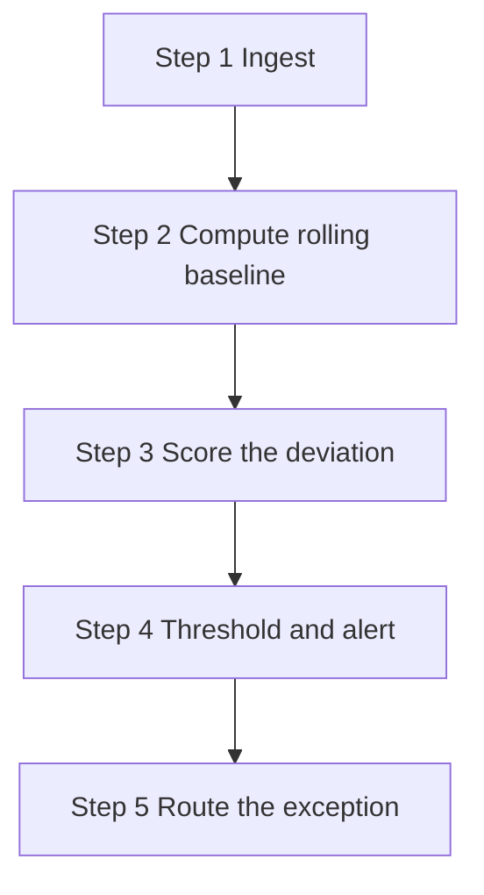

# Lecture 2 — Digital Supply Chain & Control Towers

> **Duration:** ~2 hours. **Outcome:** You can explain what a "control tower" actually is (not the buzzword — the mechanism), build a rolling-baseline query over operating data in SQL, and explain why continuous replanning beats a monthly cycle even when the underlying numbers barely differ.

Weeks 1–10 of this course each solved a planning problem — forecast demand, size inventory, route freight, balance supply and demand in an S&OP cycle. Every one of those was implicitly a **snapshot**: run the numbers, make the plan, move on until next cycle. This lecture is about the layer of tooling that sits on top of all of it and keeps watching **between** snapshots — because Week 11's disruption didn't wait for next month's S&OP meeting to happen.

## 1. What a control tower actually is

"Control tower" gets used loosely in supply chain marketing to mean almost any dashboard. Stripped to its mechanism, a control tower is three things wired together:

1. **A continuously updated data layer** — the operational tables (orders, shipments, inventory, receipts) refreshed on a short cycle (hourly, daily), not a monthly extract.
2. **A set of computed baselines and thresholds** — "normal" defined precisely enough that software, not a person eyeballing a chart, can tell when today's number is abnormal.
3. **An alerting and escalation path** — when a threshold is crossed, someone (or something) gets notified *before* they would have noticed on their own.

Crunch Gear's `daily_ops` table is deliberately the first ingredient of a control tower — real, dated, per-DC operating metrics. Lectures 2 and 3, plus Exercise 3, build the second and third ingredients on top of it.

```sql
-- The raw material: one row per DC per day. This alone is not a control tower —
-- it's just data. A control tower is what you compute FROM this, continuously.
SELECT ops_date, dc, otif_pct, fill_rate_pct, avg_lead_time_days
FROM daily_ops
WHERE dc = 'Austin East'
ORDER BY ops_date
LIMIT 5;
```

## 2. Batch cycles vs. continuous replanning

Every planning process this course has taught runs on a **cycle** — weekly demand forecast refresh, monthly S&OP, quarterly supplier scorecards. Cycles exist for a good reason: replanning has a cost (someone's time, a meeting, a re-run of an optimization), and running that cost every hour for no reason is wasteful. But a fixed cycle has a structural blind spot: **the interval between cycles is exactly where a disruption gets to run unnoticed.**

Look at what that blind spot cost Crunch Gear this week. Andes Stitch Works' fire hit on April 15. If Crunch Gear's only visibility into supplier and DC performance was a **monthly** operating review:

```sql
-- What a monthly review would have seen: April numbers, averaged, reported early May
SELECT dc,
       ROUND(AVG(otif_pct), 1) AS avg_otif_april,
       ROUND(AVG(fill_rate_pct), 1) AS avg_fill_april
FROM daily_ops
WHERE dc = 'Austin East' AND ops_date BETWEEN '2026-04-01' AND '2026-04-30'
GROUP BY dc;
```

```
 dc           | avg_otif_april | avg_fill_april
---------------+-----------------+-----------------
 Austin East   |            93.2 |            94.4
```

A monthly-average OTIF of 93.2% barely looks alarming — it's a few points under the 96% baseline, easily dismissed as normal variation, because April *contains* both three weeks of completely normal operation and four days of the disruption's earliest, still-mild onset. **The averaging that makes a monthly report readable is the same averaging that hides a disruption until it's already deep into its worst days.** By the time a monthly cycle would have flagged anything worth investigating, the real damage — the 61% OTIF days in early May — had already happened and was sitting in the *next* month's report, a full cycle late.

A **daily** rolling view, by contrast, sees the trend forming in real time:

```sql
SELECT ops_date, otif_pct,
       ROUND(AVG(otif_pct) OVER (
           ORDER BY ops_date
           ROWS BETWEEN 6 PRECEDING AND CURRENT ROW
       ), 1) AS rolling_7d_otif
FROM daily_ops
WHERE dc = 'Austin East' AND ops_date BETWEEN '2026-04-20' AND '2026-05-02'
ORDER BY ops_date;
```

The 7-day rolling average starts drifting downward well before any single day looks catastrophic — which is precisely the point. A control tower's job isn't to detect the day OTIF hits 61%; by then everyone already knows. Its job is to detect the day the *trend* turns, while the number is still merely "a bit soft," giving the operations team a week or more of lead time a monthly cycle structurally cannot provide.

## 3. Building the pipeline: from raw table to daily signal

A real control-tower pipeline has a repeatable shape, and it's worth learning the shape even before Exercise 3 has you build the whole thing:

**Step 1 — Ingest.** New operational data lands in the raw table (`daily_ops` here; in production this would be an ETL job pulling from an OMS, a WMS, and carrier EDI feeds). This week the table is pre-seeded, but in a real pipeline this step runs daily, appending yesterday's rows.

**Step 2 — Compute rolling baselines.** For every metric that matters, compute what "normal" looks like *as of right now*, not as of some fixed historical period — because normal itself can shift over a season (retail hits different demand baselines around holidays), and a control tower needs to compare today against a *recent* baseline, not last year's.

```sql
SELECT ops_date, dc, otif_pct,
       ROUND(AVG(otif_pct) OVER (
           PARTITION BY dc ORDER BY ops_date
           ROWS BETWEEN 13 PRECEDING AND 1 PRECEDING
       ), 2) AS baseline_14d_otif
FROM daily_ops
WHERE dc = 'Austin East'
ORDER BY ops_date;
```

Note the window: `13 PRECEDING AND 1 PRECEDING` — the baseline deliberately **excludes today's row**, comparing today against the 14 days *before* it. Including today's value in its own baseline dilutes an anomaly by mixing it into the average that's supposed to catch it.

**Step 3 — Score the deviation.** Turn "today vs. baseline" into a single comparable number — most simply, the raw gap; more rigorously, a z-score (Lecture 3 builds this out).

```sql
SELECT ops_date, dc, otif_pct,
       ROUND(AVG(otif_pct) OVER (
           PARTITION BY dc ORDER BY ops_date
           ROWS BETWEEN 13 PRECEDING AND 1 PRECEDING
       ), 2) AS baseline_14d_otif,
       otif_pct - ROUND(AVG(otif_pct) OVER (
           PARTITION BY dc ORDER BY ops_date
           ROWS BETWEEN 13 PRECEDING AND 1 PRECEDING
       ), 2) AS gap
FROM daily_ops
WHERE dc = 'Austin East'
ORDER BY ops_date;
```

**Step 4 — Threshold and alert.** Decide a gap (or z-score) that's big enough to be worth a human's attention, and flag it — `CASE WHEN gap < -8 THEN TRUE ELSE FALSE END`, for instance. Too sensitive and every normal day's noise triggers an alert (alert fatigue — the fastest way to get a control tower ignored); too loose and it's no better than the monthly cycle it's replacing. Exercise 3 has you tune exactly this trade-off.

**Step 5 — Route the exception.** A flagged row needs somewhere to go — a table of open exceptions, a message to a Slack channel, an email — and, critically, a way to mark it resolved so the same anomaly doesn't re-alert every day it persists. This is the "exception management" half of Lecture 3.


*The five-step shape of a control-tower pipeline, from raw table to a routed, resolvable exception.*

## 4. Materialized views: making the pipeline fast enough to run daily

Running a window-function query like the ones above over 180 rows is instant. Running the equivalent over years of daily data across a full DC network is not something you want recomputing from scratch on every dashboard refresh. PostgreSQL's answer is a **materialized view** — a query whose result is stored like a table and refreshed on a schedule:

```sql
CREATE MATERIALIZED VIEW daily_ops_with_baseline AS
SELECT ops_date, dc, otif_pct, fill_rate_pct, avg_lead_time_days,
       AVG(otif_pct) OVER (
           PARTITION BY dc ORDER BY ops_date
           ROWS BETWEEN 13 PRECEDING AND 1 PRECEDING
       ) AS baseline_14d_otif
FROM daily_ops;

-- Refresh it once new data lands (run this daily, e.g., from a cron job or scheduler)
REFRESH MATERIALIZED VIEW daily_ops_with_baseline;
```

(SQLite has no `MATERIALIZED VIEW` — use a plain `VIEW`, or, if refresh performance genuinely matters, write the computed rows into a real table with an `INSERT ... SELECT` you re-run on schedule. For this week's 180-row table, a plain view or even the raw query is fast enough either way; the materialized-view pattern matters at production scale, and it's worth knowing the name and the mechanism now.)

## 5. Where scheduling fits: the pipeline needs a heartbeat

None of Steps 1–5 run themselves — something has to trigger the pipeline on a cadence. In production this is typically:

- **`cron`** (or a managed equivalent) — the simplest option, a scheduled job that runs a script at a fixed time every day. `0 6 * * * python3 daily_pipeline.py` runs the pipeline every morning at 6 AM.
- **An orchestrator** (Airflow, Dagster, Prefect, or a cloud-native scheduler) — used when the pipeline has multiple dependent steps (ingest, then baseline, then alert, then notify) that need to run in order, retry on failure, and be observable when something breaks. Overkill for one query; standard practice once a pipeline has more than a couple of stages feeding each other.

You won't stand up Airflow this week — Exercise 3 has you write the pipeline logic as a plain Python script you *could* schedule with `cron`, because understanding what the scheduled job actually needs to do is the prerequisite for choosing how to schedule it.

## 6. Check yourself

- Why does a monthly-average report understate the severity of a disruption that both starts and (partially) resolves within that same month?
- In the rolling-baseline query, why does the window exclude the current day (`1 PRECEDING`, not `CURRENT ROW`)?
- What are the five steps of a control-tower pipeline, in order, and what does each one produce as its output?
- Why is a materialized view (or an equivalent pre-computed table) necessary at production scale even though a plain query works fine on 180 rows?
- Name one risk of setting an anomaly threshold too sensitively, and one risk of setting it too loosely.

If those are automatic, Lecture 3 takes the "score the deviation" step further — real anomaly-detection statistics, what happens when a human reviews (or doesn't review) a flagged exception, and where AI genuinely helps versus where it's marketing.

## Further reading

- **PostgreSQL — Window Functions Tutorial:** <https://www.postgresql.org/docs/current/tutorial-window.html>
- **PostgreSQL — Materialized Views:** <https://www.postgresql.org/docs/current/rules-materializedviews.html>
- **Apache Airflow — Concepts (DAGs, scheduling, retries):** <https://airflow.apache.org/docs/apache-airflow/stable/core-concepts/overview.html>
- **Gartner — glossary entry on Supply Chain Control Towers** (search "control tower" at): <https://www.gartner.com/en/supply-chain/glossary>
