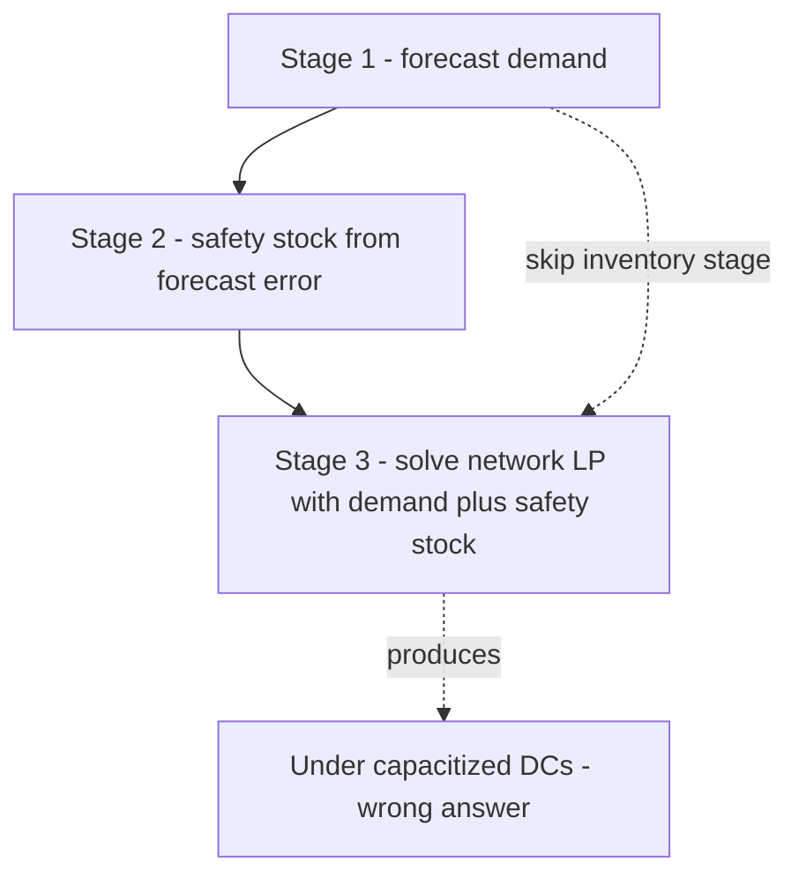

# Integrating Forecast, Inventory & Network

Lecture 1 hand-computed one number: the $174,229/month baseline. Everything from here forward is that same computation, automated, and then genuinely improved — not by guessing at a better DC assignment, but by handing a solver a precise mathematical description of the trade-off and letting it find the answer no spreadsheet ever could. This lecture builds three functions — `forecast_demand`, `compute_inventory_policy`, and `build_and_solve_network_lp` — and chains them so each one's output is the next one's input. That chain **is** the capstone. Everything else this week is either building a piece of it, running it, or explaining its result to someone who doesn't want to see the code.

## 1. Why "integration" is the hard part

Individually, you already know how to do every piece of this:

- Forecasting a time series (Weeks 3–4).
- Turning a forecast's error into a safety-stock number (Week 5).
- Writing a linear program (new this week, built from scratch below).

The part nobody teaches you in a single-topic lecture is that **these three things depend on each other in a specific order, and getting the order wrong produces a plausible-looking, wrong answer.** Forecast demand first — you need a number to plan against. Then size inventory policy against that forecast's *error*, not against the forecast's *point estimate* — safety stock exists specifically to absorb the part the forecast got wrong. Only then can you optimize the network, because the LP needs to know how much volume each DC will actually be asked to carry (forecast demand *plus* the safety stock cushion), not just the forecast's bare mean. Reverse this order — optimize the network against the forecast alone, then bolt inventory policy on afterward — and you'll under-capacity every DC by exactly the amount of safety stock you forgot to plan for.


*Forecast, then inventory, then network - skipping the middle stage silently undersizes every DC.*

## 2. Stage 1 — Forecast demand per SKU-region

Twenty-four SKU-region pairs (4 regions × 6 SKUs), twenty-four months of history each. A seasonal-naive forecast — "next month's forecast for this calendar month is this SKU-region's historical average for that calendar month" — is simple, auditable, and (per Week 3) a mandatory baseline before reaching for anything fancier. For a capstone, auditable beats clever.

```python
import pandas as pd
import numpy as np
from sqlalchemy import create_engine

engine = create_engine("postgresql:///crunch_chain_capstone")

def forecast_demand(engine, target_month: str) -> pd.DataFrame:
    """Seasonal-naive forecast: mean of this calendar month across all history years."""
    hist = pd.read_sql("SELECT * FROM demand_history", engine)
    hist["cal_month"] = pd.PeriodIndex(hist["month"], freq="M").month
    target_cal_month = pd.Period(target_month, freq="M").month

    grp = (hist[hist["cal_month"] == target_cal_month]
           .groupby(["region_id", "sku_id"])["units"]
           .agg(forecast="mean", sigma="std")
           .reset_index())
    grp["month"] = target_month
    return grp

forecast = forecast_demand(engine, "2026-07")
forecast.to_sql("demand_forecast", engine, if_exists="replace", index=False)
```

**Backtest it before trusting it** — exactly Week 4's discipline, not skipped just because this is the last week:

```python
def backtest_mape(engine) -> float:
    hist = pd.read_sql("SELECT * FROM demand_history", engine)
    hist["cal_month"] = pd.PeriodIndex(hist["month"], freq="M").month
    errors = []
    for (region, sku), g in hist.groupby(["region_id", "sku_id"]):
        for cal_month, gm in g.groupby("cal_month"):
            for i in range(len(gm)):
                train = gm.drop(gm.index[i])
                if len(train) == 0:
                    continue
                pred = train["units"].mean()
                actual = gm["units"].iloc[i]
                if actual > 0:
                    errors.append(abs(pred - actual) / actual)
    return 100 * np.mean(errors)

print(f"Seasonal-naive MAPE: {backtest_mape(engine):.1f}%")   # ≈ 8-9% on this dataset
```

The MAPE comes out close to **8–9%** — and that's not a coincidence you should shrug past. Lecture 1's demand generator injected exactly 8% noise on top of a fully-known seasonal pattern. A seasonal-naive forecast, given enough history, recovers that noise level almost exactly, because it correctly captures the seasonal signal and leaves only the irreducible randomness as error. **This is the cleanest possible confirmation that your forecast is doing its job**: the residual error should converge toward the data's true noise floor, no lower. On a real dataset you'll never know the true noise floor in advance — this capstone's synthetic data is the rare case where you can verify the forecast is working exactly as well as it theoretically can.

## 3. Stage 2 — Inventory policy from the forecast's error

Week 5's formulas, applied per SKU-region, using the `sigma` column the forecast function just gave you — this is the entire reason Stage 1 computed a standard deviation, not just a mean.

```python
from scipy.stats import norm

SERVICE_LEVEL = 0.95
Z = norm.ppf(SERVICE_LEVEL)          # 1.645
ORDER_COST = 250                     # $ per replenishment order, flat
HOLDING_RATE = 0.22                  # % of unit cost, annualized
LEAD_TIME_DAYS = {"AUS": 6, "MEM": 4, "REN": 9}   # domestic plant → DC, the fast replenishment lane

def compute_inventory_policy(forecast: pd.DataFrame, dc_assignment: dict,
                              unit_cost: float = 25.0) -> pd.DataFrame:
    rows = []
    for _, r in forecast.iterrows():
        dc = dc_assignment[r["region_id"]]
        lt_months = LEAD_TIME_DAYS[dc] / 30
        annual_demand = r["forecast"] * 12
        H = unit_cost * HOLDING_RATE
        eoq = np.sqrt(2 * annual_demand * ORDER_COST / H)
        sigma_lt = (r["sigma"] or 0) * np.sqrt(lt_months)
        safety_stock = Z * sigma_lt
        rop = r["forecast"] * lt_months + safety_stock
        rows.append({**r.to_dict(), "dc_id": dc, "eoq": round(eoq),
                     "safety_stock": round(safety_stock), "reorder_point": round(rop)})
    return pd.DataFrame(rows)
```

**Worked example, by hand** — SKU-100 (Trailhead Rain Shell) in the Midwest, served by MEM (4-day lead time):

```
forecast (monthly)  = 8,000 × 0.20 share           = 1,600 units/mo
annual demand D     = 1,600 × 12                   = 19,200 units/yr
H (holding, $/yr)   = $25 × 0.22                    = $5.50/unit/yr
EOQ = √(2 × 19,200 × 250 / 5.50)  = √1,745,455       ≈ 1,321 units/order
                                                        (~14.5 orders/year, one every ~25 days)

lead time            = 4 days = 0.133 months
σ_d (monthly, ≈8%)   = 1,600 × 0.08                 ≈ 128 units
σ_LT = σ_d × √0.133                                  ≈ 46.7 units
safety stock = 1.645 × 46.7                          ≈ 77 units
reorder point = (1,600 × 0.133) + 77 = 213 + 77       ≈ 290 units
```

Read that reorder point out loud: **when MEM's on-hand SKU-100 stock hits 290 units, place the next 1,321-unit order.** That's an operational instruction a warehouse system can act on directly — which is exactly what this stage of the pipeline exists to produce.

### Rolling safety stock up to the DC/network level

Finance doesn't ask "what's SKU-100's reorder point at MEM?" — they ask "how much money is tied up in safety stock, total?" Aggregate at the DC level using each DC's **total** post-optimization volume (all SKUs combined) and its fast-lane lead time:

```python
def dc_level_holding_cost(dc_volume: dict, unit_cost: float = 25.0) -> float:
    total_monthly_cost = 0
    for dc, monthly_units in dc_volume.items():
        lt_months = LEAD_TIME_DAYS[dc] / 30
        sigma_d = monthly_units * 0.08
        sigma_lt = sigma_d * np.sqrt(lt_months)
        ss = Z * sigma_lt
        total_monthly_cost += ss * unit_cost * (HOLDING_RATE / 12)
    return total_monthly_cost
```

Run this against the **naive** current-state DC volumes (AUS 24,000 / MEM 0 / REN 6,500, all on a flat 30-day buffer — not this formula at all, that's the point) and you reproduce Lecture 1's $13,979/mo. Run it against the **LP-optimized** DC volumes computed in Stage 3 below (AUS 2,000 / MEM 22,000 / REN 6,500) and you get:

```
AUS: 2,000 × 0.08 = 160/mo σ_d; LT=0.20mo; σ_LT=71.6;  SS=118; cost=118×25×0.01833=$54/mo
MEM: 22,000 × 0.08 = 1,760/mo σ_d; LT=0.133mo; σ_LT=642.6; SS=1,057; cost=1,057×25×0.01833=$484/mo
REN: 6,500 × 0.08 = 520/mo σ_d; LT=0.30mo; σ_LT=284.8; SS=469; cost=469×25×0.01833=$215/mo
                                                                    Total ≈ $753/mo
```

**$13,979/mo down to $753/mo** — a 94.6% cut in safety-stock holding cost, just from replacing a flat "30 days of everything, everywhere" rule with a policy that actually accounts for each DC's real demand variability and real (short, domestic) replenishment lead time. This is the single biggest number in this capstone, and it's bigger than the network reallocation savings you're about to compute in Stage 3 — a genuinely common finding in real inventory work: **naive flat-buffer policies are almost always drastically oversized once lead times are short**, because `√LT` shrinks fast as lead time shrinks, and a flat day-count rule never noticed.

## 4. Stage 3 — Optimize network flow with linear programming

A **linear program (LP)** finds the values of a set of *decision variables* that minimize (or maximize) a linear *objective function*, subject to linear *constraints*. Here: the decision variables are how many units flow on each DC→region lane; the objective is total outbound freight cost; the constraints are "every region's demand gets met" and "no DC ships more than its capacity."

```python
import pulp

DCS = ["AUS", "MEM", "REN"]
REGIONS = ["NE", "SE", "MW", "WE"]
CAPACITY = {"AUS": 26000, "MEM": 22000, "REN": 15000}
DEMAND = {"NE": 7000, "SE": 9000, "MW": 8000, "WE": 6500}   # from Stage 1, summed across SKUs
LANE_COST = {
    ("AUS", "NE"): 2.40, ("AUS", "SE"): 1.30, ("AUS", "MW"): 1.70, ("AUS", "WE"): 2.10,
    ("MEM", "NE"): 1.60, ("MEM", "SE"): 1.20, ("MEM", "MW"): 1.40, ("MEM", "WE"): 2.60,
    ("REN", "NE"): 2.90, ("REN", "SE"): 2.70, ("REN", "MW"): 2.20, ("REN", "WE"): 1.10,
}

def build_and_solve_network_lp(demand, capacity, lane_cost):
    prob = pulp.LpProblem("crunch_gear_network_flow", pulp.LpMinimize)
    x = {(d, r): pulp.LpVariable(f"x_{d}_{r}", lowBound=0)
         for d in DCS for r in REGIONS}

    # Objective: minimize total outbound freight cost
    prob += pulp.lpSum(lane_cost[d, r] * x[d, r] for d in DCS for r in REGIONS)

    # Constraint 1: every region's demand is fully met
    for r in REGIONS:
        prob += pulp.lpSum(x[d, r] for d in DCS) == demand[r], f"demand_{r}"

    # Constraint 2: no DC ships more than its monthly capacity
    for d in DCS:
        prob += pulp.lpSum(x[d, r] for r in REGIONS) <= capacity[d], f"capacity_{d}"

    prob.solve(pulp.PULP_CBC_CMD(msg=False))
    plan = {(d, r): x[d, r].value() for d in DCS for r in REGIONS if x[d, r].value() > 0}
    return plan, pulp.value(prob.objective), pulp.LpStatus[prob.status]

plan, total_cost, status = build_and_solve_network_lp(DEMAND, CAPACITY, LANE_COST)
print(status, total_cost)
```

Solving prints `Optimal 40550.0` — matching, unit for unit, Lecture 1 §5's hand-worked stepping-stone solution. Read off `plan`:

```
{('MEM','NE'): 7000.0, ('MEM','MW'): 8000.0, ('MEM','SE'): 7000.0,
 ('AUS','SE'): 2000.0, ('REN','WE'): 6500.0}
```

MEM is used to its exact 22,000-unit capacity; the 2,000 units that can't fit spill to AUS on the SE lane — the single cheapest place to put an overflow, at only $0.10/unit more than MEM would have cost. The solver found, in milliseconds, the identical answer the by-hand marginal-cost reasoning in Lecture 1 took several paragraphs to justify. That agreement is not a coincidence, either: it's proof the LP is correctly formulated. **Always validate a new model against a case you can check by hand before trusting it on data you can't.**

## 5. Chain all three into one pipeline

```python
def run_capstone_pipeline(engine, target_month: str):
    forecast = forecast_demand(engine, target_month)
    region_demand = forecast.groupby("region_id")["forecast"].sum().to_dict()

    plan, outbound_cost, status = build_and_solve_network_lp(region_demand, CAPACITY, LANE_COST)
    assert status == "Optimal"

    dc_volume = {}
    for (d, r), units in plan.items():
        dc_volume[d] = dc_volume.get(d, 0) + units
    for d in DCS:
        dc_volume.setdefault(d, 0)

    dc_assignment = {r: max(DCS, key=lambda d: plan.get((d, r), 0)) for r in REGIONS}
    policy = compute_inventory_policy(forecast, dc_assignment)
    holding_cost = dc_level_holding_cost(dc_volume)

    fixed_cost = 42000 + 38000 + 31000
    total_cost = outbound_cost + fixed_cost + holding_cost
    return {"outbound_cost": outbound_cost, "fixed_cost": fixed_cost,
            "holding_cost": holding_cost, "total_cost": total_cost,
            "plan": plan, "policy": policy}

result = run_capstone_pipeline(engine, "2026-07")
print(f"Total in-scope monthly cost: ${result['total_cost']:,.0f}")
```

## 6. The number

| Component | Baseline (Lecture 1) | Optimized (this pipeline) | Savings |
|---|---:|---:|---:|
| Outbound freight | $49,250 | $40,550 | $8,700 |
| DC fixed cost | $111,000 | $111,000 | $0 |
| Safety-stock holding cost | $13,979 | $753 | $13,226 |
| **Total (in scope)** | **$174,229** | **$152,303** | **$21,926** |

$21,926/month, **12.6%** of the in-scope baseline — well past the 6% target set in Lecture 1's scoping document, and delivered by **two** distinct levers: network reallocation (40% of the savings) and safety-stock right-sizing (60% of the savings). Neither lever alone hits the target as convincingly, and the safety-stock lever specifically only exists because Stage 1's forecast produced a `sigma`, not just a mean — proof that the "integration" this lecture opened with promising was not a formality. Lecture 3 turns this table into a one-page memo.
