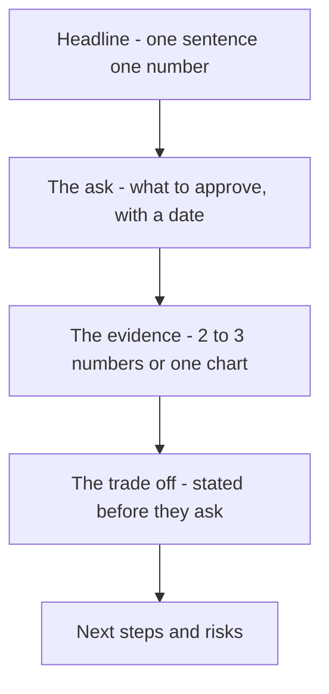

# Presenting Operations Results

You have a correct model, a solved LP, and a number: **$21,926/month, 12.6% off the in-scope baseline.** None of that matters yet. A VP of Supply Chain will not read your PuLP formulation, will not open `demand_forecast.csv`, and will give your memo about ninety seconds before deciding whether to keep reading or forward it to someone else to "dig into the details." This lecture is about the ninety seconds — how to compress six weeks of forecasting, inventory, and optimization work into something that survives them.

## 1. Executives don't want your analysis. They want a decision.

The single most common failure in a first analytics presentation is **leading with the method**. "I built a seasonal-naive forecast, backtested it to an 8.3% MAPE, computed safety stock using a 95% cycle service level and the normal approximation, then formulated a transportation LP and solved it with PuLP's CBC solver" is a completely accurate sentence and a terrible opening line. It answers a question nobody in the room asked. The question they *did* ask, implicitly, by putting this meeting on the calendar, is: **"what should we do, and what does it cost us not to?"**

Lead with the answer. Explain the method only when asked, and only as deep as the question goes.

## 2. The structure of an executive one-pager

Every strong operations recommendation memo has the same five parts, in the same order. Skipping or reordering them is the second most common failure.

1. **Headline** — one sentence, one number. Not a summary of what you did; the size of the opportunity.
2. **The ask** — what you want them to approve, in one sentence, with a date.
3. **The evidence** — 2–3 numbers or a single chart, not ten. Enough to make the headline credible, not enough to require a second meeting.
4. **The trade-off** — what you're giving up, or what could go wrong, stated *before* they ask. This is the sentence that builds trust, because it's the one a weak analyst omits.
5. **Next steps and risks** — what happens after "yes," and what you're watching for.


*The five parts of an executive one-pager, always in this order.*

### Worked example — the capstone's memo

```markdown
# Recommendation: Rebalance Crunch Gear's Network + Right-Size Safety Stock

## Headline
Reallocating DC-to-region flow and moving off a flat 30-day safety-stock rule
cuts in-scope network cost by **$21,926/month ($263K/year), a 12.6% reduction**
— with zero change to customer-facing service levels.

## The ask
Approve the new DC-to-region routing (below) and the SKU-level reorder points
in Appendix A, effective the first of next month. No capital required — this
is a policy change, not a facility change.

## The evidence
| Component            | Today       | Proposed    | Savings   |
|-----------------------|------------:|------------:|----------:|
| Outbound freight       | $49,250/mo | $40,550/mo | $8,700/mo |
| Safety-stock holding   | $13,979/mo | $753/mo    | $13,226/mo|
| **Total (in scope)**   | **$174,229/mo** | **$152,303/mo** | **$21,926/mo** |

Two levers, not one: reassigning ~10,000 units/month of Northeast, Southeast,
and Midwest volume from Austin East onto the underused Memphis DC accounts for
40% of the savings; replacing the flat 30-day safety-stock buffer with a
statistically sized reorder point — using each SKU-region's actual demand
volatility and Memphis's fast 4-day domestic lead time — accounts for the
remaining 60%. Every SKU-region's service level is held at or above the
required 95% cycle service level; nothing here trades service for cost.

## The trade-off
Memphis DC now runs at 100% of its rated monthly capacity (22,000/22,000
units) versus today's near-zero utilization. That removes the slack Memphis
currently has to absorb an unplanned demand spike without a manual reroute.
We recommend re-running this model monthly as new demand data lands (the
pipeline is automated — see Appendix B) so the plan adjusts before Memphis
becomes a bottleneck, rather than after.

## Next steps and risks
- **Week 1:** update routing rules in the WMS; no system changes needed, DC
  destinations only.
- **Week 2–4:** monitor Memphis fill rate and OTIF weekly; alert if Memphis
  utilization exceeds 95% two weeks running (early signal to shift the next
  2,000–3,000 units of demand growth back toward Austin East).
- **Risk not modeled here:** a port disruption at Hai Phong would affect lead
  times on the plant-to-DC leg, which this analysis held fixed (see Scope,
  Appendix C). A companion resilience analysis is recommended for Q3.
```

Notice what this memo does *not* do: it does not open with "I built a linear program." It does not show the PuLP code. It does not walk through the EOQ formula. All of that exists — in an appendix, or in the repo, for the one stakeholder in ten who asks "how did you get that number?" — but it is not the first thing anyone sees.

## 3. Quantify the trade-off, don't hide it

Every real recommendation costs something, even a good one. "We found $263K/year and there's no downside" reads as either naive or dishonest to an experienced operations leader — every network has slack for a reason, and removing it removes optionality. The Memphis-utilization trade-off above is the honest version: *we're claiming this money, and here's exactly what we're giving up to get it, and here's the plan for watching that give-up.* Stating the trade-off first, unprompted, is what makes a recommendation memo different from a sales pitch, and it's the fastest way to earn the credibility that gets your next recommendation approved without three follow-up meetings.

## 4. One chart, chosen on purpose

If you include exactly one chart, make it a **waterfall** — baseline on the left, each lever's contribution as a step, optimized total on the right. It answers the two questions a stakeholder actually has at a glance: *how big is this*, and *where did it come from*.

```
$174,229 ─┐
          │ Outbound reallocation   -$8,700
          ├──────────────────────────────────┐
          │                                   │
          │ Safety-stock right-sizing -$13,226│
          │                                   ├──────┐
          │                                          │
$152,303 ─┴──────────────────────────────────────────┴── Optimized total
```

Avoid: a table of all 24 SKU-region reorder points on the summary slide (that's Appendix A material), a pie chart of cost components (pie charts answer "what share," not "how much did we save," which is the actual question), or more than one color scheme fighting for attention. Week 3–4's forecasting lectures and the `dataviz` design discipline both apply here — a chart's first job is to be immediately readable by someone who has ten seconds, not to display everything you computed.

## 5. Answering the questions you didn't put in the memo

A strong presenter treats the Q&A, not the slide, as the real test. Three questions come up in almost every network-optimization review — prepare the answer before you're asked:

- **"What if demand is 20% higher than forecast next quarter?"** Re-run the pipeline with a scaled demand vector and report the new plan and cost — this is a five-minute rerun, not a new project, because the pipeline is automated. Say that explicitly; it's a selling point for the *process*, not just this month's answer.
- **"Why didn't you also reconsider which plant supplies which DC?"** Because the scoping document held plant sourcing out of scope on purpose (Lecture 1 §2) — say so plainly, and offer it as a natural follow-on analysis, not a gap you missed.
- **"How confident are we in the safety-stock numbers?"** Point to the backtested MAPE (Lecture 2 §2) as the evidence the demand-variability estimate underneath the safety-stock formula is grounded in actual forecast error, not a guess — this is exactly why Stage 1 computed a `sigma`, not just a mean, and it's worth stating that connection out loud.

## 6. What this lecture is really teaching

Every technical skill in this course — SQL, forecasting, EOQ, linear programming — exists to produce a number an organization can act on. The number is worthless if the person who can approve the action can't understand it in ninety seconds, and it's dangerous if you hide the trade-off that makes it real. The memo template above is not a formality tacked onto the end of a "real" analytics project — writing it well, with the trade-off stated plainly and the ask dated, **is** the last and most valuable step of the job. Challenge 2 and the mini-project both grade this explicitly: a perfect LP with no defensible memo is an incomplete capstone.
